Aiken-Lang Milestone 2

Plooty Research: https://plooty-xyz-research.netlify.app/

Aiken Community
List of all aiken community
https://github.com/aiken-lang/aiken/discussions
https://cardanoupdates.com/aiken-lang/aiken
https://www.reddit.com/r/cardano/comments/11d9cuj/aiken_simplifies_writing_smart_contracts_for/?rdt=40341
https://www.lidonation.com/en/proposals/aiken-open-source-smart-contract-library-by-meshjs-trustlevel-f11
https://crates.io/teams/github:aiken-lang:maintainers
https://discord.gg/EscYHV8v
https://www.lidonation.com/en/posts/the-heartbeat-of-cardano-shifts-to-aiken
https://x.com/aiken_eng?lang=en
https://cardano.ideascale.com/c/idea/112062
https://cardanofoundation.org/blog/aiken-the-future-of-smart-contracts
https://cardano.ideascale.com/c/idea/112062/activity
https://indigoprotocol1.medium.com/optimizing-the-throughput-of-cardano-the-evolution-of-indigo-protocols-smart-contracts-a498ecc42823
https://forum.cardano.org/t/cardano-community-digest-17-april-2023/116916

Github Resourse Link Iken-Lang
https://github.com/aiken-lang
https://github.com/aiken-lang/stdlib/tree/main/lib/aiken
https://github.com/STEAKProtocol/STEAKProtocol
https://github.com/Anastasia-Labs/design-patterns/tree/main
https://github.com/Anastasia-Labs/aiken-trie
https://github.com/Anastasia-Labs/aiken-merkle-tree
https://github.com/aiken-lang/aiken-mode/blob/master/aiken-mode.el
https://github.com/aiken-lang/aiken-mode/tree/master
https://github.com/SundaeSwap-finance/aicone?tab=readme-ov-file
https://github.com/aiken-lang/awesome-aiken?tab=readme-ov-file#Dapps
https://github.com/encryptedcoins/encoins-core-aiken
https://mehen.io/
https://github.com/spacebudz/nebula/tree/main/contract/src/nebula
https://github.com/logicalmechanism/assist/tree/main/lib/assist
https://github.com/logicalmechanism/assist
https://github.com/logicalmechanism/assist/tree/main/lib/assist
https://github.com/logicalmechanism/assist
https://github.com/spacebudz/nebula/tree/main
https://github.com/aiken-extra
https://github.com/spacebudz/nebula/tree/main
https://github.com/Cardano-Fans/acca


1) List of all functions available on Aiken

# Math Library’
Link: https://github.com/aiken-lang/stdlib/blob/main/lib/aiken/math/rational.ak

Function: rational.ak

//// This module implements operations between rational numbers. Internally, rational aren't
//// automatically reduced as this is **only done on-demand**.
////
//// Thus, for example:
////
//// ```aiken
//// rational.new(2, 3) != rational.new(4, 6)
//// ```
////
//// Comparing rational values should, therefore, only happen after reduction (see [reduce](#reduce)) or via the [compare](#compare) method.

use aiken/builtin
use aiken/list
use aiken/math
use aiken/option

/// Opaque type used to ensure the sign of the Rational is managed strictly in the numerator.
pub opaque type Rational {
  numerator: Int,
  denominator: Int,
}

/// An unsafe constructor for `Rational` values. Assumes that the following invariants are
/// enforced:
///
/// - the denominator is positive (the sign is managed in the numerator);
/// - the denominator is not null.
///
/// This function is mainly used as a quick way to construct rationals from literal values.
fn ratio(numerator: Int, denominator: Int) -> Rational {
  Rational { numerator, denominator }
}

/// Make a `Rational` number from the ratio of two integers.
///
/// Returns `None` when the denominator is null.
///
/// ```aiken
/// rational.new(14, 42) == Some(r)
/// rational.new(14, 0) == None
/// ```
pub fn new(numerator: Int, denominator: Int) -> Option<Rational> {
  if denominator == 0 {
    None
  } else if denominator < 0 {
    Some(Rational { numerator: -numerator, denominator: -denominator })
  } else {
    Some(Rational { numerator, denominator })
  }
}

test new_1() {
  and {
    (new(2, 0) == None)?,
    (new(2, 3) == Some(ratio(2, 3)))?,
    (new(-2, 3) == Some(ratio(-2, 3)))?,
    (new(2, -3) == Some(ratio(-2, 3)))?,
    (new(2, 4) == Some(ratio(2, 4)))?,
    (new(-2, -3) == Some(ratio(2, 3)))?,
    (new(-2, -4) == Some(ratio(2, 4)))?,
  }
}

/// Get the numerator of a rational value.
///
/// ```aiken
/// expect Some(x) = rational.new(2, 3)
/// rational.numerator(x) == 2
/// ```
pub fn numerator(self: Rational) -> Int {
  self.numerator
}

test numerator_1() {
  expect Some(x) = new(2, 3)
  expect Some(y) = new(-2, 3)
  expect Some(z) = new(2, -3)
  expect Some(w) = new(-2, -3)

  and {
    (numerator(x) == 2)?,
    (numerator(y) == -2)?,
    (numerator(z) == -2)?,
    (numerator(w) == 2)?,
  }
}

/// Get the denominator of a rational value.
///
/// ```aiken
/// expect Some(x) = rational.new(2, 3)
/// rational.denominator(x) == 3
/// ```
pub fn denominator(self: Rational) -> Int {
  self.denominator
}

test denominator_1() {
  expect Some(x) = new(2, 3)
  expect Some(y) = new(-2, 3)
  expect Some(z) = new(2, -3)
  expect Some(w) = new(-2, -3)
  and {
    (denominator(x) == 3)?,
    (denominator(y) == 3)?,
    (denominator(z) == 3)?,
    (denominator(w) == 3)?,
  }
}

/// A null `Rational`.
pub fn zero() -> Rational {
  Rational { numerator: 0, denominator: 1 }
}

test zero_1() {
  zero() == ratio(0, 1)
}

/// Multiplication: the product of two rational values.
///
/// ```aiken
/// expect Some(x) = rational.new(2, 3)
/// expect Some(y) = rational.new(3, 4)
///
/// Some(rational.mul(x, y)) == rational.new(6, 12)
/// ```
pub fn mul(left: Rational, right: Rational) -> Rational {
  let Rational { numerator: a_n, denominator: a_d } = left
  let Rational { numerator: b_n, denominator: b_d } = right
  Rational { numerator: a_n * b_n, denominator: a_d * b_d }
}

test mul_1() {
  mul(ratio(2, 3), ratio(3, 4)) == ratio(6, 12)
}

test mul_2() {
  mul(ratio(-2, 3), ratio(-3, 4)) == ratio(6, 12)
}

test mul_3() {
  let result =
    ratio(2, 5)
      |> mul(ratio(1, 8))
      |> mul(ratio(3, 10))
      |> mul(ratio(21, 100))
      |> mul(ratio(3, 5))
      |> mul(ratio(2, 8))
      |> mul(ratio(4, 10))
      |> mul(ratio(22, 100))
      |> reduce

  result == ratio(2079, 50000000)
}

/// Division: quotient of two rational values. Returns `None` when the second
/// value is null.
///
/// ```aiken
/// expect Some(x) = rational.new(2, 3)
/// expect Some(y) = rational.new(3, 4)
///
/// rational.div(x, y) == rational.new(8, 9)
/// ```
pub fn div(left: Rational, right: Rational) -> Option<Rational> {
  reciprocal(right) |> option.map(mul(left, _))
}

test div_1() {
  div(ratio(2, 3), ratio(3, 4)) == new(8, 9)
}

test div_2() {
  div(ratio(2, 3), ratio(-3, 4)) == new(-8, 9)
}

/// Addition: sum of two rational values
///
/// ```aiken
/// expect Some(x) = rational.new(2, 3)
/// expect Some(y) = rational.new(3, 4)
///
/// Some(rational.add(x, y)) == rational.new(17, 12)
/// ```
pub fn add(left: Rational, right: Rational) -> Rational {
  let Rational { numerator: a_n, denominator: a_d } = left
  let Rational { numerator: b_n, denominator: b_d } = right
  Rational { numerator: a_n * b_d + b_n * a_d, denominator: a_d * b_d }
}

test add_1() {
  add(ratio(2, 3), ratio(3, 4)) == ratio(17, 12)
}

test add_2() {
  add(ratio(-2, 3), ratio(3, 4)) == ratio(1, 12)
}

/// Subtraction: difference of two rational values
///
/// ```aiken
/// expect Some(x) = rational.new(2, 3)
/// expect Some(y) = rational.new(3, 4)
///
/// Some(rational.sub(x, y)) == rational.new(-1, 12)
/// ```
pub fn sub(left: Rational, right: Rational) -> Rational {
  let Rational { numerator: a_n, denominator: a_d } = left
  let Rational { numerator: b_n, denominator: b_d } = right
  Rational { numerator: a_n * b_d - b_n * a_d, denominator: a_d * b_d }
}

test sub_1() {
  sub(ratio(2, 3), ratio(3, 4)) == ratio(-1, 12)
}

test sub_2() {
  sub(ratio(2, 3), ratio(-3, 4)) == ratio(17, 12)
}

test sub_3() {
  sub(ratio(-2, 3), ratio(3, 4)) == ratio(-17, 12)
}

/// Create a new `Rational` from an `Int`.
///
/// ```aiken
/// Some(rational.from_int(14)) == rational.new(14, 1)
/// Some(rational.from_int(-5)) == rational.new(-5, 1)
/// Some(rational.from_int(0)) == rational.new(0, 1)
/// ```
pub fn from_int(numerator: Int) -> Rational {
  Rational { numerator, denominator: 1 }
}

test from_int_1() {
  and {
    (from_int(14) == ratio(14, 1))?,
    (from_int(-5) == ratio(-5, 1))?,
    (from_int(0) == ratio(0, 1))?,
  }
}

/// Returns the nearest `Int` between zero and a given `Rational`.
///
/// ```aiken
/// expect Some(x) = rational.new(2, 3)
/// rational.truncate(x) == 0
///
/// expect Some(y) = rational.new(44, 14)
/// rational.truncate(y) == 3
///
/// expect Some(z) = rational.new(-14, 3)
/// rational.truncate(z) == -4
/// ```
pub fn truncate(self: Rational) -> Int {
  let Rational { numerator: a_n, denominator: a_d } = self
  builtin.quotient_integer(a_n, a_d)
}

test truncate_1() {
  and {
    (truncate(ratio(5, 2)) == 2)?,
    (truncate(ratio(5, 3)) == 1)?,
    (truncate(ratio(5, 4)) == 1)?,
    (truncate(ratio(5, 5)) == 1)?,
    (truncate(ratio(5, 6)) == 0)?,
    (truncate(ratio(8, 3)) == 2)?,
    (truncate(ratio(-14, 3)) == -4)?,
  }
}

/// Returns the greatest `Int` no greater than a given `Rational`
///
/// ```aiken
/// expect Some(x) = rational.new(2, 3)
/// rational.floor(x) == 0
///
/// expect Some(y) = rational.new(44, 14)
/// rational.floor(y) == 3
///
/// expect Some(z) = rational.new(-14, 3)
/// rational.floor(z) == -5
/// ```
pub fn floor(self: Rational) -> Int {
  let Rational { numerator: a_n, denominator: a_d } = self
  a_n / a_d
}

test floor_1() {
  and {
    (floor(ratio(5, 2)) == 2)?,
    (floor(ratio(5, 3)) == 1)?,
    (floor(ratio(5, 4)) == 1)?,
    (floor(ratio(5, 5)) == 1)?,
    (floor(ratio(5, 6)) == 0)?,
    (floor(ratio(8, 3)) == 2)?,
    (floor(ratio(-14, 3)) == -5)?,
  }
}

/// Returns the smallest `Int` not less than a given `Rational`
///
/// ```aiken
/// expect Some(x) = rational.new(2, 3)
/// rational.ceil(x) == 1
///
/// expect Some(y) = rational.new(44, 14)
/// rational.ceil(y) == 4
///
/// expect Some(z) = rational.new(-14, 3)
/// rational.ceil(z) == -4
/// ```
pub fn ceil(self: Rational) -> Int {
  let Rational { numerator, denominator } = self
  if builtin.remainder_integer(numerator, denominator) > 0 {
    builtin.quotient_integer(numerator, denominator) + 1
  } else {
    builtin.quotient_integer(numerator, denominator)
  }
}

test ceil_1() {
  and {
    (ceil(ratio(13, 5)) == 3)?,
    (ceil(ratio(15, 5)) == 3)?,
    (ceil(ratio(16, 5)) == 4)?,
    (ceil(ratio(-3, 5)) == 0)?,
    (ceil(ratio(-5, 5)) == -1)?,
    (ceil(ratio(-14, 3)) == -4)?,
    (ceil(ratio(-14, 6)) == -2)?,
    (ceil(ratio(44, 14)) == 4)?,
  }
}

/// Returns the proper fraction of a given `Rational` `r`. That is, a 2-tuple of
/// an `Int` and `Rational` (n, f) such that:
///
/// - `r = n + f`;
/// - `n` and `f` have the same sign as `r`;
/// - `f` has an absolute value less than 1.
pub fn proper_fraction(self: Rational) -> (Int, Rational) {
  let Rational { numerator, denominator } = self
  (
    builtin.quotient_integer(numerator, denominator),
    Rational {
      numerator: builtin.remainder_integer(numerator, denominator),
      denominator,
    },
  )
}

test proper_fraction_1() {
  let r = ratio(10, 7)
  let (n, f) = proper_fraction(r)
  and {
    (n == 1)?,
    (f == ratio(3, 7))?,
    (r == add(from_int(n), f))?,
  }
}

test proper_fraction_2() {
  let r = ratio(-10, 7)
  let (n, f) = proper_fraction(r)
  and {
    (n == -1)?,
    (f == ratio(-3, 7))?,
    (r == add(from_int(n), f))?,
  }
}

test proper_fraction_3() {
  let r = ratio(4, 2)
  let (n, f) = proper_fraction(r)
  and {
    (n == 2)?,
    (f == ratio(0, 2))?,
    (r == add(from_int(n), f))?,
  }
}

/// Round the argument to the nearest whole number. If the argument is
/// equidistant between two values, the greater value is returned (it
/// rounds half towards positive infinity).
///
/// ```aiken
/// expect Some(x) = rational.new(2, 3)
/// rational.round(x) == 1
///
/// expect Some(y) = rational.new(3, 2)
/// rational.round(y) == 2
///
/// expect Some(z) = rational.new(-3, 2)
/// rational.round(z) == -1
/// ```
///
/// ⚠️  This behaves differently than _Haskell_. If you're coming from
/// `PlutusTx`, beware that in Haskell, rounding on equidistant values depends on the
/// whole number being odd or even. If you need this behaviour, use [`round_even`](#round_even).
pub fn round(self: Rational) -> Int {
  let (n, f) = proper_fraction(self)

  let is_negative = f.numerator < 0

  when compare(abs(f), ratio(1, 2)) is {
    Less -> n
    Equal if is_negative -> n
    Equal -> n + 1
    Greater if is_negative -> n - 1
    Greater -> n + 1
  }
}

test round_1() {
  and {
    (round(ratio(10, 7)) == 1)?,
    (round(ratio(11, 7)) == 2)?,
    (round(ratio(3, 2)) == 2)?,
    (round(ratio(5, 2)) == 3)?,
    (round(ratio(-3, 2)) == -1)?,
    (round(ratio(-2, 3)) == -1)?,
    (round(ratio(-10, 7)) == -1)?,
    (round(ratio(4, 2)) == 2)?,
  }
}

/// Round the argument to the nearest whole number. If the argument is
/// equidistant between two values, it returns the value that is even (it
/// rounds half to even, also known as 'banker's rounding').
///
/// ```aiken
/// expect Some(w) = rational.new(2, 3)
/// rational.round_even(w) == 1
///
/// expect Some(x) = rational.new(3, 2)
/// rational.round_even(x) == 2
///
/// expect Some(y) = rational.new(5, 2)
/// rational.round_even(y) == 2
///
/// expect Some(y) = rational.new(-3, 2)
/// rational.round_even(y) == -2
/// ```
pub fn round_even(self: Rational) -> Int {
  let (n, f) = proper_fraction(self)

  let m =
    when compare(f, ratio(0, 1)) is {
      Less -> -1
      _ -> 1
    }

  let is_even = n % 2 == 0

  when compare(abs(f), ratio(1, 2)) is {
    Less -> n
    Equal if is_even -> n
    Equal -> n + m
    Greater -> n + m
  }
}

test round_even_1() {
  and {
    (round_even(ratio(10, 7)) == 1)?,
    (round_even(ratio(11, 7)) == 2)?,
    (round_even(ratio(3, 2)) == 2)?,
    (round_even(ratio(5, 2)) == 2)?,
    (round_even(ratio(-3, 2)) == -2)?,
    (round_even(ratio(-2, 3)) == -1)?,
    (round_even(ratio(-10, 7)) == -1)?,
    (round_even(ratio(4, 2)) == 2)?,
  }
}

/// Change the sign of a `Rational`.
///
/// ```aiken
/// expect Some(x) = rational.new(3, 2)
/// expect Some(y) = rational.new(-3, 2)
///
/// rational.negate(x) == y
/// rational.negate(y) == x
/// ```
pub fn negate(a: Rational) -> Rational {
  let Rational { numerator: a_n, denominator: a_d } = a
  Rational { numerator: -a_n, denominator: a_d }
}

test negate_1() {
  and {
    (negate(ratio(5, 2)) == ratio(-5, 2))?,
    (negate(ratio(-5, 2)) == ratio(5, 2))?,
    (negate(negate(ratio(5, 2))) == ratio(5, 2))?,
  }
}

/// Absolute value of a `Rational`.
///
/// ```aiken
/// expect Some(x) = rational.new(3, 2)
/// expect Some(y) = rational.new(-3, 2)
///
/// rational.abs(x) == x
/// rational.abs(y) == x
/// ```
pub fn abs(self: Rational) -> Rational {
  let Rational { numerator: a_n, denominator: a_d } = self
  Rational { numerator: math.abs(a_n), denominator: a_d }
}

test abs_examples() {
  and {
    (abs(ratio(5, 2)) == ratio(5, 2))?,
    (abs(ratio(-5, 2)) == ratio(5, 2))?,
    (abs(ratio(5, 2)) == abs(ratio(-5, 2)))?,
  }
}

/// Reciprocal of a `Rational` number. That is, a new `Rational` where the
/// numerator and denominator have been swapped.
///
/// ```aiken
/// expect Some(x) = rational.new(2, 5)
/// rational.reciprocal(x) == rational.new(5, 2)
///
/// let y = rational.zero()
/// rational.reciprocal(y) == None
/// ```
pub fn reciprocal(self: Rational) -> Option<Rational> {
  let Rational { numerator: a_n, denominator: a_d } = self
  if a_n < 0 {
    Some(Rational { numerator: -a_d, denominator: -a_n })
  } else if a_n > 0 {
    Some(Rational { numerator: a_d, denominator: a_n })
  } else {
    None
  }
}

test reciprocal_1() {
  and {
    (reciprocal(ratio(5, 2)) == new(2, 5))?,
    (reciprocal(ratio(-5, 2)) == new(-2, 5))?,
    (reciprocal(ratio(0, 2)) == None)?,
    (reciprocal(ratio(2, 3)) == new(3, 2))?,
    (reciprocal(ratio(-2, 3)) == new(-3, 2))?,
  }
}

/// Reduce a rational to its irreducible form. This operation makes the
/// numerator and denominator coprime.
///
/// ```aiken
/// expect Some(x) = rational.new(80, 200)
/// Some(rational.reduce(x)) == rational.new(2, 5)
/// ```
pub fn reduce(self: Rational) -> Rational {
  let Rational { numerator: a_n, denominator: a_d } = self
  let d = math.gcd(a_n, a_d)
  Rational { numerator: a_n / d, denominator: a_d / d }
}

test reduce_1() {
  and {
    (reduce(ratio(80, 200)) == ratio(2, 5))?,
    (reduce(ratio(-5, 1)) == ratio(-5, 1))?,
    (reduce(ratio(0, 3)) == ratio(0, 1))?,
  }
}

/// Compare two rationals for an ordering. This is safe to use even for
/// non-reduced rationals.
///
/// ```aiken
/// expect Some(x) = rational.new(2, 3)
/// expect Some(y) = rational.new(3, 4)
/// expect Some(z) = rational.new(4, 6)
///
/// compare(x, y) == Less
/// compare(y, x) == Greater
/// compare(x, x) == Equal
/// compare(x, z) == Equal
/// ```
pub fn compare(left: Rational, right: Rational) -> Ordering {
  let Rational { numerator: a_n, denominator: a_d } = left
  let Rational { numerator: b_n, denominator: b_d } = right

  let l = a_n * b_d
  let r = b_n * a_d

  if l < r {
    Less
  } else if l > r {
    Greater
  } else {
    Equal
  }
}

test compare_1() {
  expect Some(x) = new(2, 3)
  expect Some(y) = new(3, 4)
  expect Some(z) = new(4, 6)
  and {
    compare(x, y) == Less,
    compare(y, x) == Greater,
    compare(x, x) == Equal,
    compare(x, z) == Equal,
  }
}

/// Comparison of two rational values using a chosen heuristic. For example:
///
/// ```aiken
/// expect Some(x) = rational.new(2, 3)
/// expect Some(y) = rational.new(3, 4)
///
/// rational.compare_with(x, >, y) == False
/// rational.compare_with(y, >, x) == True
/// rational.compare_with(x, >, x) == False
/// rational.compare_with(x, >=, x) == True
/// rational.compare_with(x, ==, x) == True
/// rational.compare_with(x, ==, y) == False
/// ```
pub fn compare_with(
  left: Rational,
  with: fn(Int, Int) -> Bool,
  right: Rational,
) -> Bool {
  let Rational { numerator: a_n, denominator: a_d } = left
  let Rational { numerator: b_n, denominator: b_d } = right
  with(a_n * b_d, b_n * a_d)
}

// TODO: Rewrite tests using binary-operator as first-class functions once aiken-lang/aiken#619 is merged.

test compare_with_eq() {
  let eq =
    compare_with(_, fn(l, r) { l == r }, _)

  expect Some(x) = new(2, 3)
  expect Some(y) = new(3, 4)

  !eq(x, y)? && !eq(y, x)? && eq(x, x)?
}

test compare_with_neq() {
  let neq =
    compare_with(_, fn(l, r) { l != r }, _)

  expect Some(x) = new(2, 3)
  expect Some(y) = new(3, 4)

  neq(x, y)? && neq(y, x)? && !neq(x, x)?
}

test compare_with_gte() {
  let gte =
    compare_with(_, fn(l, r) { l >= r }, _)

  expect Some(x) = new(2, 3)
  expect Some(y) = new(3, 4)

  !gte(x, y)? && gte(y, x)? && gte(x, x)?
}

test compare_with_gt() {
  let gt =
    compare_with(_, fn(l, r) { l > r }, _)

  expect Some(x) = new(2, 3)
  expect Some(y) = new(3, 4)

  !gt(x, y)? && gt(y, x)? && !gt(x, x)?
}

test compare_with_lte() {
  let lte =
    compare_with(_, fn(l, r) { l <= r }, _)

  expect Some(x) = new(2, 3)
  expect Some(y) = new(3, 4)

  lte(x, y)? && !lte(y, x)? && lte(x, x)?
}

test compare_with_lt() {
  let lt =
    compare_with(_, fn(l, r) { l < r }, _)

  expect Some(x) = new(2, 3)
  expect Some(y) = new(3, 4)

  lt(x, y)? && !lt(y, x)? && !lt(x, x)?
}

/// Calculate the arithmetic mean between two `Rational` values.
///
/// ```aiken
/// let x = rational.from_int(0)
/// let y = rational.from_int(1)
/// let z = rational.from_int(2)
///
/// expect Some(result) = rational.arithmetic_mean([x, y, z])
///
/// rational.compare(result, y) == Equal
/// ```
pub fn arithmetic_mean(self: List<Rational>) -> Option<Rational> {
  div(list.foldr(self, zero(), add), from_int(list.length(self)))
}

test arithmetic_mean_1() {
  let x = ratio(1, 2)
  let y = ratio(1, 2)
  expect Some(z) = arithmetic_mean([x, y])
  reduce(z) == ratio(1, 2)
}

test arithmetic_mean_2() {
  let x = ratio(1, 1)
  let y = ratio(2, 1)
  expect Some(z) = arithmetic_mean([x, y])
  reduce(z) == ratio(3, 2)
}

test arithmetic_mean_3() {
  let xs =
    [
      ratio(1, 1),
      ratio(2, 1),
      ratio(3, 1),
      ratio(4, 1),
      ratio(5, 1),
      ratio(6, 1),
    ]
  expect Some(z) = arithmetic_mean(xs)
  reduce(z) == ratio(7, 2)
}

/// Calculate the geometric mean between two `Rational` values. This returns
/// either the exact result or the smallest integer nearest to the square root
/// for the numerator and denominator.
///
/// ```aiken
/// expect Some(x) = rational.new(1, 3)
/// expect Some(y) = rational.new(1, 6)
///
/// rational.geometric_mean(x, y) == rational.new(1, 4)
/// ```
pub fn geometric_mean(left: Rational, right: Rational) -> Option<Rational> {
  let Rational { numerator: a_n, denominator: a_d } = left
  let Rational { numerator: b_n, denominator: b_d } = right
  when math.sqrt(a_n * b_n) is {
    Some(numerator) ->
      when math.sqrt(a_d * b_d) is {
        Some(denominator) -> Some(Rational { numerator, denominator })
        None -> None
      }
    None -> None
  }
}

test geometric_mean1() {
  expect Some(x) = new(1, 2)
  expect Some(y) = new(1, 2)
  geometric_mean(x, y) == new(1, 2)
}

test geometric_mean2() {
  expect Some(x) = new(-1, 2)
  expect Some(y) = new(1, 2)
  geometric_mean(x, y) == None
}

test geometric_mean3() {
  expect Some(x) = new(1, 2)
  expect Some(y) = new(-1, 2)
  geometric_mean(x, y) == None
}

test geometric_mean4() {
  expect Some(x) = new(1, 3)
  expect Some(y) = new(1, 6)
  geometric_mean(x, y) == new(1, 4)
}

test geometric_mean5() {
  expect Some(x) = new(67, 2500)
  expect Some(y) = new(35331, 1000)
  expect Some(yi) = reciprocal(y)
  geometric_mean(x, yi) == new(258, 9398)
}


Function Blame ( rational.ak )


# Transaction Library

Link: https://github.com/aiken-lang/stdlib/tree/main/lib/aiken/transaction

Function 1: Certificate.ak

use aiken/hash.{Blake2b_224, Hash}
use aiken/transaction/credential.{PoolId, StakeCredential, VerificationKey}

/// An on-chain certificate attesting of some operation. Publishing
/// certificates / triggers different kind of rules; most of the time,
/// they require signatures from / specific keys.
pub type Certificate {
  CredentialRegistration { delegator: StakeCredential }
  CredentialDeregistration { delegator: StakeCredential }
  CredentialDelegation { delegator: StakeCredential, delegatee: PoolId }
  PoolRegistration { pool_id: PoolId, vrf: Hash<Blake2b_224, VerificationKey> }
  PoolDeregistration { pool_id: PoolId, epoch: Int }
  Governance
  TreasuryMovement
}

Function 1 Blame & Rework


Function 2: credential.ak

use aiken/builtin
use aiken/hash.{Blake2b_224, Hash}

/// A general structure for representing an on-chain `Credential`.
///
/// Credentials are always one of two kinds: a direct public/private key
/// pair, or a script (native or Plutus).
pub type Credential {
  VerificationKeyCredential(Hash<Blake2b_224, VerificationKey>)
  ScriptCredential(Hash<Blake2b_224, Script>)
}

/// A Cardano `Address` typically holding one or two credential references.
///
/// Note that legacy bootstrap addresses (a.k.a. 'Byron addresses') are
/// completely excluded from Plutus contexts. Thus, from an on-chain
/// perspective only exists addresses of type 00, 01, ..., 07 as detailed
/// in [CIP-0019 :: Shelley Addresses](https://github.com/cardano-foundation/CIPs/tree/master/CIP-0019/#shelley-addresses).
pub type Address {
  payment_credential: PaymentCredential,
  stake_credential: Option<StakeCredential>,
}

/// Smart-constructor for an [Address](#Address) from a [verification key](#VerificationKey) hash. The resulting address has no delegation rights whatsoever.
pub fn from_verification_key(vk: Hash<Blake2b_224, VerificationKey>) -> Address {
  Address {
    payment_credential: VerificationKeyCredential(vk),
    stake_credential: None,
  }
}

/// Smart-constructor for an [Address](#Address) from a [script](#Script) hash. The address has no delegation rights whatsoever.
pub fn from_script(script: Hash<Blake2b_224, Script>) -> Address {
  Address {
    payment_credential: ScriptCredential(script),
    stake_credential: None,
  }
}

/// Set (or reset) the delegation part of an [Address](#Address) using a [verification key](#VerificationKey) hash. This is useful when combined with [`from_verification_key`](#from_verification_key) and/or [`from_script`](#from_script).
pub fn with_delegation_key(
  self: Address,
  vk: Hash<Blake2b_224, VerificationKey>,
) -> Address {
  Address {
    payment_credential: self.payment_credential,
    stake_credential: Some(Inline(VerificationKeyCredential(vk))),
  }
}

/// Set (or reset) the delegation part of an [Address](#Address) using a [script](#Script) hash. This is useful when combined with [`from_verification_key`](#from_verification_key) and/or [`from_script`](#from_script).
pub fn with_delegation_script(
  self: Address,
  script: Hash<Blake2b_224, Script>,
) -> Address {
  Address {
    payment_credential: self.payment_credential,
    stake_credential: Some(Inline(ScriptCredential(script))),
  }
}

/// Represent a type of object that can be represented either inline (by hash)
/// or via a reference (i.e. a pointer to an on-chain location).
///
/// This is mainly use for capturing pointers to a stake credential
/// registration certificate in the case of so-called pointer addresses.
pub type Referenced<a> {
  Inline(a)
  Pointer { slot_number: Int, transaction_index: Int, certificate_index: Int }
}

pub type VerificationKey =
  ByteArray

pub type Script =
  ByteArray

pub type Signature =
  ByteArray

/// Verify an Ed25519 signature using the given verification key.
/// Returns `True` when the signature is valid.
pub fn verify_signature(
  key: VerificationKey,
  msg: ByteArray,
  sig: Signature,
) -> Bool {
  builtin.verify_ed25519_signature(key, msg, sig)
}

/// A `StakeCredential` represents the delegation and rewards withdrawal conditions
/// associated with some stake address / account.
///
/// A `StakeCredential` is either provided inline, or, by reference using an
/// on-chain pointer.
///
/// Read more about pointers in [CIP-0019 :: Pointers](https://github.com/cardano-foundation/CIPs/tree/master/CIP-0019/#pointers).
pub type StakeCredential =
  Referenced<Credential>

/// A 'PaymentCredential' represents the spending conditions associated with
/// some output. Hence,
///
/// - a `VerificationKeyCredential` captures an output locked by a public/private key pair;
/// - and a `ScriptCredential` captures an output locked by a native or Plutus script.
///
pub type PaymentCredential =
  Credential

/// A unique stake pool identifier, as a hash of its owner verification key.
pub type PoolId =
  Hash<Blake2b_224, VerificationKey>

Function 2 Blame & Rework


Function 3: value.ak

use aiken/builtin
use aiken/hash.{Blake2b_224, Hash}

/// A general structure for representing an on-chain `Credential`.
///
/// Credentials are always one of two kinds: a direct public/private key
/// pair, or a script (native or Plutus).
pub type Credential {
  VerificationKeyCredential(Hash<Blake2b_224, VerificationKey>)
  ScriptCredential(Hash<Blake2b_224, Script>)
}

/// A Cardano `Address` typically holding one or two credential references.
///
/// Note that legacy bootstrap addresses (a.k.a. 'Byron addresses') are
/// completely excluded from Plutus contexts. Thus, from an on-chain
/// perspective only exists addresses of type 00, 01, ..., 07 as detailed
/// in [CIP-0019 :: Shelley Addresses](https://github.com/cardano-foundation/CIPs/tree/master/CIP-0019/#shelley-addresses).
pub type Address {
  payment_credential: PaymentCredential,
  stake_credential: Option<StakeCredential>,
}

/// Smart-constructor for an [Address](#Address) from a [verification key](#VerificationKey) hash. The resulting address has no delegation rights whatsoever.
pub fn from_verification_key(vk: Hash<Blake2b_224, VerificationKey>) -> Address {
  Address {
    payment_credential: VerificationKeyCredential(vk),
    stake_credential: None,
  }
}

/// Smart-constructor for an [Address](#Address) from a [script](#Script) hash. The address has no delegation rights whatsoever.
pub fn from_script(script: Hash<Blake2b_224, Script>) -> Address {
  Address {
    payment_credential: ScriptCredential(script),
    stake_credential: None,
  }
}

/// Set (or reset) the delegation part of an [Address](#Address) using a [verification key](#VerificationKey) hash. This is useful when combined with [`from_verification_key`](#from_verification_key) and/or [`from_script`](#from_script).
pub fn with_delegation_key(
  self: Address,
  vk: Hash<Blake2b_224, VerificationKey>,
) -> Address {
  Address {
    payment_credential: self.payment_credential,
    stake_credential: Some(Inline(VerificationKeyCredential(vk))),
  }
}

/// Set (or reset) the delegation part of an [Address](#Address) using a [script](#Script) hash. This is useful when combined with [`from_verification_key`](#from_verification_key) and/or [`from_script`](#from_script).
pub fn with_delegation_script(
  self: Address,
  script: Hash<Blake2b_224, Script>,
) -> Address {
  Address {
    payment_credential: self.payment_credential,
    stake_credential: Some(Inline(ScriptCredential(script))),
  }
}

/// Represent a type of object that can be represented either inline (by hash)
/// or via a reference (i.e. a pointer to an on-chain location).
///
/// This is mainly use for capturing pointers to a stake credential
/// registration certificate in the case of so-called pointer addresses.
pub type Referenced<a> {
  Inline(a)
  Pointer { slot_number: Int, transaction_index: Int, certificate_index: Int }
}

pub type VerificationKey =
  ByteArray

pub type Script =
  ByteArray

pub type Signature =
  ByteArray

/// Verify an Ed25519 signature using the given verification key.
/// Returns `True` when the signature is valid.
pub fn verify_signature(
  key: VerificationKey,
  msg: ByteArray,
  sig: Signature,
) -> Bool {
  builtin.verify_ed25519_signature(key, msg, sig)
}

/// A `StakeCredential` represents the delegation and rewards withdrawal conditions
/// associated with some stake address / account.
///
/// A `StakeCredential` is either provided inline, or, by reference using an
/// on-chain pointer.
///
/// Read more about pointers in [CIP-0019 :: Pointers](https://github.com/cardano-foundation/CIPs/tree/master/CIP-0019/#pointers).
pub type StakeCredential =
  Referenced<Credential>

/// A 'PaymentCredential' represents the spending conditions associated with
/// some output. Hence,
///
/// - a `VerificationKeyCredential` captures an output locked by a public/private key pair;
/// - and a `ScriptCredential` captures an output locked by a native or Plutus script.
///
pub type PaymentCredential =
  Credential

/// A unique stake pool identifier, as a hash of its owner verification key.
pub type PoolId =
  Hash<Blake2b_224, VerificationKey>


Function 3 Blame


# associative_list

//// A module for working with associative lists (a.k.a `AList`).
////
//// While any function that works on `List` also work on `AList`, this module provides some extra helpers
//// that are specifically tailored to working with associative lists. Fundamentally, an `AList<k, v>` is
//// a type-alias to `List<Pair<k, v>>`.
////
//// ### Important
////
//// Unlike dictionnaries (a.k.a. `Dict`), associative lists make no assumption
//// about the ordering of elements within the list. As a result, lookup
//// functions do traverse the entire list when invoked. They are also not _sets_,
//// and thus allow for duplicate keys. This is reflected in the functions used

//to interact with them.

/// Remove a single key-value pair from the AList. If the key is not found, no changes are made.
/// Duplicate keys are not removed. Only the **first** key found is removed.
///
/// ```aiken
/// alist.remove_first([], "a") == []
/// alist.remove_first([Pair("a", 1)], "a") == []
/// alist.remove_first([Pair("a", 1), Pair("b", 2)], "a") == [Pair("b", 2)]
/// alist.remove_first([Pair("a", 1), Pair("b", 2), Pair("a", 3)], "a") == [Pair("b", 2), Pair("a", 3)]
/// ```
pub fn remove_first(self: AList<key, value>, key k: key) -> AList<key, value> {
  when self is {
    [] ->
      []
    [Pair(k2, v2), ..rest] ->
      if k == k2 {
        rest
      } else {
        [Pair(k2, v2), ..remove_first(rest, k)]
      }
  }
}

test remove_first_1() {
  remove_first([], "a") == []
}

test remove_first_2() {
  remove_first([Pair("a", 14)], "a") == []
}

test remove_first_3() {
  let fixture =
    [Pair("a", 14)]
  remove_first(fixture, "b") == fixture
}

test remove_first_4() {
  let fixture =
    [Pair("a", 1), Pair("b", 2), Pair("a", 3)]
  remove_first(fixture, "a") == [Pair("b", 2), Pair("a", 3)]
}

/// Remove a single key-value pair from the AList. If the key is not found, no changes are made.
/// Duplicate keys are not removed. Only the **last** key found is removed.
///
/// ```aiken
/// alist.remove_last([], "a") == []
/// alist.remove_last([Pair("a", 1)], "a") == []
/// alist.remove_last([Pair("a", 1), Pair("b", 2)], "a") == [Pair("b", 2)]
/// alist.remove_last([Pair("a", 1), Pair("b", 2), Pair("a", 3)], "a") == [Pair("a", 1), Pair("b", 2)]
/// ```
pub fn remove_last(self: AList<key, value>, key k: key) -> AList<key, value> {
  when self is {
    [] ->
      []
    [Pair(k2, v2), ..rest] ->
      if k == k2 {
        let tail = remove_last(rest, k)
        if tail == rest {
          rest
        } else {
          [Pair(k2, v2), ..tail]
        }
      } else {
        [Pair(k2, v2), ..remove_last(rest, k)]
      }
  }
}

test remove_last_1() {
  remove_last([], "a") == []
}

test remove_last_2() {
  remove_last([Pair("a", 14)], "a") == []
}

test remove_last_3() {
  let fixture =
    [Pair("a", 14)]
  remove_last(fixture, "b") == fixture
}

test remove_last_4() {
  let fixture =
    [Pair("a", 1), Pair("b", 2), Pair("a", 3)]
  remove_last(fixture, "a") == [Pair("a", 1), Pair("b", 2)]
}

/// Remove all key-value pairs matching the key from the AList. If the key is not found, no changes are made.
///
/// ```aiken
/// alist.remove_all([], "a") == []
/// alist.remove_all([Pair("a", 1)], "a") == []
/// alist.remove_all([Pair("a", 1), Pair("b", 2)], "a") == [Pair("b", 2)]
/// alist.remove_all([Pair("a", 1), Pair("b", 2), Pair("a", 3)], "a") == [Pair("b", 2)]
/// ```
pub fn remove_all(self: AList<key, value>, key k: key) -> AList<key, value> {
  when self is {
    [] ->
      []
    [Pair(k2, v2), ..rest] ->
      if k == k2 {
        remove_all(rest, k)
      } else {
        [Pair(k2, v2), ..remove_all(rest, k)]
      }
  }
}

test remove_all_1() {
  remove_all([], "a") == []
}

test remove_all_2() {
  remove_all([Pair("a", 14)], "a") == []
}

test remove_all_3() {
  let fixture =
    [Pair("a", 14)]
  remove_all(fixture, "b") == fixture
}

test remove_all_4() {
  let fixture =
    [Pair("a", 1), Pair("b", 2), Pair("a", 3)]
  remove_all(fixture, "a") == [Pair("b", 2)]
}

/// Finds the first key in the alist associated with a given value, if any.
///
/// ```aiken
/// alist.find_first([], 1) == None
/// alist.find_first([Pair("a", 1)], 1) == Some("a")
/// alist.find_first([Pair("a", 1), Pair("b", 2)], 1) == Some("a")
/// alist.find_first([Pair("a", 1), Pair("b", 2), Pair("c", 1)], 1) == Some("a")
/// ```
pub fn find_first(self: AList<key, value>, v: value) -> Option<key> {
  when self is {
    [] -> None
    [Pair(k2, v2), ..rest] ->
      if v == v2 {
        Some(k2)
      } else {
        find_first(rest, v)
      }
  }
}

test find_first_1() {
  find_first([], "a") == None
}

test find_first_2() {
  find_first([Pair("a", 14)], 14) == Some("a")
}

test find_first_3() {
  find_first([Pair("a", 14)], 42) == None
}

test find_first_4() {
  find_first([Pair("a", 14), Pair("b", 42), Pair("c", 14)], 14) == Some("a")
}

/// Finds the last key in the alist associated with a given value, if any.
///
/// ```aiken
/// alist.find_last([], 1) == None
/// alist.find_last([Pair("a", 1)], 1) == Some("a")
/// alist.find_last([Pair("a", 1), Pair("b", 2)], 1) == Some("a")
/// alist.find_last([Pair("a", 1), Pair("b", 2), Pair("c", 1)], 1) == Some("c")
/// ```
pub fn find_last(self: AList<key, value>, v: value) -> Option<key> {
  when self is {
    [] -> None
    [Pair(k2, v2), ..rest] ->
      if v == v2 {
        when find_last(rest, v) is {
          None -> Some(k2)
          some -> some
        }
      } else {
        find_last(rest, v)
      }
  }
}

test find_last_1() {
  find_last([], "a") == None
}

test find_last_2() {
  find_last([Pair("a", 14)], 14) == Some("a")
}

test find_last_3() {
  find_last([Pair("a", 14)], 42) == None
}

test find_last_4() {
  find_last([Pair("a", 14), Pair("b", 42), Pair("c", 14)], 14) == Some("c")
}

/// Finds all keys in the alist associated with a given value.
///
/// ```aiken
/// alist.find_all([], 1) == []
/// alist.find_all([Pair("a", 1)], 1) == ["a"]
/// alist.find_all([Pair("a", 1), Pair("b", 2)], 1) == ["a"]
/// alist.find_all([Pair("a", 1), Pair("b", 2), Pair("c", 1)], 1) == ["a", "c"]
/// ```
pub fn find_all(self: AList<key, value>, v: value) -> List<key> {
  when self is {
    [] ->
      []
    [Pair(k2, v2), ..rest] ->
      if v == v2 {
        [k2, ..find_all(rest, v)]
      } else {
        find_all(rest, v)
      }
  }
}

test find_all_1() {
  find_all([], "a") == []
}

test find_all_2() {
  find_all([Pair("a", 14)], 14) == ["a"]
}

test find_all_3() {
  find_all([Pair("a", 14)], 42) == []
}

test find_all_4() {
  find_all([Pair("a", 14), Pair("b", 42), Pair("c", 14)], 14) == ["a", "c"]
}

/// Fold over the key-value pairs in a AList. The fold direction follows the
/// order of elements in the AList and is done from right-to-left.
///
/// ```aiken
/// let fixture = [
///   Pair(1, 100),
///   Pair(2, 200),
///   Pair(3, 300),
/// ]
///
/// alist.foldr(fixture, 0, fn(k, v, result) { k * v + result }) == 1400
/// ```
pub fn foldr(
  self: AList<key, value>,
  zero: result,
  with: fn(key, value, result) -> result,
) -> result {
  when self is {
    [] -> zero
    [Pair(k, v), ..rest] -> with(k, v, foldr(rest, zero, with))
  }
}

test foldr_1() {
  foldr([], 14, fn(_, _, _) { 42 }) == 14
}

test foldr_2() {
  foldr(
    [Pair("a", 42), Pair("b", 14)],
    zero: 0,
    with: fn(_, v, total) { v + total },
  ) == 56
}

test foldr_3() {
  let fixture =
    [Pair(1, 100), Pair(2, 200), Pair(3, 300)]

  foldr(fixture, 0, fn(k, v, result) { k * v + result }) == 1400
}

/// Fold over the key-value pairs in a alist. The fold direction follows keys
/// in ascending order and is done from left-to-right.
///
/// ```aiken
/// let fixture = [
///   Pair(1, 100),
///   Pair(2, 200),
///   Pair(3, 300),
/// ]
///
/// alist.foldl(fixture, 0, fn(k, v, result) { k * v + result }) == 1400
/// ```
pub fn foldl(
  self: AList<key, value>,
  zero: result,
  with: fn(key, value, result) -> result,
) -> result {
  when self is {
    [] -> zero
    [Pair(k, v), ..rest] -> foldl(rest, with(k, v, zero), with)
  }
}

test foldl_1() {
  foldl([], 14, fn(_, _, _) { 42 }) == 14
}

test foldl_2() {
  foldl(
    [Pair("a", 42), Pair("b", 14)],
    zero: 0,
    with: fn(_, v, total) { v + total },
  ) == 56
}

/// Get the value in the alist by its key.
/// If multiple values with the same key exist, only the first one is returned.
///
/// ```aiken
/// alist.get_first([], "a") == None
/// alist.get_first([Pair("a", 1)], "a") == Some(1)
/// alist.get_first([Pair("a", 1), Pair("b", 2)], "a") == Some(1)
/// alist.get_first([Pair("a", 1), Pair("b", 2), Pair("a", 3)], "a") == Some(1)
/// ```
pub fn get_first(self: AList<key, value>, key k: key) -> Option<value> {
  when self is {
    [] -> None
    [Pair(k2, v), ..rest] ->
      if k == k2 {
        Some(v)
      } else {
        get_first(rest, k)
      }
  }
}

test get_first_1() {
  get_first([], "a") == None
}

test get_first_2() {
  get_first([Pair("a", 1)], "a") == Some(1)
}

test get_first_3() {
  get_first([Pair("a", 1), Pair("b", 2)], "a") == Some(1)
}

test get_first_4() {
  get_first([Pair("a", 1), Pair("b", 2), Pair("a", 3)], "a") == Some(1)
}

test get_first_5() {
  get_first([Pair("a", 1), Pair("b", 2), Pair("c", 3)], "d") == None
}

/// Get the value in the alist by its key.
/// If multiple values with the same key exist, only the last one is returned.
///
/// ```aiken
/// alist.get_last([], "a") == None
/// alist.get_last([Pair("a", 1)], "a") == Some(1)
/// alist.get_last([Pair("a", 1), Pair("b", 2)], "a") == Some(1)
/// alist.get_last([Pair("a", 1), Pair("b", 2), Pair("a", 3)], "a") == Some(3)
/// ```
pub fn get_last(self: AList<key, value>, key k: key) -> Option<value> {
  when self is {
    [] -> None
    [Pair(k2, v), ..rest] ->
      if k == k2 {
        when get_last(rest, k) is {
          None -> Some(v)
          some -> some
        }
      } else {
        get_last(rest, k)
      }
  }
}

test get_last_1() {
  get_last([], "a") == None
}

test get_last_2() {
  get_last([Pair("a", 1)], "a") == Some(1)
}

test get_last_3() {
  get_last([Pair("a", 1), Pair("b", 2)], "a") == Some(1)
}

test get_last_4() {
  get_last([Pair("a", 1), Pair("b", 2), Pair("a", 3)], "a") == Some(3)
}

test get_last_5() {
  get_last([Pair("a", 1), Pair("b", 2), Pair("c", 3)], "d") == None
}

/// Get all values in the alist associated with a given key.
///
/// ```aiken
/// alist.get_all([], "a") == []
/// alist.get_all([Pair("a", 1)], "a") == [1]
/// alist.get_all([Pair("a", 1), Pair("b", 2)], "a") == [1]
/// alist.get_all([Pair("a", 1), Pair("b", 2), Pair("a", 3)], "a") == [1, 3]
/// ```
pub fn get_all(self: AList<key, value>, key k: key) -> List<value> {
  when self is {
    [] ->
      []
    [Pair(k2, v), ..rest] ->
      if k == k2 {
        [v, ..get_all(rest, k)]
      } else {
        get_all(rest, k)
      }
  }
}

test get_all_1() {
  get_all([], "a") == []
}

test get_all_2() {
  get_all([Pair("a", 1)], "a") == [1]
}

test get_all_3() {
  get_all([Pair("a", 1), Pair("b", 2)], "a") == [1]
}

test get_all_4() {
  get_all([Pair("a", 1), Pair("b", 2), Pair("a", 3)], "a") == [1, 3]
}

test get_all_5() {
  get_all([Pair("a", 1), Pair("b", 2), Pair("c", 3)], "d") == []
}

/// Check if a key exists in the alist.
///
/// ```aiken
/// alist.has_key([], "a") == False
/// alist.has_key([Pair("a", 1)], "a") == True
/// alist.has_key([Pair("a", 1), Pair("b", 2)], "a") == True
/// alist.has_key([Pair("a", 1), Pair("b", 2), Pair("a", 3)], "a") == True
/// ```
pub fn has_key(self: AList<key, value>, k: key) -> Bool {
  when self is {
    [] -> False
    // || is lazy so this is fine
    [Pair(k2, _), ..rest] -> k == k2 || has_key(rest, k)
  }
}

test has_key_1() {
  !has_key([], "a")
}

test has_key_2() {
  has_key([Pair("a", 14)], "a")
}

test has_key_3() {
  !has_key([Pair("a", 14)], "b")
}

test has_key_4() {
  has_key([Pair("a", 14), Pair("b", 42)], "b")
}

test has_key_5() {
  has_key([Pair("a", 14), Pair("b", 42), Pair("a", 42)], "a")
}

/// Extract all the keys present in a given `AList`.
///
/// ```aiken
/// alist.keys([]) == []
/// alist.keys([Pair("a", 1)]) == ["a"]
/// alist.keys([Pair("a", 1), Pair("b", 2)]) == ["a", "b"]
/// alist.keys([Pair("a", 1), Pair("b", 2), Pair("a", 3)]) == ["a", "b", "a"]
/// ```
pub fn keys(self: AList<key, value>) -> List<key> {
  when self is {
    [] ->
      []
    [Pair(k, _), ..rest] ->
      [k, ..keys(rest)]
  }
}

test keys_1() {
  keys([]) == []
}

test keys_2() {
  keys([Pair("a", 0)]) == ["a"]
}

test keys_3() {
  keys([Pair("a", 0), Pair("b", 0)]) == ["a", "b"]
}

/// Apply a function to all key-value pairs in a alist, replacing the values.
///
/// ```aiken
/// let fixture = [Pair("a", 100), Pair("b", 200)]
///
/// alist.map(fixture, fn(_k, v) { v * 2 }) == [Pair("a", 200), Pair("b", 400)]
/// ```
pub fn map(
  self: AList<key, value>,
  with: fn(key, value) -> result,
) -> AList<key, result> {
  when self is {
    [] ->
      []
    [Pair(k, v), ..rest] ->
      [Pair(k, with(k, v)), ..map(rest, with)]
  }
}

test map_1() {
  let fixture =
    [Pair("a", 1), Pair("b", 2)]

  map(fixture, with: fn(k, _) { k }) == [Pair("a", "a"), Pair("b", "b")]
}

test map_2() {
  let fixture =
    [Pair("a", 1), Pair("b", 2)]

  map(fixture, with: fn(_, v) { v + 1 }) == [Pair("a", 2), Pair("b", 3)]
}

/// Extract all the values present in a given `AList`.
///
/// ```aiken
/// alist.values([]) == []
/// alist.values([Pair("a", 1)]) == [1]
/// alist.values([Pair("a", 1), Pair("b", 2)]) == [1, 2]
/// alist.values([Pair("a", 1), Pair("b", 2), Pair("a", 3)]) == [1, 2, 3]
/// ```
pub fn values(self: AList<key, value>) -> List<value> {
  when self is {
    [] ->
      []
    [Pair(_, v), ..rest] ->
      [v, ..values(rest)]
  }
}

test values_1() {
  values([]) == []
}

test values_2() {
  values([Pair("a", 1)]) == [1]
}

test values_3() {
  values([Pair("a", 1), Pair("b", 2)]) == [1, 2]
}

test values_4() {
  values([Pair("a", 1), Pair("b", 2), Pair("a", 3)]) == [1, 2, 3]
}


Blame


# bytearray.ak
use aiken/builtin
use aiken/math
use aiken/option

/// Compare two bytearrays lexicographically.
///
/// ```aiken
/// bytearray.compare(#"00", #"FF") == Less
/// bytearray.compare(#"42", #"42") == Equal
/// bytearray.compare(#"FF", #"00") == Greater
/// ```
pub fn compare(left: ByteArray, right: ByteArray) -> Ordering {
  if builtin.less_than_bytearray(left, right) {
    Less
  } else if builtin.equals_bytearray(left, right) {
    Equal
  } else {
    Greater
  }
}

/// Combine two `ByteArray` together.
///
/// ```aiken
/// bytearray.concat(left: #[1, 2, 3], right: #[4, 5, 6]) == #[1, 2, 3, 4, 5, 6]
/// ```
pub fn concat(left: ByteArray, right: ByteArray) -> ByteArray {
  builtin.append_bytearray(left, right)
}

test concat_1() {
  concat(#"", #"") == #""
}

test concat_2() {
  concat(#"", #"01") == #"01"
}

test concat_3() {
  concat(#"0102", #"") == #"0102"
}

test concat_4() {
  concat(#"0102", #"0304") == #"01020304"
}

/// Returns the suffix of a `ByteArray` after `n` elements.
///
/// ```aiken
/// bytearray.drop(#[1, 2, 3], n: 2) == #[3]
/// ```
pub fn drop(self: ByteArray, n: Int) -> ByteArray {
  builtin.slice_bytearray(n, builtin.length_of_bytearray(self) - n, self)
}

test drop_1() {
  let x = #"01020304050607"
  drop(x, 2) == #"0304050607"
}

test drop_2() {
  let x = #"01020304050607"
  drop(x, 0) == x
}

test drop_3() {
  let x = #"01"
  drop(x, 1) == #""
}

test drop_4() {
  let x = #""
  drop(x, 2) == #""
}

/// Left-fold over bytes of a [`ByteArray`](https://aiken-lang.github.io/prelude/aiken.html#ByteArray). Note that every byte given to the callback function is comprised between 0 and 255.
///
/// ```aiken
/// bytearray.foldl(#"acab", 0, fn(byte, acc) { acc * 256 + byte }) == 44203
/// bytearray.foldl(#[1, 2, 3], #"", flip(bytearray.push)) == #[3, 2, 1]
/// ```
pub fn foldl(
  self: ByteArray,
  zero: result,
  with: fn(Int, result) -> result,
) -> result {
  do_foldl(self, zero, builtin.length_of_bytearray(self), 0, with)
}

fn do_foldl(
  self: ByteArray,
  zero: result,
  len: Int,
  cursor: Int,
  with: fn(Int, result) -> result,
) -> result {
  if cursor == len {
    zero
  } else {
    do_foldl(
      self,
      with(builtin.index_bytearray(self, cursor), zero),
      len,
      cursor + 1,
      with,
    )
  }
}

test foldl_1() {
  foldl(#[], 42, fn(byte, acc) { byte + acc }) == 42
}

test foldl_2() {
  foldl(#"acab", 0, fn(byte, acc) { acc * 256 + byte }) == 44203
}

test foldl_3() {
  foldl(
    #"356cf088720a169dae0ce0bb1df8588944389fa43322f0d6ef4ed8c069bfd405",
    0,
    fn(byte, acc) { acc * 256 + byte },
  ) == 24165060555594911913195642527692216679757672038384202527929620681761931383813
}

test foldl_4() {
  foldl(#[1, 2, 3, 4, 5], #"", flip(push)) == #[5, 4, 3, 2, 1]
}

/// Right-fold over bytes of a [`ByteArray`](https://aiken-lang.github.io/prelude/aiken.html#ByteArray). Note that every byte given to the callback function is comprised between 0 and 255.
///
/// ```aiken
/// bytearray.foldr(#"acab", 0, fn(byte, acc) { acc * 256 + byte }) == 43948
/// bytearray.foldl(#[1, 2, 3], #"", flip(bytearray.push)) == #[1, 2, 3]
/// ```
pub fn foldr(
  self: ByteArray,
  zero: result,
  with: fn(Int, result) -> result,
) -> result {
  do_foldr(self, zero, builtin.length_of_bytearray(self) - 1, with)
}

fn do_foldr(
  self: ByteArray,
  zero: result,
  cursor: Int,
  with: fn(Int, result) -> result,
) -> result {
  if cursor < 0 {
    zero
  } else {
    do_foldr(
      self,
      with(builtin.index_bytearray(self, cursor), zero),
      cursor - 1,
      with,
    )
  }
}

test foldr_1() {
  foldr(#[], 42, fn(byte, acc) { byte + acc }) == 42
}

test foldr_2() {
  foldr(#"acab", 0, fn(byte, acc) { acc * 256 + byte }) == 43948
}

test foldr_3() {
  foldr(#[1, 2, 3, 4, 5], #"", flip(push)) == #[1, 2, 3, 4, 5]
}

/// Search the start and end positions of a sub-array in a `ByteArray`.
///
/// ```aiken
/// bytearray.index_of("Hello, World!", "World") == Some((7, 11))
/// bytearray.index_of("Hello, World!", "foo") == None
/// bytearray.index_of("Hello, World!", "!") == Some((12, 12))
/// bytearray.index_of("Hello, World!", "o") == Some((4, 4))
/// bytearray.index_of("Hello, World!", "Hello, World!") == Some((0, 12))
/// ```
pub fn index_of(self: ByteArray, bytes: ByteArray) -> Option<(Int, Int)> {
  let offset = length(bytes)

  do_index_of(self, bytes, 0, offset, length(self))
    |> option.map(fn(ix) { (ix, ix + offset - 1) })
}

fn do_index_of(
  self: ByteArray,
  bytes: ByteArray,
  cursor: Int,
  offset: Int,
  size: Int,
) -> Option<Int> {
  if cursor + offset > size {
    None
  } else {
    if builtin.slice_bytearray(cursor, offset, self) == bytes {
      Some(cursor)
    } else {
      do_index_of(self, bytes, cursor + 1, offset, size)
    }
  }
}

test index_of_1() {
  index_of("Hello, World!", "World") == Some((7, 11))
}

test index_of_2() {
  index_of("Hello, World!", "foo") == None
}

test index_of_3() {
  index_of("Hello, World!", "!") == Some((12, 12))
}

test index_of_4() {
  index_of("Hello, World!", "o") == Some((4, 4))
}

test index_of_5() {
  index_of("Hello, World!", "Hello, World!") == Some((0, 12))
}

/// Returns the number of bytes in a `ByteArray`.
///
/// ```aiken
/// bytearray.length(#[1, 2, 3]) == 3
/// ```
pub fn length(self: ByteArray) -> Int {
  builtin.length_of_bytearray(self)
}

test length_1() {
  length(#"") == 0
}

test length_2() {
  length(#"010203") == 3
}

/// Returns `True` when the given `ByteArray` is empty.
///
/// ```aiken
/// bytearray.is_empty(#"") == True
/// bytearray.is_empty(#"00ff") == False
/// ```
pub fn is_empty(self: ByteArray) -> Bool {
  builtin.length_of_bytearray(self) == 0
}

test is_empty_1() {
  is_empty(#"") == True
}

test is_empty_2() {
  is_empty(#"01") == False
}

/// Convert a `String` into a `ByteArray`.
///
/// ```aiken
/// bytearray.from_string(@"ABC") == #"414243"
/// ```
pub fn from_string(str: String) -> ByteArray {
  builtin.encode_utf8(str)
}

test from_string_1() {
  from_string(@"") == ""
}

test from_string_2() {
  from_string(@"ABC") == #"414243"
}

/// Add a byte element in front of a `ByteArray`. When the given byte is
/// greater than 255, it wraps-around. **PlutusV2 behavior** So 256 is mapped to 0, 257 to 1, and so
/// forth. 
/// In PlutusV3 this will error instead of wrapping around.
///
/// ```aiken
/// bytearray.push(#"", 0) == #"00"
/// bytearray.push(#"0203", 1) == #"010203"
/// bytearray.push(#"0203", 257) == #"010203"
/// ```
pub fn push(self: ByteArray, byte: Int) -> ByteArray {
  builtin.cons_bytearray(byte, self)
}

test push_1() {
  push(#[], 0) == #[0]
}

test push_2() {
  push(#[2, 3], 1) == #[1, 2, 3]
}

test push_3() {
  let x = 257
  push(#[2, 3], x) == #[1, 2, 3]
}

/// Reduce bytes in a ByteArray from left to right using the accumulator as left operand.
/// Said differently, this is [`foldl`](#foldl) with callback arguments swapped.
///
/// ```aiken
/// bytearray.reduce(#[1,2,3], #[], bytearray.push) == #[3, 2, 1]
/// ```
pub fn reduce(
  self: ByteArray,
  zero: result,
  with: fn(result, Int) -> result,
) -> result {
  foldl(self, zero, flip(with))
}

test reduce_1() {
  reduce(#[], #[], push) == #[]
}

test reduce_2() {
  reduce(#[1, 2, 3], #[], push) == #[3, 2, 1]
}

/// Extract a `ByteArray` as a slice of another `ByteArray`.
///
/// Indexes are 0-based and inclusive.
///
/// ```aiken
/// bytearray.slice(#[0, 1, 2, 3, 4, 5, 6], start: 1, end: 3) == #[1, 2, 3]
/// ```
pub fn slice(self: ByteArray, start: Int, end: Int) -> ByteArray {
  builtin.slice_bytearray(start, end - start + 1, self)
}

test slice_1() {
  slice(#"", 1, 2) == #""
}

test slice_2() {
  slice(#"010203", 1, 2) == #"0203"
}

test slice_3() {
  slice(#"010203", 0, 42) == #"010203"
}

test slice_4() {
  slice(#[0, 1, 2, 3, 4], 0, 3) == #[0, 1, 2, 3]
}

test slice_5() {
  slice(#[0, 1, 2, 3, 4], 1, 2) == #[1, 2]
}

/// Returns the n-length prefix of a `ByteArray`.
///
/// ```aiken
/// bytearray.take(#[1, 2, 3], n: 2) == #[1, 2]
/// ```
pub fn take(self: ByteArray, n: Int) -> ByteArray {
  builtin.slice_bytearray(0, n, self)
}

test take_1() {
  let x = #"01020304050607"
  take(x, 2) == #"0102"
}

test take_2() {
  let x = #"01020304050607"
  take(x, 0) == #""
}

test take_3() {
  let x = #"01"
  take(x, 1) == x
}

test take_4() {
  let x = #"010203"
  take(x, 0) == #""
}

/// Convert a `ByteArray` into a `String`.
///
/// <br/>⚠️<pre>WARNING</pre> | This functions fails if the underlying `ByteArray` isn't UTF-8-encoded. <br/>In particular, you cannot convert arbitrary hash digests using this function. <br/>For converting arbitrary `ByteArray`s, use [bytearray.to_hex](#to_hex).
/// ---                  | ---
///
///
/// ```aiken
/// bytearray.to_string(#"414243") == "ABC"
///
/// bytearray.to_string(some_hash) -> fail
/// ```
pub fn to_string(self: ByteArray) -> String {
  builtin.decode_utf8(self)
}

test to_string_1() {
  to_string("") == @""
}

test to_string_2() {
  to_string("ABC") == @"ABC"
}

/// Encode a `ByteArray` as a hexidecimal `String`.
///
/// ```aiken
/// use aiken/bytearray
///
/// bytearray.to_hex("Hello world!") == @"48656c6c6f20776f726c6421"
/// ```
pub fn to_hex(self: ByteArray) -> String {
  self
    |> encode_base16(builtin.length_of_bytearray(self) - 1, "")
    |> builtin.decode_utf8
}

// Construct an hex string in reverse order, from the back. The 'builder' is an
// accumulator. It works fast because `index_bytearray` follows a constant-time cost
// model
fn encode_base16(bytes: ByteArray, ix: Int, builder: ByteArray) -> ByteArray {
  if ix < 0 {
    builder
  } else {
    let byte = builtin.index_bytearray(bytes, ix)
    let msb = byte / 16
    let lsb = byte % 16
    encode_base16(
      bytes,
      ix - 1,
      builtin.cons_bytearray(
        msb + if msb < 10 {
          48
        } else {
          87
        },
        builtin.cons_bytearray(
          lsb + if lsb < 10 {
            48
          } else {
            87
          },
          builder,
        ),
      ),
    )
  }
}

test to_hex_1() {
  to_hex("Hello world!") == @"48656c6c6f20776f726c6421"
}

test to_hex_2() {
  to_hex("The quick brown fox jumps over the lazy dog") == @"54686520717569636b2062726f776e20666f78206a756d7073206f76657220746865206c617a7920646f67"
}

/// Checks whether a bit (Most-Significant-Bit first) is set in the given 'ByteArray'.
///
/// For example, consider the following bytearray: `#"8b765f"`. It can also be written as the
/// following bits sequence:
///
/// `8`    | `b`    | `7`    | `6`    | `5`    | `f`
/// ---    | ---    | ---    | ---    | ---    | ---
/// `1000` | `1011` | `0111` | `0110` | `0101` | `1111`
///
/// And thus, we have:
///
/// ```aiken
/// test_bit(#"8b765f", 0) == True
/// test_bit(#"8b765f", 1) == False
/// test_bit(#"8b765f", 2) == False
/// test_bit(#"8b765f", 3) == False
/// test_bit(#"8b765f", 7) == True
/// test_bit(#"8b765f", 8) == False
/// test_bit(#"8b765f", 20) == True
/// test_bit(#"8b765f", 21) == True
/// test_bit(#"8b765f", 22) == True
/// test_bit(#"8b765f", 23) == True
/// ```
pub fn test_bit(self: ByteArray, ix: Int) -> Bool {
  builtin.less_than_equals_bytearray(
    #[128],
    builtin.cons_bytearray(
      builtin.index_bytearray(self, ix / 8) * math.pow2(ix % 8),
      "",
    ),
  )
}

test test_bit_0() {
  test_bit(#"8b765f", 0)
}

test test_bit_1() {
  !test_bit(#"8b765f", 1)
}

test test_bit_2() {
  !test_bit(#"8b765f", 2)
}

test test_bit_3() {
  !test_bit(#"8b765f", 3)
}

test test_bit_7() {
  test_bit(#"8b765f", 7)
}

test test_bit_8() {
  !test_bit(#"8b765f", 8)
}

test test_bit_20_21_22_23() {
  and {
    test_bit(#"8b765f", 20),
    test_bit(#"8b765f", 21),
    test_bit(#"8b765f", 22),
    test_bit(#"8b765f", 23),
  }
}


Blame


# cbor.ak

use aiken/builtin.{
  append_bytearray, choose_data, cons_bytearray, decode_utf8, index_bytearray,
  length_of_bytearray, quotient_integer, remainder_integer, serialise_data,
  un_b_data, un_constr_data, un_i_data, un_list_data, un_map_data,
}
use aiken/list

/// Serialise any value to binary, encoding using [CBOR](https://www.rfc-editor.org/rfc/rfc8949).
///
/// This is particularly useful in combination with hashing functions, as a way
/// to obtain a byte representation that matches the serialised representation
/// used by the ledger in the context of on-chain code.
///
/// Note that the output matches the output of [`diagnostic`](#diagnostic),
/// though with a different encoding. [`diagnostic`](#diagnostic) is merely a
/// textual representation of the CBOR encoding that is human friendly and
/// useful for debugging.
///
/// ```aiken
/// serialise(42) == #"182a"
/// serialise(#"a1b2") == #"42a1b2"
/// serialise([]) == #"80"
/// serialise((1, 2)) == #"9f0102ff"
/// serialise((1, #"ff", 3)) == #"9f0141ff03ff"
/// serialise([(1, #"ff")]) == #"a10141ff"
/// serialise(Some(42)) == #"d8799f182aff"
/// serialise(None) == #"d87a80"
/// ```
pub fn serialise(self: Data) -> ByteArray {
  serialise_data(self)
}

test serialise_1() {
  serialise(42) == #"182a"
}

test serialise_2() {
  serialise(#"a1b2") == #"42a1b2"
}

test serialise_3() {
  serialise([]) == #"80"
}

test serialise_4() {
  serialise((1, 2)) == #"9f0102ff"
}

test serialise_5() {
  serialise((1, #"ff", 3)) == #"9f0141ff03ff"
}

test serialise_6() {
  serialise([(1, #"ff")]) == #"9f9f0141ffffff"
}

test serialise_7() {
  serialise(Some(42)) == #"d8799f182aff"
}

test serialise_8() {
  serialise(None) == #"d87a80"
}

test serialise_9() {
  serialise([Pair(1, #"ff")]) == #"a10141ff"
}

/// Obtain a String representation of _anything_. This is particularly (and only) useful for tracing
/// and debugging. This function is expensive and should not be used in any production code as it
/// will very likely explodes the validator's budget.
///
/// The output is a [CBOR diagnostic](https://www.rfc-editor.org/rfc/rfc8949#name-diagnostic-notation)
/// of the underlying on-chain binary representation of the data. It's not as
/// easy to read as plain Aiken code, but it is handy for troubleshooting values
/// _at runtime_. Incidentally, getting familiar with reading CBOR diagnostic is
/// a good idea in the Cardano world.
///
/// ```aiken
/// diagnostic(42) == "42"
/// diagnostic(#"a1b2") == "h'A1B2'"
/// diagnostic([1, 2, 3]) == "[_ 1, 2, 3]"
/// diagnostic([]) == "[]"
/// diagnostic((1, 2)) == "[_ 1, 2]"
/// diagnostic((1, #"ff", 3)) == "[_ 1, h'FF', 3]"
/// diagnostic([(1, #"ff")]) == "{_ 1: h'FF' }"
/// diagnostic(Some(42)) == "121([_ 42])"
/// diagnostic(None) == "122([])"
/// ```
pub fn diagnostic(self: Data) -> String {
  do_diagnostic(self, #"")
    |> decode_utf8
}

/// UTF-8 lookup table. Comes in handy to decipher the code below.
///
/// | Symbol | Decimal | Hex  |
/// | ---    | ---     | ---  |
/// |        | 32      | 0x20 |
/// | '      | 39      | 0x27 |
/// | (      | 40      | 0x28 |
/// | )      | 41      | 0x29 |
/// | ,      | 44      | 0x2c |
/// | 0      | 48      | 0x30 |
/// | :      | 58      | 0x3a |
/// | A      | 65      | 0x41 |
/// | [      | 91      | 0x5b |
/// | ]      | 93      | 0x5d |
/// | _      | 95      | 0x5f |
/// | h      | 104     | 0x68 |
/// | {      | 123     | 0x7b |
/// | }      | 125     | 0x7d |
fn do_diagnostic(self: Data, builder: ByteArray) -> ByteArray {
  choose_data(
    self,
    {
      // -------- Constr
      let Pair(constr, fields) = un_constr_data(self)

      // NOTE: This is fundamentally the same logic for serializing list. However, the compiler
      // doesn't support mutual recursion just yet, so we can't extract that logic in a separate
      // function.
      //
      // See [aiken-lang/aiken#389](https://github.com/aiken-lang/aiken/pull/389)
      let builder =
        when fields is {
          [] -> append_bytearray(#"5b5d29", builder)
          _ -> {
            let (_, bytes) =
              list.foldr(
                fields,
                (#"5d", append_bytearray(#"29", builder)),
                fn(e: Data, st: (ByteArray, ByteArray)) {
                  (#"2c20", do_diagnostic(e, append_bytearray(st.1st, st.2nd)))
                },
              )
            append_bytearray(#"5b5f20", bytes)
          }
        }

      let constr_tag =
        if constr < 7 {
          121 + constr
        } else if constr < 128 {
          1280 + constr - 7
        } else {
          fail @"What are you doing? No I mean, seriously."
        }

      builder
        |> append_bytearray(#"28", _)
        |> from_int(constr_tag, _)
    },
    {
      // -------- Map

      let elems = un_map_data(self)
      when elems is {
        [] -> append_bytearray(#"7b7d", builder)
        _ -> {
          let (_, bytes) =
            list.foldr(
              elems,
              (#"207d", builder),
              fn(e: Pair<Data, Data>, st: (ByteArray, ByteArray)) {
                let value =
                  do_diagnostic(e.2nd, append_bytearray(st.1st, st.2nd))
                (
                  #"2c20",
                  do_diagnostic(e.1st, append_bytearray(#"3a20", value)),
                )
              },
            )
          append_bytearray(#"7b5f20", bytes)
        }
      }
    },
    {
      // -------- List

      let elems = un_list_data(self)
      when elems is {
        [] -> append_bytearray(#"5b5d", builder)
        _ -> {
          let (_, bytes) =
            list.foldr(
              elems,
              (#"5d", builder),
              fn(e: Data, st: (ByteArray, ByteArray)) {
                (#"2c20", do_diagnostic(e, append_bytearray(st.1st, st.2nd)))
              },
            )
          append_bytearray(#"5b5f20", bytes)
        }
      }
    },
    // -------- Integer
    self
      |> un_i_data
      |> from_int(builder),
    {
      // -------- ByteArray
      let bytes = un_b_data(self)

      bytes
        |> encode_base16(
            length_of_bytearray(bytes) - 1,
            append_bytearray(#"27", builder),
          )
        |> append_bytearray(#"6827", _)
    },
  )
}

fn encode_base16(bytes: ByteArray, ix: Int, builder: ByteArray) -> ByteArray {
  if ix < 0 {
    builder
  } else {
    let byte = index_bytearray(bytes, ix)
    let msb = byte / 16
    let lsb = byte % 16
    let builder =
      cons_bytearray(
        msb + if msb < 10 {
          48
        } else {
          55
        },
        cons_bytearray(
          lsb + if lsb < 10 {
            48
          } else {
            55
          },
          builder,
        ),
      )
    encode_base16(bytes, ix - 1, builder)
  }
}

fn from_int(i: Int, digits: ByteArray) -> ByteArray {
  if i == 0 {
    append_bytearray(#"30", digits)
  } else if i < 0 {
    append_bytearray(#"2d", from_int(-i, digits))
  } else {
    do_from_int(
      quotient_integer(i, 10),
      cons_bytearray(remainder_integer(i, 10) + 48, digits),
    )
  }
}

fn do_from_int(i: Int, digits: ByteArray) -> ByteArray {
  if i <= 0 {
    digits
  } else {
    do_from_int(
      quotient_integer(i, 10),
      cons_bytearray(remainder_integer(i, 10) + 48, digits),
    )
  }
}

test diagnostic_1() {
  diagnostic(42) == @"42"
}

test diagnostic_2() {
  diagnostic(#"a1b2") == @"h'A1B2'"
}

test diagnostic_3() {
  diagnostic([1, 2, 3]) == @"[_ 1, 2, 3]"
}

test diagnostic_4() {
  diagnostic([]) == @"[]"
}

test diagnostic_5() {
  diagnostic((1, 2)) == @"[_ 1, 2]"
}

test diagnostic_6() {
  diagnostic((1, #"ff", 3)) == @"[_ 1, h'FF', 3]"
}

test diagnostic_7() {
  diagnostic([(1, #"ff")]) == @"[_ [_ 1, h'FF']]"
}

test diagnostic_7_alt() {
  diagnostic([Pair(1, #"ff")]) == @"{_ 1: h'FF' }"
}

test diagnostic_8() {
  diagnostic(Some(42)) == @"121([_ 42])"
}

test diagnostic_9() {
  diagnostic(None) == @"122([])"
}

test diagnostic_10() {
  let xs: List<(Int, Int)> =
    []
  diagnostic(xs) == @"[]"
}

test diagnostic_10_alt() {
  let xs: AList<Int, Int> =
    []
  diagnostic(xs) == @"{}"
}

type Foo {
  foo: Bar,
}

type Bar {
  A
  B(Int)
}

test diagnostic_11() {
  diagnostic(Foo { foo: A }) == @"121([_ 121([])])"
}

test diagnostic_12() {
  diagnostic(Foo { foo: B(42) }) == @"121([_ 122([_ 42])])"
}

type Baz {
  a0: Int,
  b0: ByteArray,
}

test diagnostic_13() {
  diagnostic(Baz { a0: 14, b0: #"ff" }) == @"121([_ 14, h'FF'])"
}

test diagnostic_14() {
  diagnostic([0]) == @"[_ 0]"
}

test diagnostic_15() {
  diagnostic(-42) == @"-42"
}

test diagnostic_16() {
  diagnostic([-1, 0, 1]) == @"[_ -1, 0, 1]"
}

Blame


# dict.ak

//// A module for working with bytearray dictionaries.
////
//// ### Important
////
//// Dictionaries are **ordered sets** of key-value pairs, which thus
//// preserve some invariants. Specifically, each key is only present once in
//// the dictionary and all keys are stored in ascending lexicographic order.
////
//// These invariants allow for more optimized functions to operate on `Dict`,
//// but as a trade-offs, prevent `Dict` from being serializable. To recover a `Dict`
//// from an unknown `Data`, you must first recover an `AList<k, v>` and use
//// `dict.from_ascending_list`.

use aiken/builtin

/// An opaque `Dict`. The type is opaque because the module maintains some
/// invariant, namely: there's only one occurrence of a given key in the dictionary.
///
/// Note that the `key` parameter is a phantom-type, and only present as a
/// means of documentation. Keys can be any type, yet will need to comparable
/// to use functions like `insert`.
///
/// See for example:
///
/// ```aiken
/// pub type Value =
///   Dict<PolicyId, Dict<AssetName, Int>>
/// ```
pub opaque type Dict<key, value> {
  inner: AList<ByteArray, value>,
}

/// Create a new empty Dict
/// ```aiken
/// dict.to_list(dict.new()) == []
/// ```
pub fn new() -> Dict<key, value> {
  Dict { inner: [] }
}

const foo = #"666f6f"

const bar = #"626172"

const baz = #"62617a"

fn fixture_1() {
  new()
    |> insert(foo, 42)
    |> insert(bar, 14)
}

/// Remove a key-value pair from the dictionary. If the key is not found, no changes are made.
///
/// ```aiken
/// let result =
///   dict.new()
///     |> dict.insert(key: "a", value: 100)
///     |> dict.insert(key: "b", value: 200)
///     |> dict.delete(key: "a")
///     |> dict.to_list()
///
/// result == [Pair("b", 200)]
/// ```
pub fn delete(self: Dict<key, value>, key: ByteArray) -> Dict<key, value> {
  Dict { inner: do_delete(self.inner, key) }
}

fn do_delete(
  self: AList<ByteArray, value>,
  key k: ByteArray,
) -> AList<ByteArray, value> {
  when self is {
    [] ->
      []
    [Pair(k2, v2), ..rest] ->
      if builtin.less_than_equals_bytearray(k, k2) {
        if k == k2 {
          rest
        } else {
          self
        }
      } else {
        [Pair(k2, v2), ..do_delete(rest, k)]
      }
  }
}

test delete_1() {
  delete(new(), foo) == new()
}

test delete_2() {
  let m =
    new()
      |> insert(foo, 14)
  delete(m, foo) == new()
}

test delete_3() {
  let m =
    new()
      |> insert(foo, 14)
  delete(m, bar) == m
}

test delete_4() {
  let m =
    new()
      |> insert(foo, 14)
      |> insert(bar, 14)
  !has_key(delete(m, foo), foo)
}

test delete_5() {
  let m =
    new()
      |> insert(foo, 14)
      |> insert(bar, 14)
  has_key(delete(m, bar), foo)
}

test delete_6() {
  let m =
    new()
      |> insert("aaa", 1)
      |> insert("bbb", 2)
      |> insert("ccc", 3)
      |> insert("ddd", 4)
      |> insert("eee", 5)
      |> insert("fff", 6)
      |> insert("ggg", 7)
      |> insert("hhh", 8)
      |> insert("iii", 9)
      |> insert("jjj", 10)

  delete(m, "bcd") == m
}

/// Keep only the key-value pairs that pass the given predicate.
///
/// ```aiken
/// let result =
///   dict.new()
///     |> dict.insert(key: "a", value: 100)
///     |> dict.insert(key: "b", value: 200)
///     |> dict.insert(key: "c", value: 300)
///     |> dict.filter(fn(k, _v) { k != "a" })
///     |> dict.to_list()
///
/// result == [Pair("b", 200), Pair("c", 300)]
/// ```
pub fn filter(
  self: Dict<key, value>,
  with: fn(ByteArray, value) -> Bool,
) -> Dict<key, value> {
  Dict { inner: do_filter(self.inner, with) }
}

fn do_filter(
  self: AList<ByteArray, value>,
  with: fn(ByteArray, value) -> Bool,
) -> AList<ByteArray, value> {
  when self is {
    [] ->
      []
    [Pair(k, v), ..rest] ->
      if with(k, v) {
        [Pair(k, v), ..do_filter(rest, with)]
      } else {
        do_filter(rest, with)
      }
  }
}

test filter_1() {
  filter(new(), fn(_, _) { True }) == new()
}

test filter_2() {
  let expected =
    new()
      |> insert(foo, 42)
  filter(fixture_1(), fn(_, v) { v > 14 }) == expected
}

test filter_3() {
  let expected =
    new()
      |> insert(bar, 14)
  filter(fixture_1(), fn(k, _) { k == bar }) == expected
}

/// Finds a value in the dictionary, and returns the first key found to have that value.
///
/// ```aiken
/// let result =
///   dict.new()
///     |> dict.insert(key: "a", value: 42)
///     |> dict.insert(key: "b", value: 14)
///     |> dict.insert(key: "c", value: 42)
///     |> dict.find(42)
///
/// result == Some("a")
/// ```
pub fn find(self: Dict<key, value>, value v: value) -> Option<ByteArray> {
  do_find(self.inner, v)
}

fn do_find(self: AList<ByteArray, value>, value v: value) -> Option<ByteArray> {
  when self is {
    [] -> None
    [Pair(k2, v2), ..rest] ->
      if v == v2 {
        Some(k2)
      } else {
        do_find(rest, v)
      }
  }
}

test find_1() {
  find(new(), foo) == None
}

test find_2() {
  find(
    new()
      |> insert(foo, 14),
    14,
  ) == Some(foo)
}

test find_3() {
  find(
    new()
      |> insert(foo, 14),
    42,
  ) == None
}

test find_4() {
  find(
    new()
      |> insert(foo, 14)
      |> insert(bar, 42)
      |> insert(baz, 14),
    14,
  ) == Some(baz)
}

/// Fold over the key-value pairs in a dictionary. The fold direction follows keys
/// in ascending order and is done from right-to-left.
///
/// ```aiken
/// let result =
///   dict.new()
///     |> dict.insert(key: "a", value: 100)
///     |> dict.insert(key: "b", value: 200)
///     |> dict.insert(key: "c", value: 300)
///     |> dict.foldr(0, fn(_k, v, r) { v + r })
///
/// result == 600
/// ```
pub fn foldr(
  self: Dict<key, value>,
  zero: result,
  with: fn(ByteArray, value, result) -> result,
) -> result {
  do_foldr(self.inner, zero, with)
}

fn do_foldr(
  self: AList<ByteArray, value>,
  zero: result,
  with: fn(ByteArray, value, result) -> result,
) -> result {
  when self is {
    [] -> zero
    [Pair(k, v), ..rest] -> with(k, v, do_foldr(rest, zero, with))
  }
}

test foldr_1() {
  foldr(new(), 14, fn(_, _, _) { 42 }) == 14
}

test foldr_2() {
  foldr(fixture_1(), zero: 0, with: fn(_, v, total) { v + total }) == 56
}

/// Fold over the key-value pairs in a dictionary. The fold direction follows keys
/// in ascending order and is done from left-to-right.
///
/// ```aiken
/// let result =
///   dict.new()
///     |> dict.insert(key: "a", value: 100)
///     |> dict.insert(key: "b", value: 200)
///     |> dict.insert(key: "c", value: 300)
///     |> dict.foldl(0, fn(_k, v, r) { v + r })
///
/// result == 600
/// ```
pub fn foldl(
  self: Dict<key, value>,
  zero: result,
  with: fn(ByteArray, value, result) -> result,
) -> result {
  do_foldl(self.inner, zero, with)
}

fn do_foldl(
  self: AList<ByteArray, value>,
  zero: result,
  with: fn(ByteArray, value, result) -> result,
) -> result {
  when self is {
    [] -> zero
    [Pair(k, v), ..rest] -> do_foldl(rest, with(k, v, zero), with)
  }
}

test fold_1() {
  foldl(new(), 14, fn(_, _, _) { 42 }) == 14
}

test fold_2() {
  foldl(fixture_1(), zero: 0, with: fn(_, v, total) { v + total }) == 56
}

/// Construct a dictionary from a list of key-value pairs. Note that when a key is present
/// multiple times, the first occurrence prevails.
///
/// ```aiken
/// let alist = [Pair("a", 100), Pair("c", 300), Pair("b", 200)]
///
/// let result =
///   dict.from_list(alist)
///     |> dict.to_list()
///
/// result == [Pair("a", 100), Pair("b", 200), Pair("c", 300)]
/// ```
pub fn from_list(self: AList<ByteArray, value>) -> Dict<key, value> {
  Dict { inner: do_from_list(self) }
}

fn do_from_list(xs: AList<ByteArray, value>) -> AList<ByteArray, value> {
  when xs is {
    [] ->
      []
    [Pair(k, v), ..rest] -> do_insert(do_from_list(rest), k, v)
  }
}

test from_list_1() {
  from_list([]) == new()
}

test from_list_2() {
  from_list([Pair(foo, 42), Pair(bar, 14)]) == from_list(
    [Pair(bar, 14), Pair(foo, 42)],
  )
}

test from_list_3() {
  from_list([Pair(foo, 42), Pair(bar, 14)]) == fixture_1()
}

test from_list_4() {
  from_list([Pair(foo, 42), Pair(bar, 14), Pair(foo, 1337)]) == fixture_1()
}

test bench_from_list() {
  let dict =
    from_list(
      [
        Pair("bbba", 8),
        Pair("bbab", 12),
        Pair("aabb", 13),
        Pair("aaab", 9),
        Pair("bbbb", 16),
        Pair("aaaa", 1),
        Pair("aaba", 5),
        Pair("abab", 10),
        Pair("baba", 7),
        Pair("baab", 11),
        Pair("abaa", 2),
        Pair("baaa", 3),
        Pair("bbaa", 4),
        Pair("babb", 15),
        Pair("abbb", 14),
        Pair("abba", 6),
      ],
    )

  size(dict) == 16
}

/// Like ['from_list'](from_list), but from an already sorted list by ascending
/// keys. This function fails (i.e. halt the program execution) if the list isn't
/// sorted.
///
/// ```aiken
/// let alist = [Pair("a", 100), Pair("b", 200), Pair("c", 300)]
///
/// let result =
///   dict.from_ascending_list(alist)
///     |> dict.to_list()
///
/// result == [Pair("a", 100), Pair("b", 200), Pair("c", 300)]
/// ```
///
/// This is meant to be used to turn a list constructed off-chain into a `Dict`
/// which has taken care of maintaining interval invariants. This function still
/// performs a sanity check on all keys to avoid silly mistakes. It is, however,
/// considerably faster than ['from_list'](from_list)
pub fn from_ascending_list(xs: AList<ByteArray, value>) -> Dict<key, value> {
  let Void = check_ascending_list(xs)
  Dict { inner: xs }
}

fn check_ascending_list(xs: AList<ByteArray, value>) {
  when xs is {
    [] -> Void
    [_] -> Void
    [Pair(x0, _), Pair(x1, _) as e, ..rest] ->
      if builtin.less_than_bytearray(x0, x1) {
        check_ascending_list([e, ..rest])
      } else {
        fail @"keys in associative list aren't in ascending order"
      }
  }
}

/// Like [`from_ascending_list`](#from_ascending_list) but fails if **any**
/// value doesn't satisfy the predicate.
///
/// ```aiken
/// let alist = [Pair("a", 100), Pair("b", 200), Pair("c", 300)]
///
/// dict.from_ascending_list_with(alist, fn(x) { x <= 250 }) // fail
/// ```
pub fn from_ascending_list_with(
  xs: AList<ByteArray, value>,
  predicate: fn(value) -> Bool,
) -> Dict<key, value> {
  let Void = check_ascending_list_with(xs, predicate)
  Dict { inner: xs }
}

fn check_ascending_list_with(
  xs: AList<ByteArray, value>,
  predicate: fn(value) -> Bool,
) {
  when xs is {
    [] -> Void
    [Pair(_, v)] ->
      if predicate(v) {
        Void
      } else {
        fail @"value doesn't satisfy predicate"
      }
    [Pair(x0, v0), Pair(x1, _) as e, ..rest] ->
      if builtin.less_than_bytearray(x0, x1) {
        if predicate(v0) {
          check_ascending_list_with([e, ..rest], predicate)
        } else {
          fail @"value doesn't satisfy predicate"
        }
      } else {
        fail @"keys in associative list aren't in ascending order"
      }
  }
}

test bench_from_ascending_list() {
  let dict =
    from_ascending_list(
      [
        Pair("aaaa", 1),
        Pair("aaab", 9),
        Pair("aaba", 5),
        Pair("aabb", 13),
        Pair("abaa", 2),
        Pair("abab", 10),
        Pair("abba", 6),
        Pair("abbb", 14),
        Pair("baaa", 3),
        Pair("baab", 11),
        Pair("baba", 7),
        Pair("babb", 15),
        Pair("bbaa", 4),
        Pair("bbab", 12),
        Pair("bbba", 8),
        Pair("bbbb", 16),
      ],
    )

  size(dict) == 16
}

/// Get a value in the dict by its key.
///
/// ```aiken
/// let result =
///   dict.new()
///     |> dict.insert(key: "a", value: "Aiken")
///     |> dict.get(key: "a")
///
///  result == Some("Aiken")
/// ```
pub fn get(self: Dict<key, value>, key: ByteArray) -> Option<value> {
  do_get(self.inner, key)
}

fn do_get(self: AList<ByteArray, value>, key k: ByteArray) -> Option<value> {
  when self is {
    [] -> None
    [Pair(k2, v), ..rest] ->
      if builtin.less_than_equals_bytearray(k, k2) {
        if k == k2 {
          Some(v)
        } else {
          None
        }
      } else {
        do_get(rest, k)
      }
  }
}

test get_1() {
  get(new(), foo) == None
}

test get_2() {
  let m =
    new()
      |> insert(foo, "Aiken")
      |> insert(bar, "awesome")
  get(m, key: foo) == Some("Aiken")
}

test get_3() {
  let m =
    new()
      |> insert(foo, "Aiken")
      |> insert(bar, "awesome")
  get(m, key: baz) == None
}

test get_4() {
  let m =
    new()
      |> insert("aaa", "1")
      |> insert("bbb", "2")
      |> insert("ccc", "3")
      |> insert("ddd", "4")
      |> insert("eee", "5")
      |> insert("fff", "6")
      |> insert("ggg", "7")
      |> insert("hhh", "8")
      |> insert("iii", "9")
      |> insert("jjj", "10")

  get(m, "bcd") == None
}

test get_5() {
  let m =
    new()
      |> insert("aaa", "1")
      |> insert("bbb", "2")
      |> insert("ccc", "3")
      |> insert("ddd", "4")
      |> insert("eee", "5")
      |> insert("fff", "6")
      |> insert("ggg", "7")
      |> insert("hhh", "8")
      |> insert("iii", "9")
      |> insert("jjj", "10")

  get(m, "kkk") == None
}

/// Check if a key exists in the dictionary.
///
/// ```aiken
/// let result =
///   dict.new()
///     |> dict.insert(key: "a", value: "Aiken")
///     |> dict.has_key("a")
///
/// result == True
/// ```
pub fn has_key(self: Dict<key, value>, key k: ByteArray) -> Bool {
  do_has_key(self.inner, k)
}

fn do_has_key(self: AList<ByteArray, value>, key k: ByteArray) -> Bool {
  when self is {
    [] -> False
    [Pair(k2, _), ..rest] ->
      if builtin.less_than_equals_bytearray(k, k2) {
        k == k2
      } else {
        do_has_key(rest, k)
      }
  }
}

test has_key_1() {
  !has_key(new(), foo)
}

test has_key_2() {
  has_key(
    new()
      |> insert(foo, 14),
    foo,
  )
}

test has_key_3() {
  !has_key(
    new()
      |> insert(foo, 14),
    bar,
  )
}

test has_key_4() {
  has_key(
    new()
      |> insert(foo, 14)
      |> insert(bar, 42),
    bar,
  )
}

/// Insert a value in the dictionary at a given key. If the key already exists, its value is **overridden**. If you need ways to combine keys together, use (`insert_with`)[#insert_with].
///
/// ```aiken
/// let result =
///   dict.new()
///     |> dict.insert(key: "a", value: 1)
///     |> dict.insert(key: "b", value: 2)
///     |> dict.insert(key: "a", value: 3)
///     |> dict.to_list()
///
/// result == [Pair("a", 3), Pair("b", 2)]
/// ```
pub fn insert(
  self: Dict<key, value>,
  key k: ByteArray,
  value v: value,
) -> Dict<key, value> {
  Dict { inner: do_insert(self.inner, k, v) }
}

fn do_insert(
  self: AList<ByteArray, value>,
  key k: ByteArray,
  value v: value,
) -> AList<ByteArray, value> {
  when self is {
    [] ->
      [Pair(k, v)]
    [Pair(k2, v2), ..rest] ->
      if builtin.less_than_bytearray(k, k2) {
        [Pair(k, v), ..self]
      } else {
        if k == k2 {
          [Pair(k, v), ..rest]
        } else {
          [Pair(k2, v2), ..do_insert(rest, k, v)]
        }
      }
  }
}

test insert_1() {
  let m1 =
    new()
      |> insert(foo, 42)
  let m2 =
    new()
      |> insert(foo, 14)
  insert(m1, foo, 14) == m2
}

test insert_2() {
  let m1 =
    new()
      |> insert(foo, 42)
  let m2 =
    new()
      |> insert(bar, 14)
  insert(m1, bar, 14) == insert(m2, foo, 42)
}

/// Insert a value in the dictionary at a given key. When the key already exist, the provided
/// merge function is called. The value existing in the dictionary is passed as the second argument
/// to the merge function, and the new value is passed as the third argument.
///
/// ```aiken
/// let sum =
///   fn (_k, a, b) { Some(a + b) }
///
/// let result =
///   dict.new()
///     |> dict.insert_with(key: "a", value: 1, with: sum)
///     |> dict.insert_with(key: "b", value: 2, with: sum)
///     |> dict.insert_with(key: "a", value: 3, with: sum)
///     |> dict.to_list()
///
/// result == [Pair("a", 4), Pair("b", 2)]
/// ```
pub fn insert_with(
  self: Dict<key, value>,
  key k: ByteArray,
  value v: value,
  with: fn(ByteArray, value, value) -> Option<value>,
) -> Dict<key, value> {
  Dict {
    inner: do_insert_with(self.inner, k, v, fn(k, v1, v2) { with(k, v2, v1) }),
  }
}

test insert_with_1() {
  let sum =
    fn(_k, a, b) { Some(a + b) }

  let result =
    new()
      |> insert_with(key: "foo", value: 1, with: sum)
      |> insert_with(key: "bar", value: 2, with: sum)
      |> to_list()

  result == [Pair("bar", 2), Pair("foo", 1)]
}

test insert_with_2() {
  let sum =
    fn(_k, a, b) { Some(a + b) }

  let result =
    new()
      |> insert_with(key: "foo", value: 1, with: sum)
      |> insert_with(key: "bar", value: 2, with: sum)
      |> insert_with(key: "foo", value: 3, with: sum)
      |> to_list()

  result == [Pair("bar", 2), Pair("foo", 4)]
}

test insert_with_3() {
  let with =
    fn(k, a, _b) {
      if k == "foo" {
        Some(a)
      } else {
        None
      }
    }

  let result =
    new()
      |> insert_with(key: "foo", value: 1, with: with)
      |> insert_with(key: "bar", value: 2, with: with)
      |> insert_with(key: "foo", value: 3, with: with)
      |> insert_with(key: "bar", value: 4, with: with)
      |> to_list()

  result == [Pair("foo", 1)]
}

/// Efficiently checks whether a dictionary is empty.
/// ```aiken
/// dict.is_empty(dict.new()) == True
/// ```
pub fn is_empty(self: Dict<key, value>) -> Bool {
  when self.inner is {
    [] -> True
    _ -> False
  }
}

test is_empty_1() {
  is_empty(new())
}

/// Extract all the keys present in a given `Dict`.
///
/// ```aiken
/// let result =
///   dict.new()
///     |> dict.insert("a", 14)
///     |> dict.insert("b", 42)
///     |> dict.insert("a", 1337)
///     |> dict.keys()
///
/// result == ["a", "b"]
/// ```
pub fn keys(self: Dict<key, value>) -> List<ByteArray> {
  do_keys(self.inner)
}

fn do_keys(self: AList<ByteArray, value>) -> List<ByteArray> {
  when self is {
    [] ->
      []
    [Pair(k, _), ..rest] ->
      [k, ..do_keys(rest)]
  }
}

test keys_1() {
  keys(new()) == []
}

test keys_2() {
  keys(
    new()
      |> insert(foo, 0)
      |> insert(bar, 0),
  ) == [bar, foo]
}

/// Apply a function to all key-value pairs in a Dict.
///
/// ```aiken
/// let result =
///   dict.new()
///     |> dict.insert("a", 100)
///     |> dict.insert("b", 200)
///     |> dict.insert("c", 300)
///     |> dict.map(fn(_k, v) { v * 2 })
///     |> dict.to_list()
///
///  result == [Pair("a", 200), Pair("b", 400), Pair("c", 600)]
/// ```
pub fn map(self: Dict<key, a>, with: fn(ByteArray, a) -> b) -> Dict<key, b> {
  Dict { inner: do_map(self.inner, with) }
}

fn do_map(
  self: AList<ByteArray, a>,
  with: fn(ByteArray, a) -> b,
) -> AList<ByteArray, b> {
  when self is {
    [] ->
      []
    [Pair(k, v), ..rest] ->
      [Pair(k, with(k, v)), ..do_map(rest, with)]
  }
}

test map_1() {
  let result =
    fixture_1()
      |> map(with: fn(k, _) { k })
  get(result, foo) == Some(foo)
}

test map_2() {
  let result =
    fixture_1()
      |> map(with: fn(_, v) { v + 1 })
  get(result, foo) == Some(43) && size(result) == size(fixture_1())
}

/// Get the inner list holding the dictionary data.
///
/// ```aiken
/// let result =
///   dict.new()
///     |> dict.insert("a", 100)
///     |> dict.insert("b", 200)
///     |> dict.insert("c", 300)
///     |> dict.to_list()
///
/// result == [Pair("a", 100), Pair("b", 200), Pair("c", 300)]
/// ```
pub fn to_list(self: Dict<key, value>) -> AList<ByteArray, value> {
  self.inner
}

test to_list_1() {
  to_list(new()) == []
}

test to_list_2() {
  to_list(fixture_1()) == [Pair(bar, 14), Pair(foo, 42)]
}

/// Return the number of key-value pairs in the dictionary.
///
/// ```aiken
/// let result =
///   dict.new()
///     |> dict.insert("a", 100)
///     |> dict.insert("b", 200)
///     |> dict.insert("c", 300)
///     |> dict.size()
///
/// result == 3
/// ```
pub fn size(self: Dict<key, value>) -> Int {
  do_size(self.inner)
}

fn do_size(self: AList<key, value>) -> Int {
  when self is {
    [] -> 0
    [_, ..rest] -> 1 + do_size(rest)
  }
}

test size_1() {
  size(new()) == 0
}

test size_2() {
  size(
    new()
      |> insert(foo, 14),
  ) == 1
}

test size_3() {
  size(
    new()
      |> insert(foo, 14)
      |> insert(bar, 42),
  ) == 2
}

/// Combine two dictionaries. If the same key exist in both the left and
/// right dictionary, values from the left are preferred (i.e. left-biaised).
///
/// ```aiken
/// let left_dict = dict.from_list([Pair("a", 100), Pair("b", 200)])
/// let right_dict = dict.from_list([Pair("a", 150), Pair("c", 300)])
///
/// let result =
///   dict.union(left_dict, right_dict) |> dict.to_list()
///
/// result == [Pair("a", 100), Pair("b", 200), Pair("c", 300)]
/// ```
pub fn union(
  left: Dict<key, value>,
  right: Dict<key, value>,
) -> Dict<key, value> {
  Dict { inner: do_union(left.inner, right.inner) }
}

fn do_union(
  left: AList<ByteArray, value>,
  right: AList<ByteArray, value>,
) -> AList<ByteArray, value> {
  when left is {
    [] -> right
    [Pair(k, v), ..rest] -> do_union(rest, do_insert(right, k, v))
  }
}

test union_1() {
  union(fixture_1(), new()) == fixture_1()
}

test union_2() {
  union(new(), fixture_1()) == fixture_1()
}

test union_3() {
  let left =
    new()
      |> insert(foo, 14)
  let right =
    new()
      |> insert(bar, 42)
      |> insert(baz, 1337)
  union(left, right) == from_list(
    [Pair(foo, 14), Pair(baz, 1337), Pair(bar, 42)],
  )
}

test union_4() {
  let left =
    new()
      |> insert(foo, 14)
  let right =
    new()
      |> insert(bar, 42)
      |> insert(foo, 1337)
  union(left, right) == from_list([Pair(foo, 14), Pair(bar, 42)])
}

/// Like [`union`](#union) but allows specifying the behavior to adopt when a key is present
/// in both dictionaries. The first value received correspond to the value in the left
/// dictionnary, whereas the second argument corresponds to the value in the right dictionnary.
///
/// When passing `None`, the value is removed and not present in the union.
///
/// ```aiken
/// let left_dict = dict.from_list([Pair("a", 100), Pair("b", 200)])
/// let right_dict = dict.from_list([Pair("a", 150), Pair("c", 300)])
///
/// let result =
///   dict.union_with(
///     left_dict,
///     right_dict,
///     fn(_k, v1, v2) { Some(v1 + v2) },
///   )
///     |> dict.to_list()
///
/// result == [Pair("a", 250), Pair("b", 200), Pair("c", 300)]
/// ```
pub fn union_with(
  left: Dict<key, value>,
  right: Dict<key, value>,
  with: fn(ByteArray, value, value) -> Option<value>,
) -> Dict<key, value> {
  Dict { inner: do_union_with(left.inner, right.inner, with) }
}

fn do_union_with(
  left: AList<ByteArray, value>,
  right: AList<ByteArray, value>,
  with: fn(ByteArray, value, value) -> Option<value>,
) -> AList<ByteArray, value> {
  when left is {
    [] -> right
    [Pair(k, v), ..rest] ->
      do_union_with(rest, do_insert_with(right, k, v, with), with)
  }
}

fn do_insert_with(
  self: AList<ByteArray, value>,
  key k: ByteArray,
  value v: value,
  with: fn(ByteArray, value, value) -> Option<value>,
) -> AList<ByteArray, value> {
  when self is {
    [] ->
      [Pair(k, v)]
    [Pair(k2, v2), ..rest] ->
      if builtin.less_than_bytearray(k, k2) {
        [Pair(k, v), ..self]
      } else {
        if k == k2 {
          when with(k, v, v2) is {
            Some(combined) ->
              [Pair(k, combined), ..rest]
            None -> rest
          }
        } else {
          [Pair(k2, v2), ..do_insert_with(rest, k, v, with)]
        }
      }
  }
}

test union_with_1() {
  let left =
    new()
      |> insert(foo, 14)

  let right =
    new()
      |> insert(bar, 42)
      |> insert(foo, 1337)

  let result = union_with(left, right, with: fn(_, l, r) { Some(l + r) })

  result == from_list([Pair(foo, 1351), Pair(bar, 42)])
}

/// Extract all the values present in a given `Dict`.
///
/// ```aiken
/// let result =
///   dict.new()
///     |> dict.insert("a", 14)
///     |> dict.insert("b", 42)
///     |> dict.insert("c", 1337)
///     |> dict.values()
///
/// result == [1337, 42]
/// ```
pub fn values(self: Dict<key, value>) -> List<value> {
  do_values(self.inner)
}

fn do_values(self: AList<key, value>) -> List<value> {
  when self is {
    [] ->
      []
    [Pair(_, v), ..rest] ->
      [v, ..do_values(rest)]
  }
}

test values_1() {
  values(new()) == []
}

test values_2() {
  values(
    new()
      |> insert(foo, 3)
      |> insert(bar, 4),
  ) == [4, 3]
}


Blame


# hash.ak

//// This module defines `Hash`, a self-documenting type-alias with a
//// phantom-type for readability.
////
//// On-chain, any hash digest value is represented as a plain 'ByteArray'.
//// Though in practice, hashes come from different sources and have
//// different semantics.
////
//// Hence, while this type-alias doesn't provide any strong type-guarantees,
//// it helps writing functions signatures with more meaningful types than mere
//// 'ByteArray'.
////
//// Compare for example:
////
//// ```aiken
//// pub type Credential {
////   VerificationKeyCredential(ByteArray)
////   ScriptCredential(ByteArray)
//// }
//// ```
////
//// with
////
//// ```aiken
//// pub type Credential {
////   VerificationKeyCredential(Hash<Blake2b_224, VerificationKey>)
////   ScriptCredential(Hash<Blake2b_224, Script>)
//// }
//// ```
////
//// Both are strictly equivalent, but the second reads much better.

use aiken/builtin

/// A `Hash` is nothing more than a `ByteArray`, but it carries extra
/// information for readability.
pub type Hash<alg, a> =
  ByteArray

/// A blake2b-224 hash algorithm.
///
/// Typically used for:
///
/// - [`Credential`](../aiken/transaction/credential.html#Credential)
/// - [`PolicyId`](../aiken/transaction/value.html#PolicyId)
///
/// Note: there's no function to calculate blake2b-224 hash digests on-chain.
pub opaque type Blake2b_224 {
  Blake2b_224
}

/// A blake2b-256 hash algorithm.
///
/// Typically used for:
///
/// - [`TransactionId`](../aiken/transaction.html#TransactionId)
pub opaque type Blake2b_256 {
  Blake2b_256
}

/// Compute the blake2b-256 hash digest of some data.
pub fn blake2b_256(bytes: ByteArray) -> Hash<Blake2b_256, a> {
  builtin.blake2b_256(bytes)
}

/// A SHA2-256 hash algorithm.
pub opaque type Sha2_256 {
  Sha2_256
}

/// Compute the sha2-256 hash digest of some data.
pub fn sha2_256(bytes: ByteArray) -> Hash<Sha2_256, a> {
  builtin.sha2_256(bytes)
}

/// A SHA3-256 hash algorithm.
pub opaque type Sha3_256 {
  Sha3_256
}

/// Compute the sha3-256 hash digest of some data.
pub fn sha3_256(bytes: ByteArray) -> Hash<Sha3_256, a> {
  builtin.sha3_256(bytes)
}

Blame


# int.ak
use aiken/bytearray
use aiken/math
use aiken/option

/// Compare two integers.
///
/// ```aiken
/// int.compare(14, 42) == Less
/// int.compare(14, 14) == Equal
/// int.compare(42, 14) == Greater
/// ```
pub fn compare(left: Int, right: Int) -> Ordering {
  if left < right {
    Less
  } else if left > right {
    Greater
  } else {
    Equal
  }
}

/// Parse an integer from a utf-8 encoded 'ByteArray', when possible.
///
/// ```aiken
/// int.from_utf8("14") == Some(14)
/// int.from_utf8("-42") == Some(-42)
/// int.from_utf8("007") == Some(7)
/// int.from_utf8("foo") == None
/// int.from_utf8("1.0") == None
/// int.from_utf8("1-2") == None
/// ```
pub fn from_utf8(bytes: ByteArray) -> Option<Int> {
  bytes
    |> bytearray.foldr(
        Some((0, 0)),
        fn(byte, st) {
          when st is {
            None -> None
            Some((n, e)) ->
              if byte < 48 || byte > 57 {
                if byte == 45 {
                  Some((-n, 0))
                } else {
                  None
                }
              } else if n < 0 {
                None
              } else {
                let digit = byte - 48
                Some((n + digit * math.pow(10, e), e + 1))
              }
          }
        },
      )
    |> option.map(fn(tuple) { tuple.1st })
}

test from_utf8_1() {
  from_utf8("0017") == Some(17)
}

test from_utf8_2() {
  from_utf8("42") == Some(42)
}

test from_utf8_3() {
  from_utf8("1337") == Some(1337)
}

test from_utf8_4() {
  from_utf8("-14") == Some(-14)
}

test from_utf8_5() {
  from_utf8("foo") == None
}

test from_utf8_6() {
  from_utf8("1-2") == None
}


Blame

# interval.ak

//// In a eUTxO-based blockchain like Cardano, the management of time can be
//// finicky.
////
//// Indeed, in order to maintain a complete determinism in the execution of
//// scripts, it is impossible to introduce a notion of _"current time"_ since
//// the execution would then depend on factor that are external to the
//// transaction itself: the ineluctable stream of time flowing in our universe.
////
//// Hence, to work around that, we typically define time intervals, which gives
//// window -- a.k.a intervals -- within which the transaction can be executed.
//// From within a script, it isn't possible to know when exactly the script is
//// executed, but we can reason about the interval bounds to validate pieces of
//// logic.

/// A type to represent intervals of values. Interval are inhabited by a type
/// `a` which is useful for non-infinite intervals that have a finite
/// lower-bound and/or upper-bound.
///
/// This allows to represent all kind of mathematical intervals:
///
/// ```aiken
/// // [1; 10]
/// let i0: Interval<PosixTime> = Interval
///   { lower_bound:
///       IntervalBound { bound_type: Finite(1), is_inclusive: True }
///   , upper_bound:
///       IntervalBound { bound_type: Finite(10), is_inclusive: True }
///   }
/// ```
///
/// ```aiken
/// // (20; infinity)
/// let i1: Interval<PosixTime> = Interval
///   { lower_bound:
///       IntervalBound { bound_type: Finite(20), is_inclusive: False }
///   , upper_bound:
///       IntervalBound { bound_type: PositiveInfinity, is_inclusive: False }
///   }
/// ```
pub type Interval<a> {
  lower_bound: IntervalBound<a>,
  upper_bound: IntervalBound<a>,
}

/// An interval bound, either inclusive or exclusive.
pub type IntervalBound<a> {
  bound_type: IntervalBoundType<a>,
  is_inclusive: Bool,
}

/// Return the highest bound of the two.
///
/// ```aiken
/// let ib1 = IntervalBound { bound_type: Finite(0), is_inclusive: False }
/// let ib2 = IntervalBound { bound_type: Finite(1), is_inclusive: False }
///
/// interval.max(ib1, ib2) == ib2
/// ```
pub fn max(
  left: IntervalBound<Int>,
  right: IntervalBound<Int>,
) -> IntervalBound<Int> {
  when compare_bound(left, right) is {
    Less -> right
    Equal -> left
    Greater -> left
  }
}

/// Return the smallest bound of the two.
///
/// ```aiken
/// let ib1 = IntervalBound { bound_type: Finite(0), is_inclusive: False }
/// let ib2 = IntervalBound { bound_type: Finite(1), is_inclusive: False }
///
/// interval.min(ib1, ib2) == ib1
/// ```
pub fn min(
  left: IntervalBound<Int>,
  right: IntervalBound<Int>,
) -> IntervalBound<Int> {
  when compare_bound(left, right) is {
    Less -> left
    Equal -> left
    Greater -> right
  }
}

fn compare_bound(
  left: IntervalBound<Int>,
  right: IntervalBound<Int>,
) -> Ordering {
  when compare_bound_type(left.bound_type, right.bound_type) is {
    Less -> Less
    Greater -> Greater
    Equal ->
      if left.is_inclusive == right.is_inclusive {
        Equal
      } else if left.is_inclusive {
        Greater
      } else {
        Less
      }
  }
}

/// A type of interval bound. Where finite, a value of type `a` must be
/// provided. `a` will typically be an `Int`, representing a number of seconds or
/// milliseconds.
pub type IntervalBoundType<a> {
  NegativeInfinity
  Finite(a)
  PositiveInfinity
}

fn compare_bound_type(
  left: IntervalBoundType<Int>,
  right: IntervalBoundType<Int>,
) -> Ordering {
  when left is {
    NegativeInfinity ->
      when right is {
        NegativeInfinity -> Equal
        _ -> Less
      }
    PositiveInfinity ->
      when right is {
        PositiveInfinity -> Equal
        _ -> Greater
      }
    Finite(left) ->
      when right is {
        NegativeInfinity -> Greater
        PositiveInfinity -> Less
        Finite(right) ->
          if left < right {
            Less
          } else if left == right {
            Equal
          } else {
            Greater
          }
      }
  }
}

// TODO: Replace 'Int' with a generic 'a' once we have comparable traits.

/// Checks whether an element is contained within the interval.
///
/// ```aiken
/// let iv =
///   Interval {
///     lower_bound: IntervalBound {
///       bound_type: Finite(14), 
///       is_inclusive: True
///     },
///     upper_bound: IntervalBound {
///       bound_type: Finite(42), 
///       is_inclusive: False
///     },
///   }
///
/// interval.contains(iv, 25) == True
/// interval.contains(iv, 0) == False
/// interval.contains(iv, 14) == True
/// interval.contains(iv, 42) == False
/// ```
pub fn contains(self: Interval<Int>, elem: Int) -> Bool {
  let is_greater_than_lower_bound =
    when self.lower_bound.bound_type is {
      NegativeInfinity -> True
      Finite(lower_bound) ->
        if self.lower_bound.is_inclusive {
          elem >= lower_bound
        } else {
          elem > lower_bound
        }
      PositiveInfinity -> False
    }

  let is_smaller_than_upper_bound =
    when self.upper_bound.bound_type is {
      NegativeInfinity -> False
      Finite(upper_bound) ->
        if self.upper_bound.is_inclusive {
          elem <= upper_bound
        } else {
          elem < upper_bound
        }
      PositiveInfinity -> True
    }

  is_greater_than_lower_bound && is_smaller_than_upper_bound
}

test contains_1() {
  let iv = everything()
  contains(iv, 14)
}

test contains_2() {
  let iv = entirely_before(15)
  contains(iv, 14)
}

test contains_3() {
  let iv = before(14)
  contains(iv, 14)
}

test contains_4() {
  let iv = entirely_before(14)
  !contains(iv, 14)
}

test contains_5() {
  let iv = entirely_after(13)
  contains(iv, 14)
}

test contains_6() {
  let iv = after(14)
  contains(iv, 14)
}

test contains_7() {
  let iv = entirely_after(14)
  !contains(iv, 14)
}

test contains_8() {
  let iv = between(42, 1337)
  !contains(iv, 14)
}

test contains_9() {
  let iv = between(0, 42)
  contains(iv, 14)
}

test contains_10() {
  let iv = between(0, 42)
  contains(iv, 42)
}

test contains_11() {
  let iv = entirely_between(0, 42)
  !contains(iv, 0)
}

test contains_12() {
  let iv = empty()
  !contains(iv, 14)
}

/// Create an interval that contains every possible values. i.e. (-INF, +INF)
///
/// ```aiken
/// interval.contains(everything(), 0) == True
/// interval.contains(everything(), 1000) == True
/// ```
pub fn everything() -> Interval<a> {
  Interval {
    lower_bound: IntervalBound {
      bound_type: NegativeInfinity,
      is_inclusive: True,
    },
    upper_bound: IntervalBound {
      bound_type: PositiveInfinity,
      is_inclusive: True,
    },
  }
}

/// Create an empty interval that contains no value.
///
/// ```aiken
/// interval.contains(empty(), 0) == False
/// interval.contains(empty(), 1000) == False
/// ```
pub fn empty() -> Interval<a> {
  Interval {
    lower_bound: IntervalBound {
      bound_type: PositiveInfinity,
      is_inclusive: True,
    },
    upper_bound: IntervalBound {
      bound_type: NegativeInfinity,
      is_inclusive: True,
    },
  }
}

/// Create an interval that includes all values between two bounds, including the bounds. i.e. [lower_bound, upper_bound]
///
/// ```aiken
/// interval.between(10, 100) == Interval {
///   lower_bound: IntervalBound { bound_type: Finite(10), is_inclusive: True },
///   upper_bound: IntervalBound { bound_type: Finite(100), is_inclusive: True },
/// }
/// ```
pub fn between(lower_bound: a, upper_bound: a) -> Interval<a> {
  Interval {
    lower_bound: IntervalBound {
      bound_type: Finite(lower_bound),
      is_inclusive: True,
    },
    upper_bound: IntervalBound {
      bound_type: Finite(upper_bound),
      is_inclusive: True,
    },
  }
}

/// Create an interval that includes all values between two bounds, excluding the bounds. i.e. (lower_bound, upper_bound)
///
/// ```aiken
/// interval.entirely_between(10, 100) == Interval {
///   lower_bound: IntervalBound { bound_type: Finite(10), is_inclusive: False },
///   upper_bound: IntervalBound { bound_type: Finite(100), is_inclusive: False },
/// }
/// ```
pub fn entirely_between(lower_bound: a, upper_bound: a) -> Interval<a> {
  Interval {
    lower_bound: IntervalBound {
      bound_type: Finite(lower_bound),
      is_inclusive: False,
    },
    upper_bound: IntervalBound {
      bound_type: Finite(upper_bound),
      is_inclusive: False,
    },
  }
}

/// Create an interval that includes all values greater than the given bound. i.e [lower_bound, +INF)
///
/// ```aiken
/// interval.after(10) == Interval {
///   lower_bound: IntervalBound { bound_type: Finite(10), is_inclusive: True },
///   upper_bound: IntervalBound { bound_type: PositiveInfinity, is_inclusive: True },
/// }
/// ```
pub fn after(lower_bound: a) -> Interval<a> {
  Interval {
    lower_bound: IntervalBound {
      bound_type: Finite(lower_bound),
      is_inclusive: True,
    },
    upper_bound: IntervalBound {
      bound_type: PositiveInfinity,
      is_inclusive: True,
    },
  }
}

// TODO: Replace 'Int' with a generic 'a' once we have comparable traits.

/// Check whether the interval is entirely after the point "a"
///
/// ```aiken
/// interval.is_entirely_after(interval.after(10), 5) == True
/// interval.is_entirely_after(interval.after(10), 10) == False
/// interval.is_entirely_after(interval.after(10), 15) == False
/// interval.is_entirely_after(interval.between(10, 20), 30) == False
/// interval.is_entirely_after(interval.between(10, 20), 5) == True
pub fn is_entirely_after(self: Interval<Int>, point: Int) -> Bool {
  when self.lower_bound.bound_type is {
    Finite(low) ->
      if self.lower_bound.is_inclusive {
        point < low
      } else {
        point <= low
      }
    _ -> False
  }
}

test is_entirely_after_1() {
  is_entirely_after(after(10), 5)
}

test is_entirely_after_2() {
  !is_entirely_after(after(10), 10)
}

test is_entirely_after_3() {
  !is_entirely_after(after(10), 15)
}

test is_entirely_after_4() {
  !is_entirely_after(between(10, 20), 30)
}

test is_entirely_after_5() {
  is_entirely_after(between(10, 20), 5)
}

test is_entirely_after_6() {
  is_entirely_after(entirely_after(10), 10)
}

test is_entirely_after_7() {
  !is_entirely_after(before(10), 5)
}

test is_entirely_after_8() {
  !is_entirely_after(before(10), 15)
}

test is_entirely_after_9() {
  !is_entirely_after(entirely_before(10), 5)
}

// TODO: Replace 'Int' with a generic 'a' once we have comparable traits.

/// Check whether the interval is entirely before the point "a"
///
/// ```aiken
/// interval.is_entirely_before(interval.before(10), 15) == True
/// interval.is_entirely_before(interval.before(10), 10) == False
/// interval.is_entirely_before(interval.before(10), 5) == False
/// interval.is_entirely_before(interval.between(10, 20), 30) == True
/// interval.is_entirely_before(interval.between(10, 20), 5) == False
pub fn is_entirely_before(self: Interval<Int>, point: Int) -> Bool {
  when self.upper_bound.bound_type is {
    Finite(hi) ->
      if self.upper_bound.is_inclusive {
        hi < point
      } else {
        hi <= point
      }
    _ -> False
  }
}

test is_entirely_before_1() {
  is_entirely_before(before(10), 15)
}

test is_entirely_before_2() {
  !is_entirely_before(before(10), 10)
}

test is_entirely_before_3() {
  !is_entirely_before(before(10), 5)
}

test is_entirely_before_4() {
  is_entirely_before(between(10, 20), 30)
}

test is_entirely_before_5() {
  !is_entirely_before(between(10, 20), 5)
}

test is_entirely_before_6() {
  is_entirely_before(entirely_before(10), 10)
}

test is_entirely_before_7() {
  !is_entirely_before(after(10), 15)
}

test is_entirely_before_8() {
  !is_entirely_before(after(10), 5)
}

test is_entirely_before_9() {
  !is_entirely_before(entirely_after(10), 5)
}

/// Create an interval that includes all values after (and not including) the given bound. i.e (lower_bound, +INF)
///
/// ```aiken
/// interval.entirely_after(10) == Interval {
///   lower_bound: IntervalBound { bound_type: Finite(10), is_inclusive: False },
///   upper_bound: IntervalBound { bound_type: PositiveInfinity, is_inclusive: True },
/// }
/// ```
pub fn entirely_after(lower_bound: a) -> Interval<a> {
  Interval {
    lower_bound: IntervalBound {
      bound_type: Finite(lower_bound),
      is_inclusive: False,
    },
    upper_bound: IntervalBound {
      bound_type: PositiveInfinity,
      is_inclusive: True,
    },
  }
}

/// Create an interval that includes all values before (and including) the given bound. i.e (-INF, upper_bound]
///
/// ```aiken
/// interval.before(100) == Interval {
///   lower_bound: IntervalBound { bound_type: NegativeInfinity, is_inclusive: True },
///   upper_bound: IntervalBound { bound_type: Finite(100), is_inclusive: True },
/// }
/// ```
pub fn before(upper_bound: a) -> Interval<a> {
  Interval {
    lower_bound: IntervalBound {
      bound_type: NegativeInfinity,
      is_inclusive: True,
    },
    upper_bound: IntervalBound {
      bound_type: Finite(upper_bound),
      is_inclusive: True,
    },
  }
}

/// Create an interval that includes all values before (and not including) the given bound. i.e (-INF, upper_bound)
///
/// ```aiken
/// interval.entirely_before(10) == Interval {
///   lower_bound: IntervalBound { bound_type: NegativeInfinity, is_inclusive: True },
///   upper_bound: IntervalBound { bound_type: Finite(10), is_inclusive: False },
/// }
/// ```
pub fn entirely_before(upper_bound: a) -> Interval<a> {
  Interval {
    lower_bound: IntervalBound {
      bound_type: NegativeInfinity,
      is_inclusive: True,
    },
    upper_bound: IntervalBound {
      bound_type: Finite(upper_bound),
      is_inclusive: False,
    },
  }
}

/// Tells whether an interval is empty; i.e. that is contains no value.
///
/// ```aiken
/// let iv1 = interval.empty()
///
/// let iv2 = Interval {
///     lower_bound: IntervalBound { bound_type: Finite(0), is_inclusive: False },
///     upper_bound: IntervalBound { bound_type: Finite(0), is_inclusive: False },
///   }
///
/// let iv3 = Interval {
///     lower_bound: IntervalBound { bound_type: Finite(0), is_inclusive: False },
///     upper_bound: IntervalBound { bound_type: Finite(100), is_inclusive: False },
///   }
///
/// interval.is_empty(iv1) == True
/// interval.is_empty(iv2) == True
/// interval.is_empty(iv3) == False
///
/// // Note: Two empty intervals are not necessarily equal.
/// iv1 != iv2
/// ```
pub fn is_empty(self: Interval<Int>) -> Bool {
  let ordering =
    compare_bound_type(self.lower_bound.bound_type, self.upper_bound.bound_type)

  when ordering is {
    Greater -> True
    Equal -> !(self.lower_bound.is_inclusive && self.upper_bound.is_inclusive)
    Less -> {
      let is_open_interval =
        !self.lower_bound.is_inclusive && !self.upper_bound.is_inclusive
      if is_open_interval {
        when (self.lower_bound.bound_type, self.upper_bound.bound_type) is {
          (Finite(lower_bound), Finite(upper_bound)) ->
            lower_bound + 1 == upper_bound
          _ -> False
        }
      } else {
        False
      }
    }
  }
}

/// Computes the largest interval contains in the two given intervals, if any.
///
/// ```aiken
/// let iv1 = interval.between(0, 10)
/// let iv2 = interval.between(2, 14)
/// interval.intersection(iv1, iv2) == interval.between(2, 10)
///
/// let iv1 = interval.entirely_before(10)
/// let iv2 = interval.entirely_after(0)
/// interval.intersection(iv1, iv2) == interval.entirely_between(0, 10)
///
/// let iv1 = interval.between(0, 1)
/// let iv2 = interval.between(2, 3)
/// interval.intersection(iv1, iv2) |> interval.is_empty
/// ```
pub fn intersection(iv1: Interval<Int>, iv2: Interval<Int>) -> Interval<Int> {
  Interval {
    lower_bound: max(iv1.lower_bound, iv2.lower_bound),
    upper_bound: min(iv1.upper_bound, iv2.upper_bound),
  }
}

test intersection_1() {
  let iv1 = between(0, 10)
  let iv2 = between(2, 14)
  intersection(iv1, iv2) == between(2, 10)
}

test intersection_2() {
  let iv1 = between(0, 1)
  let iv2 = between(1, 2)
  intersection(iv1, iv2) == between(1, 1)
}

test intersection_3() {
  let iv1 = between(0, 1)
  let iv2 = entirely_between(1, 2)
  intersection(iv1, iv2)
    |> is_empty
}

test intersection_4() {
  let iv1 = entirely_between(0, 1)
  let iv2 = entirely_between(1, 2)
  intersection(iv1, iv2)
    |> is_empty
}

test intersection_5() {
  let iv1 = between(0, 10)
  let iv2 = before(4)
  intersection(iv1, iv2) == between(0, 4)
}

test intersection_6() {
  let iv1 = entirely_before(10)
  let iv2 = entirely_after(0)
  intersection(iv1, iv2) == entirely_between(0, 10)
}

/// Computes the smallest interval containing the two given intervals, if any
///
/// ```aiken
/// let iv1 = between(0, 10)
/// let iv2 = between(2, 14)
/// hull(iv1, iv2) == between(0, 14)
///
/// let iv1 = between(5, 10)
/// let iv2 = before(0)
/// hull(iv1, iv2) == before(10)
///
/// let iv1 = entirely_after(0)
/// let iv2 = between(10, 42)
/// hull(iv1, iv2) = entirely_after(0)
/// ```
pub fn hull(iv1: Interval<Int>, iv2: Interval<Int>) -> Interval<Int> {
  Interval {
    lower_bound: min(iv1.lower_bound, iv2.lower_bound),
    upper_bound: max(iv1.upper_bound, iv2.upper_bound),
  }
}

test hull_1() {
  let iv1 = between(0, 10)
  let iv2 = between(2, 14)
  hull(iv1, iv2) == between(0, 14)
}

test hull_2() {
  let iv1 = between(5, 10)
  let iv2 = before(0)
  hull(iv1, iv2) == before(10)
}

test hull_3() {
  let iv1 = entirely_after(0)
  let iv2 = between(10, 42)
  hull(iv1, iv2) == entirely_after(0)
}
Blame


# list.ak

use aiken/builtin
use aiken/bytearray
use aiken/int

/// Determine if all elements of the list satisfy the given predicate.
///
/// Note: an empty list always satisfies the predicate.
///
/// ```aiken
/// list.all([], fn(n) { n > 0 }) == True
/// list.all([1, 2, 3], fn(n) { n > 0 }) == True
/// list.all([1, 2, 3], fn(n) { n == 2 }) == False
/// ```
pub fn all(self: List<a>, predicate: fn(a) -> Bool) -> Bool {
  when self is {
    [] -> True
    [x, ..xs] -> predicate(x) && all(xs, predicate)
  }
}

test all_1() {
  all([1, 2, 3], fn(n) { n > 0 }) == True
}

test all_2() {
  all([1, 2, 3], fn(n) { n > 42 }) == False
}

test all_3() {
  all([], fn(n) { n == 42 }) == True
}

/// Determine if at least one element of the list satisfies the given predicate.
///
/// Note: an empty list never satisfies the predicate.
///
/// ```aiken
/// list.any([], fn(n) { n > 2 }) == False
/// list.any([1, 2, 3], fn(n) { n > 0 }) == True
/// list.any([1, 2, 3], fn(n) { n == 2 }) == True
/// list.any([1, 2, 3], fn(n) { n < 0 }) == False
/// ```
pub fn any(self: List<a>, predicate: fn(a) -> Bool) -> Bool {
  when self is {
    [] -> False
    [x, ..xs] -> predicate(x) || any(xs, predicate)
  }
}

test any_1() {
  any([1, 2, 3], fn(n) { n > 0 }) == True
}

test any_2() {
  any([1, 2, 3], fn(n) { n > 42 }) == False
}

test any_3() {
  any([], fn(n) { n == 42 }) == False
}

/// Count how many items in the list satisfy the given predicate.
///
/// ```aiken
/// list.count([], fn(a) { a > 2}) == 0
/// list.count([1, 2, 3], fn(a) { n > 0 }) == 3
/// list.count([1, 2, 3], fn(a) { n >= 2 }) == 2
/// list.count([1, 2, 3], fn(a) { n > 5 }) == 0
/// ```
pub fn count(self: List<a>, predicate: fn(a) -> Bool) -> Int {
  foldl(
    self,
    0,
    fn(item, total) {
      if predicate(item) {
        total + 1
      } else {
        total
      }
    },
  )
}

test count_empty() {
  count([], fn(a) { a > 2 }) == 0
}

test count_all() {
  count([1, 2, 3], fn(a) { a > 0 }) == 3
}

test count_some() {
  count([1, 2, 3], fn(a) { a >= 2 }) == 2
}

test count_none() {
  count([1, 2, 3], fn(a) { a > 5 }) == 0
}

/// Return Some(item) at the index or None if the index is out of range. The index is 0-based.
///
/// ```aiken
/// list.at([1, 2, 3], 1) == Some(2)
/// list.at([1, 2, 3], 42) == None
/// ```
pub fn at(self: List<a>, index: Int) -> Option<a> {
  when self is {
    [] -> None
    [x, ..xs] ->
      if index == 0 {
        Some(x)
      } else {
        at(xs, index - 1)
      }
  }
}

test at_1() {
  at([1, 2, 3], -1) == None
}

test at_2() {
  at([], 0) == None
}

test at_3() {
  at([1, 2, 3], 3) == None
}

test at_4() {
  at([1], 0) == Some(1)
}

test at_5() {
  at([1, 2, 3], 2) == Some(3)
}

/// Merge two lists together.
///
/// ```aiken
/// list.concat([], []) == []
/// list.concat([], [1, 2, 3]) == [1, 2, 3]
/// list.concat([1, 2, 3], [4, 5, 6]) == [1, 2, 3, 4, 5, 6]
/// ```
pub fn concat(left: List<a>, right: List<a>) -> List<a> {
  when left is {
    [] -> right
    [x, ..xs] ->
      [x, ..concat(xs, right)]
  }
}

test concat_1() {
  concat([1, 2, 3], [4, 5, 6]) == [1, 2, 3, 4, 5, 6]
}

test concat_2() {
  concat([1, 2, 3], []) == [1, 2, 3]
}

test concat_3() {
  concat([], [1, 2, 3]) == [1, 2, 3]
}

/// Remove the first occurrence of the given element from the list.
///
/// ```aiken
/// list.delete([1, 2, 3, 1], 1) == [2, 3, 1]
/// list.delete([1, 2, 3], 14) == [1, 2, 3]
/// ```
pub fn delete(self: List<a>, elem: a) -> List<a> {
  when self is {
    [] ->
      []
    [x, ..xs] ->
      if x == elem {
        xs
      } else {
        [x, ..delete(xs, elem)]
      }
  }
}

test delete_1() {
  delete([], 42) == []
}

test delete_2() {
  delete([1, 2, 3, 1], 1) == [2, 3, 1]
}

test delete_3() {
  delete([1, 2, 3], 14) == [1, 2, 3]
}

test delete_4() {
  delete([2], 2) == []
}

/// Remove the first occurrence of each element of the second list from the first one.
///
/// ```
/// list.difference(["h", "e", "l", "l", "o"], ["l", "e", "l"]) == ["h", "o"]
/// list.difference([1, 2, 3, 4, 5], [1, 1, 2]) == [3, 4, 5]
/// list.difference([1, 2, 3], []) == [1, 2, 3]
/// ```
pub fn difference(self: List<a>, with: List<a>) -> List<a> {
  when with is {
    [] -> self
    [x, ..xs] -> difference(delete(self, x), xs)
  }
}

test difference_1() {
  difference(["h", "e", "l", "l", "o"], ["l", "e", "l"]) == ["h", "o"]
}

test difference_2() {
  difference([1, 2, 3, 4, 5], [1, 1, 2]) == [3, 4, 5]
}

test difference_3() {
  difference([1, 2, 3], []) == [1, 2, 3]
}

test difference_4() {
  difference([], [1, 2, 3]) == []
}

/// Drop the first `n` elements of a list.
///
/// ```aiken
/// list.drop([1, 2, 3], 2) == [3]
/// list.drop([], 42) == []
/// list.drop([1, 2, 3], 42) == []
/// ```
pub fn drop(self: List<a>, n: Int) -> List<a> {
  if n <= 0 {
    self
  } else {
    when self is {
      [] ->
        []
      [_x, ..xs] -> drop(xs, n - 1)
    }
  }
}

test drop_1() {
  drop([], 42) == []
}

test drop_2() {
  drop([1, 2, 3], 2) == [3]
}

/// Returns the suffix of the given list after removing all elements that satisfy the predicate.
///
/// ```aiken
/// list.drop_while([1, 2, 3], fn(x) { x < 2 }) == [2, 3]
/// list.drop_while([], fn(x) { x > 2 }) == []
/// list.drop_while([1, 2, 3], fn(x) { x == 3 }) == [1, 2, 3]
/// ```
pub fn drop_while(self: List<a>, predicate: fn(a) -> Bool) -> List<a> {
  when self is {
    [] ->
      []
    [x, ..xs] ->
      if predicate(x) {
        drop_while(xs, predicate)
      } else {
        self
      }
  }
}

test drop_while_1() {
  drop_while([], fn(x) { x > 2 }) == []
}

test drop_while_2() {
  let xs =
    [10, 9, 8, 7, 6, 5, 4, 3, 2, 1]
  drop_while(xs, fn(x) { x > 5 }) == [5, 4, 3, 2, 1]
}

test drop_while_3() {
  let xs =
    [10, 9, 8, 7, 6, 5, 4, 3, 2, 1]
  drop_while(xs, fn(x) { x == 42 }) == xs
}

test drop_while_4() {
  let xs =
    [10, 9, 8, 7, 6, 5, 4, 3, 2, 1]
  drop_while(xs, fn(x) { x < 42 }) == []
}

/// Produce a list of elements that satisfy a predicate.
///
/// ```aiken
/// list.filter([1, 2, 3], fn(x) { x >= 2 }) == [2, 3]
/// list.filter([], fn(x) { x > 2 }) == []
/// list.filter([1, 2, 3], fn(x) { x == 3 }) == [3]
/// ```
pub fn filter(self: List<a>, predicate: fn(a) -> Bool) -> List<a> {
  when self is {
    [] ->
      []
    [x, ..xs] ->
      if predicate(x) {
        [x, ..filter(xs, predicate)]
      } else {
        filter(xs, predicate)
      }
  }
}

test filter_1() {
  filter([], fn(x) { x > 0 }) == []
}

test filter_2() {
  let xs =
    [1, 2, 3, 4, 5, 6]
  filter(xs, fn(x) { builtin.mod_integer(x, 2) == 0 }) == [2, 4, 6]
}

test filter_3() {
  let filter_foldr =
    fn(xs, f) {
      foldr(
        xs,
        [],
        fn(x, ys) {
          if f(x) {
            [x, ..ys]
          } else {
            ys
          }
        },
      )
    }

  let is_odd =
    fn(n) { builtin.mod_integer(n, 2) != 0 }

  filter_foldr([1, 2, 3], is_odd) == filter([1, 2, 3], is_odd)
}

/// Produce a list of transformed elements that satisfy a predicate.
///
/// ```aiken
/// let transform = fn(x) { if x % 2 == 0 { None } else { Some(3*x) } }
/// list.filter_map([1, 2, 3], transform) == [3, 9]
/// ```
pub fn filter_map(self: List<a>, predicate: fn(a) -> Option<b>) -> List<b> {
  when self is {
    [] ->
      []
    [x, ..xs] ->
      when predicate(x) is {
        None -> filter_map(xs, predicate)
        Some(y) ->
          [y, ..filter_map(xs, predicate)]
      }
  }
}

test filter_map_1() {
  filter_map([], fn(_) { Some(42) }) == []
}

test filter_map_2() {
  filter_map(
    [1, 2, 3, 4, 5, 6],
    fn(x) {
      if builtin.mod_integer(x, 2) != 0 {
        Some(3 * x)
      } else {
        None
      }
    },
  ) == [3, 9, 15]
}

/// Find the first element satisfying the given predicate, if any.
///
/// ```aiken
/// list.find([1, 2, 3], fn(x) { x == 2 }) == Some(2)
/// list.find([4, 5, 6], fn(x) { x == 2 }) == None
/// ```
pub fn find(self: List<a>, predicate: fn(a) -> Bool) -> Option<a> {
  when self is {
    [] -> None
    [x, ..xs] ->
      if predicate(x) {
        Some(x)
      } else {
        find(xs, predicate)
      }
  }
}

test find_1() {
  find([1, 2, 3], fn(x) { x == 1 }) == Some(1)
}

test find_2() {
  find([1, 2, 3], fn(x) { x > 42 }) == None
}

test find_3() {
  find([], fn(_) { True }) == None
}

/// Map elements of a list into a new list and flatten the result.
///
/// ```aiken
/// list.flat_map([1, 2, 3], fn(a) { [a, 2*a] }) == [1, 2, 2, 4, 3, 6]
/// ```
pub fn flat_map(self: List<a>, with: fn(a) -> List<b>) -> List<b> {
  foldr(self, [], fn(x, xs) { concat(with(x), xs) })
}

test flat_map_1() {
  flat_map([], fn(a) { [a] }) == []
}

test flat_map_2() {
  flat_map([1, 2, 3], fn(a) { [a, a] }) == [1, 1, 2, 2, 3, 3]
}

/// Reduce a list from left to right.
///
/// ```aiken
/// list.foldl([1, 2, 3], 0, fn(n, total) { n + total }) == 6
/// list.foldl([1, 2, 3], [], fn(x, xs) { [x, ..xs] }) == [3, 2, 1]
/// ```
pub fn foldl(self: List<a>, zero: b, with: fn(a, b) -> b) -> b {
  when self is {
    [] -> zero
    [x, ..xs] -> foldl(xs, with(x, zero), with)
  }
}

test foldl_1() {
  foldl([], 0, fn(_, _) { 1 }) == 0
}

test foldl_2() {
  foldl([1, 2, 3, 4, 5], 0, fn(n, total) { n + total }) == 15
}

test foldl_3() {
  foldl([1, 2, 3, 4], [], fn(x, xs) { [x, ..xs] }) == [4, 3, 2, 1]
}

/// Reduce a list from right to left.
///
/// ```aiken
/// list.foldr([1, 2, 3], 0, fn(n, total) { n + total }) == 6
/// list.foldr([1, 2, 3], [], fn(x, xs) { [x, ..xs] }) == [1, 2, 3]
/// ```
pub fn foldr(self: List<a>, zero: b, with: fn(a, b) -> b) -> b {
  when self is {
    [] -> zero
    [x, ..xs] -> with(x, foldr(xs, zero, with))
  }
}

test foldr_1() {
  foldr([1, 2, 3, 4, 5], 0, fn(n, total) { n + total }) == 15
}

test foldr_2() {
  foldr(
    [1, 2, 3],
    "",
    fn(n, _str) {
      if builtin.mod_integer(n, 2) == 0 {
        "foo"
      } else {
        "bar"
      }
    },
  ) == "bar"
}

test foldr_3() {
  foldr([1, 2, 3, 4], [], fn(x, xs) { [x, ..xs] }) == [1, 2, 3, 4]
}

/// Return all elements except the last one.
///
/// ```aiken
/// list.init([]) == None
/// list.init([1, 2, 3]) == Some([1, 2])
/// ```
pub fn init(self: List<a>) -> Option<List<a>> {
  when self is {
    [] -> None
    _ -> Some(do_init(self))
  }
}

fn do_init(self: List<a>) -> List<a> {
  when self is {
    [] -> fail @"unreachable"
    [_] ->
      []
    [x, ..xs] ->
      [x, ..do_init(xs)]
  }
}

test init_1() {
  init([]) == None
}

test init_2() {
  init([1]) == Some([])
}

test init_3() {
  init([1, 2, 3, 4]) == Some([1, 2, 3])
}

/// Figures out whether a list contain the given element.
///
/// ```aiken
/// list.has([1, 2, 3], 2) == True
/// list.has([1, 2, 3], 14) == False
/// list.has([], 14) == False
/// ```
pub fn has(self: List<a>, elem: a) -> Bool {
  when self is {
    [] -> False
    [x, ..xs] ->
      if x == elem {
        True
      } else {
        has(xs, elem)
      }
  }
}

test has_1() {
  has([1, 2, 3], 1) == True
}

test has_2() {
  has([1, 2, 3], 14) == False
}

test has_3() {
  has([], 14) == False
}

/// Gets the index of an element of a list, if any. Otherwise, returns None.
///
/// ```aiken
/// list.index_of([1, 5, 2], 2) == Some(2)
/// list.index_of([1, 7, 3], 4) == None
/// list.index_of([1, 0, 9, 6], 6) == 3
/// list.index_of([], 6) == None
/// ```
pub fn index_of(self: List<a>, elem: a) -> Option<Int> {
  do_index_of(self, elem, 0)
}

fn do_index_of(self: List<a>, elem: a, i: Int) -> Option<Int> {
  when self is {
    [] -> None
    [x, ..xs] ->
      if x == elem {
        Some(i)
      } else {
        do_index_of(xs, elem, i + 1)
      }
  }
}

test index_of_1() {
  index_of([1, 5, 2], 2) == Some(2)
}

test index_of_2() {
  index_of([1, 7, 3], 4) == None
}

test index_of_3() {
  index_of([1, 0, 9, 6], 6) == Some(3)
}

test index_of_4() {
  index_of([], 6) == None
}

/// Get the first element of a list
///
/// ```aiken
/// list.head([1, 2, 3]) == Some(1)
/// list.head([]) == None
/// ```
pub fn head(self: List<a>) -> Option<a> {
  when self is {
    [] -> None
    _ -> Some(builtin.head_list(self))
  }
}

test head_1() {
  head([1, 2, 3]) == Some(1)
}

test head_2() {
  head([]) == None
}

/// Like [`foldr`](#foldr), but also provides the position (0-based) of the elements when iterating.
///
/// ```aiken
/// let group = fn(i, x, xs) { [(i, x), ..xs] }
/// list.indexed_foldr(["a", "b", "c"], [], group) == [
///   (0, "a"),
///   (1, "b"),
///   (2, "c")
/// ]
/// ```
pub fn indexed_foldr(
  self: List<a>,
  zero: result,
  with: fn(Int, a, result) -> result,
) -> result {
  do_indexed_foldr(0, self, zero, with)
}

fn do_indexed_foldr(
  n: Int,
  self: List<a>,
  zero: result,
  with: fn(Int, a, result) -> result,
) -> result {
  when self is {
    [] -> zero
    [x, ..xs] -> with(n, x, do_indexed_foldr(n + 1, xs, zero, with))
  }
}

test indexed_foldr_1() {
  indexed_foldr([], 0, fn(i, x, xs) { i + x + xs }) == 0
}

test indexed_foldr_2() {
  let letters =
    ["a", "b", "c"]
  indexed_foldr(letters, [], fn(i, x, xs) { [(i, x), ..xs] }) == [
    (0, "a"),
    (1, "b"),
    (2, "c"),
  ]
}

/// List [`map`](#map) but provides the position (0-based) of the elements while iterating.
///
/// ```aiken
/// list.indexed_map([1, 2, 3], fn(i, x) { i + x }) == [1, 3, 5]
/// ```
pub fn indexed_map(self: List<a>, with: fn(Int, a) -> result) -> List<result> {
  do_indexed_map(0, self, with)
}

fn do_indexed_map(
  n: Int,
  self: List<a>,
  with: fn(Int, a) -> result,
) -> List<result> {
  when self is {
    [] ->
      []
    [x, ..xs] ->
      [with(n, x), ..do_indexed_map(n + 1, xs, with)]
  }
}

test indexed_map_1() {
  indexed_map([], fn(i, _n) { i }) == []
}

test indexed_map_2() {
  indexed_map(
    [4, 8, 13, 2],
    fn(i, n) {
      if n == 8 {
        n
      } else {
        i
      }
    },
  ) == [0, 8, 2, 3]
}

/// Checks whether a list is empty.
///
/// ```aiken
/// list.is_empty([]) == True
/// list.is_empty([1, 2, 3]) == False
/// ```
pub fn is_empty(self: List<a>) -> Bool {
  when self is {
    [] -> True
    _ -> False
  }
}

test is_empty_1() {
  is_empty([]) == True
}

test is_empty_2() {
  is_empty([1, 2, 3]) == False
}

/// Get the last in the given list, if any.
///
/// ```aiken
/// list.last([]) == None
/// list.last([1, 2, 3]) == Some(3)
/// ```
pub fn last(self: List<a>) -> Option<a> {
  when self is {
    [] -> None
    [x] -> Some(x)
    [_, ..xs] -> last(xs)
  }
}

test last_1() {
  last([]) == None
}

test last_2() {
  last([1]) == Some(1)
}

test last_3() {
  last([1, 2, 3, 4]) == Some(4)
}

/// Get the number of elements in the given list.
///
/// ```aiken
/// list.length([]) == 0
/// list.length([1, 2, 3]) == 3
/// ```
pub fn length(self: List<a>) -> Int {
  when self is {
    [] -> 0
    [_, ..xs] -> 1 + length(xs)
  }
}

test length_1() {
  length([]) == 0
}

test length_2() {
  length([1, 2, 3]) == 3
}

/// Apply a function to each element of a list.
///
/// ```aiken
/// list.map([1, 2, 3, 4], fn(n) { n + 1 }) == [2, 3, 4, 5]
/// ```
pub fn map(self: List<a>, with: fn(a) -> result) -> List<result> {
  when self is {
    [] ->
      []
    [x, ..xs] ->
      [with(x), ..map(xs, with)]
  }
}

test map_1() {
  map([], fn(n) { n + 1 }) == []
}

test map_2() {
  map([1, 2, 3, 4], fn(n) { n + 1 }) == [2, 3, 4, 5]
}

/// Apply a function of two arguments, combining elements from two lists.
///
/// Note: if one list is longer, the extra elements are dropped.
///
/// ```aiken
/// list.map2([1, 2, 3], [1, 2], fn(a, b) { a + b }) == [2, 4]
/// ```
pub fn map2(
  self: List<a>,
  bs: List<b>,
  with: fn(a, b) -> result,
) -> List<result> {
  when self is {
    [] ->
      []
    [x, ..xs] ->
      when bs is {
        [] ->
          []
        [y, ..ys] ->
          [with(x, y), ..map2(xs, ys, with)]
      }
  }
}

test map2_1() {
  map2([], [1, 2, 3], fn(a, b) { a + b }) == []
}

test map2_2() {
  map2([1, 2, 3], [1, 2], fn(a, b) { a + b }) == [2, 4]
}

test map2_3() {
  map2([42], [1, 2, 3], fn(_a, b) { Some(b) }) == [Some(1)]
}

/// Apply a function of three arguments, combining elements from three lists.
///
/// Note: if one list is longer, the extra elements are dropped.
///
/// ```aiken
/// list.map3([1, 2, 3], [1, 2], [1, 2, 3], fn(a, b, c) { a + b + c }) == [3, 6]
/// ```
pub fn map3(
  self: List<a>,
  bs: List<b>,
  cs: List<c>,
  with: fn(a, b, c) -> result,
) -> List<result> {
  when self is {
    [] ->
      []
    [x, ..xs] ->
      when bs is {
        [] ->
          []
        [y, ..ys] ->
          when cs is {
            [] ->
              []
            [z, ..zs] ->
              [with(x, y, z), ..map3(xs, ys, zs, with)]
          }
      }
  }
}

test map3_1() {
  map3([], [], [1, 2, 3], fn(a, b, c) { a + b + c }) == []
}

test map3_2() {
  map3([1, 2, 3], [1, 2], [1, 2, 3], fn(a, b, c) { a + b + c }) == [3, 6]
}

/// Add an element in front of the list. Sometimes useful when combined with
/// other functions.
///
/// ```aiken
/// list.push([2, 3], 1) == [1, ..[2, 3]] == [1, 2, 3]
/// ```
pub fn push(self: List<a>, elem: a) -> List<a> {
  [elem, ..self]
}

test push_1() {
  push([], 0) == [0]
}

test push_2() {
  push([2, 3], 1) == [1, 2, 3]
}

/// Construct a list of a integer from a given range.
///
/// ```aiken
/// list.range(0, 3) == [0, 1, 2, 3]
/// list.range(-1, 1) == [-1, 0, 1]
/// ```
pub fn range(from: Int, to: Int) -> List<Int> {
  if from > to {
    []
  } else {
    [from, ..range(from + 1, to)]
  }
}

test range_1() {
  range(0, 3) == [0, 1, 2, 3]
}

test range_2() {
  range(-1, 1) == [-1, 0, 1]
}

/// Construct a list filled with n copies of a value.
///
/// ```aiken
/// list.repeat("na", 3) == ["na", "na", "na"]
/// ```
pub fn repeat(elem: a, n_times: Int) -> List<a> {
  if n_times <= 0 {
    []
  } else {
    [elem, ..repeat(elem, n_times - 1)]
  }
}

test repeat_1() {
  repeat(42, 0) == []
}

test repeat_2() {
  repeat(14, 3) == [14, 14, 14]
}

/// Return the list with its elements in the reserve order.
///
/// ```aiken
/// list.reverse([1, 2, 3]) == [3, 2, 1]
/// ```
pub fn reverse(self: List<a>) -> List<a> {
  foldl(self, [], fn(x, xs) { [x, ..xs] })
}

test reverse_1() {
  reverse([]) == []
}

test reverse_2() {
  reverse([1, 2, 3]) == [3, 2, 1]
}

/// Returns a tuple with all elements that satisfy the predicate at first
/// element, and the rest as second element.
///
/// ```aiken
/// list.partition([1, 2, 3, 4], fn(x) { x % 2 == 0 }) == ([2, 4], [1, 3])
/// ```
pub fn partition(self: List<a>, predicate: fn(a) -> Bool) -> (List<a>, List<a>) {
  when self is {
    [] -> ([], [])
    [x, ..xs] -> {
      let (left, right) = partition(xs, predicate)
      if predicate(x) {
        ([x, ..left], right)
      } else {
        (left, [x, ..right])
      }
    }
  }
}

test partition_1() {
  partition([], fn(x) { x > 2 }) == ([], [])
}

test partition_2() {
  let xs =
    [10, 9, 8, 7, 6, 5, 4, 3, 2, 1]
  partition(xs, fn(x) { x > 5 }) == ([10, 9, 8, 7, 6], [5, 4, 3, 2, 1])
}

test partition_3() {
  let xs =
    [10, 9, 8, 7, 6, 5, 4, 3, 2, 1]
  partition(xs, fn(x) { x == 42 }) == ([], xs)
}

test partition_4() {
  let xs =
    [10, 9, 8, 7, 6, 5, 4, 3, 2, 1]
  partition(xs, fn(x) { x < 42 }) == (xs, [])
}

test partition_5() {
  partition([1, 2, 3, 4], fn(x) { x % 2 == 0 }) == ([2, 4], [1, 3])
}

/// Extract a sublist from the given list using 0-based indexes. Negative
/// indexes wrap over, so `-1` refers to the last element of the list.
///
/// ```aiken
/// list.slice([1, 2, 3, 4, 5, 6], from: 2, to: 4) == [3, 4, 5]
/// list.slice([1, 2, 3, 4, 5, 6], from: -2, to: -1) == [5, 6]
/// list.slice([1, 2, 3, 4, 5, 6], from: 1, to: -1) == [2, 3, 4, 5, 6]
/// ```
pub fn slice(self: List<a>, from: Int, to: Int) {
  let (i, l) =
    if from >= 0 {
      (from, None)
    } else {
      let l = length(self)
      (l + from, Some(l))
    }

  let j =
    if to >= 0 {
      to - i + 1
    } else {
      when l is {
        Some(l) -> l + to - i + 1
        None -> length(self) + to - i + 1
      }
    }

  self
    |> drop(i)
    |> take(j)
}

test slice_1() {
  slice([1, 2, 3], 0, 2) == [1, 2, 3]
}

test slice_2() {
  slice([1, 2, 3, 4, 5, 6], from: 2, to: 4) == [3, 4, 5]
}

test slice_3() {
  slice([1, 2, 3, 4, 5, 6], from: -2, to: -1) == [5, 6]
}

test slice_4() {
  slice([1, 2, 3, 4, 5, 6], from: 1, to: -1) == [2, 3, 4, 5, 6]
}

test slice_5() {
  slice([1, 2, 3, 4, 5, 6], from: -4, to: -3) == [3, 4]
}

test slice_6() {
  slice([1, 2, 3, 4, 5, 6], from: -2, to: 1) == []
}

/// Sort a list in ascending order using the given comparison function.
///
/// ```aiken
/// use aiken/int
///
/// sort([3, 1, 4, 0, 2], int.compare) == [0, 1, 2, 3, 4]
/// sort([1, 2, 3], int.compare) == [1, 2, 3]
/// ```
pub fn sort(self: List<a>, compare: fn(a, a) -> Ordering) -> List<a> {
  when self is {
    [] ->
      []
    [x, ..xs] -> insert(sort(xs, compare), x, compare)
  }
}

fn insert(self: List<a>, e: a, compare: fn(a, a) -> Ordering) -> List<a> {
  when self is {
    [] ->
      [e]
    [x, ..xs] ->
      if compare(e, x) == Less {
        [e, ..self]
      } else {
        [x, ..insert(xs, e, compare)]
      }
  }
}

test sort_1() {
  let xs =
    [6, 7, 5, 4, 1, 3, 9, 8, 0, 2]
  sort(xs, int.compare) == [0, 1, 2, 3, 4, 5, 6, 7, 8, 9]
}

test sort_2() {
  let xs =
    [0, 1, 2, 3, 4, 5, 6, 7, 8, 9]
  sort(xs, int.compare) == [0, 1, 2, 3, 4, 5, 6, 7, 8, 9]
}

test sort_3() {
  let xs =
    [9, 8, 7, 6, 5, 4, 3, 2, 1, 0]
  sort(xs, int.compare) == [0, 1, 2, 3, 4, 5, 6, 7, 8, 9]
}

test sort_4() {
  sort([], int.compare) == []
}

/// Cut a list in two, such that the first list contains the given number of /
/// elements and the second list contains the rest.
///
/// Fundamentally equivalent to (but more efficient):
///
/// ```aiken
/// // span(xs, n) == (take(xs, n), drop(xs, n))
/// span([1, 2, 3, 4, 5], 3) == ([1, 2, 3], [4, 5])
/// ```
pub fn span(self: List<a>, n: Int) -> (List<a>, List<a>) {
  when self is {
    [] -> ([], [])
    [x, ..xs] ->
      if n <= 0 {
        ([], self)
      } else {
        let (left, right) = span(xs, n - 1)
        ([x, ..left], right)
      }
  }
}

test span_1() {
  span([], 2) == ([], [])
}

test span_2() {
  span([1, 2, 3], 2) == ([1, 2], [3])
}

test span_3() {
  span([1, 2, 3], -1) == ([], [1, 2, 3])
}

test span_4() {
  span([1, 2, 3], 42) == ([1, 2, 3], [])
}

/// Get elements of a list after the first one, if any.
///
/// ```aiken
/// list.tail([]) == None
/// list.tail([1, 2, 3]) == Some([2, 3])
/// ```
pub fn tail(self: List<a>) -> Option<List<a>> {
  when self is {
    [] -> None
    [_, ..xs] -> Some(xs)
  }
}

test tail_1() {
  tail([1, 2, 3]) == Some([2, 3])
}

test tail_2() {
  tail([]) == None
}

/// Get the first `n` elements of a list.
///
/// ```aiken
/// list.take([1, 2, 3], 2) == [1, 2]
/// list.take([1, 2, 3], 14) == [1, 2, 3]
/// ```
pub fn take(self: List<a>, n: Int) -> List<a> {
  if n <= 0 {
    []
  } else {
    when self is {
      [] ->
        []
      [x, ..xs] ->
        [x, ..take(xs, n - 1)]
    }
  }
}

test take_1() {
  take([], 42) == []
}

test take_2() {
  take([1, 2, 3], 2) == [1, 2]
}

/// Returns the longest prefix of the given list where all elements satisfy the predicate.
///
/// ```aiken
/// list.take_while([1, 2, 3], fn(x) { x > 2 }) == []
/// list.take_while([1, 2, 3], fn(x) { x < 2 }) == [1]
/// ```
pub fn take_while(self: List<a>, predicate: fn(a) -> Bool) -> List<a> {
  when self is {
    [] ->
      []
    [x, ..xs] ->
      if predicate(x) {
        [x, ..take_while(xs, predicate)]
      } else {
        []
      }
  }
}

test take_while_1() {
  take_while([], fn(x) { x > 2 }) == []
}

test take_while_2() {
  let xs =
    [10, 9, 8, 7, 6, 5, 4, 3, 2, 1]
  take_while(xs, fn(x) { x > 5 }) == [10, 9, 8, 7, 6]
}

test take_while_3() {
  let xs =
    [10, 9, 8, 7, 6, 5, 4, 3, 2, 1]
  take_while(xs, fn(x) { x == 42 }) == []
}

test take_while_4() {
  let xs =
    [10, 9, 8, 7, 6, 5, 4, 3, 2, 1]
  take_while(xs, fn(x) { x < 42 }) == xs
}

/// Removes duplicate elements from a list.
///
/// ```aiken
/// list.unique([1, 2, 3, 1]) == [1, 2, 3]
/// ```
pub fn unique(self: List<a>) -> List<a> {
  when self is {
    [] ->
      []
    [x, ..xs] ->
      [x, ..unique(filter(xs, fn(y) { y != x }))]
  }
}

test unique_1() {
  unique([]) == []
}

test unique_2() {
  let xs =
    [1, 2, 3, 1, 1, 3, 4, 1, 2, 3, 2, 4, 5, 6, 7, 8, 9, 10, 9]
  unique(xs) == [1, 2, 3, 4, 5, 6, 7, 8, 9, 10]
}

/// Decompose a list of tuples into a tuple of lists.
///
/// ```
/// list.unzip([(1, "a"), (2, "b")]) == ([1, 2], ["a", "b"])
/// ```
pub fn unzip(self: List<(a, b)>) -> (List<a>, List<b>) {
  when self is {
    [] -> ([], [])
    [(a, b), ..xs] -> {
      let (a_tail, b_tail) = unzip(xs)
      ([a, ..a_tail], [b, ..b_tail])
    }
  }
}

test unzip_1() {
  unzip([]) == ([], [])
}

test unzip_2() {
  unzip([(1, "a"), (2, "b")]) == ([1, 2], ["a", "b"])
}

/// Combine two lists together.
///
/// Note: if one list is longer, the extra elements are dropped.
///
/// ```aiken
/// list.zip([1, 2], ["a", "b", "c"]) == [(1, "a"), (2, "b")]
/// ```
pub fn zip(self: List<a>, bs: List<b>) -> List<(a, b)> {
  when self is {
    [] ->
      []
    [x, ..xs] ->
      when bs is {
        [] ->
          []
        [y, ..ys] ->
          [(x, y), ..zip(xs, ys)]
      }
  }
}

test zip_1() {
  zip([], [1, 2, 3]) == []
}

test zip_2() {
  zip([1, 2, 3], []) == []
}

test zip_3() {
  zip([1, 2], ["a", "b", "c"]) == [(1, "a"), (2, "b")]
}

/// Reduce a list from left to right using the accumulator as left operand.
/// Said differently, this is [`foldl`](#foldl) with callback arguments swapped.
///
/// ```aiken
/// list.reduce([#[1], #[2], #[3]], #[0], bytearray.concat) == #[0, 1, 2, 3]
/// list.reduce([True, False, True], False, fn(b, a) { or { b, a } }) == True
/// ```
pub fn reduce(self: List<a>, zero: b, with: fn(b, a) -> b) -> b {
  foldl(self, zero, flip(with))
}

test reduce_1() {
  reduce([], 0, fn(n, total) { n + total }) == 0
}

test reduce_2() {
  reduce([1, 2, 3], 0, fn(n, total) { n + total }) == 6
}

test reduce_3() {
  reduce([True, False, True], False, fn(left, right) { left || right }) == True
}

test reduce_4() {
  reduce(
    [#[1], #[2], #[3]],
    #[9],
    fn(left, right) { bytearray.concat(left, right) },
  ) == #[9, 1, 2, 3]
}


Blame


# math.ak

//// This module contains some basic Math utilities. Standard arithmetic
//// operations on integers are available through native operators:
////
//// Operator | Description
//// ---      | :---
//// `+`      | Arithmetic sum
//// `-`      | Arithmetic difference
//// `/`      | Whole division
//// `*`      | Arithmetic multiplication
//// `%`      | Remainder by whole division
////
//// Here are a few examples:
////
//// ```aiken
//// 1 + 1   // 2
//// 10 - 2  // 8
//// 40 / 14 // 2
//// 3 * 4   // 12
//// 10 % 3  // 1

use aiken/builtin

/// Calculate the absolute value of an integer.
///
/// ```aiken
/// math.abs(-42) == 42
/// math.abs(14) == 14
/// ```
pub fn abs(self: Int) -> Int {
  if self < 0 {
    0 - self
  } else {
    self
  }
}

test abs_1() {
  abs(14) == 14
}

test abs_2() {
  abs(-42) == 42
}

/// Restrict the value of an integer between two min and max bounds
///
/// ```aiken
/// math.clamp(14, min: 0, max: 10) == 10
/// ```
pub fn clamp(self: Int, min: Int, max: Int) -> Int {
  if self < min {
    min
  } else {
    if self > max {
      max
    } else {
      self
    }
  }
}

test clamp_1() {
  clamp(14, min: 0, max: 10) == 10
}

test clamp_2() {
  clamp(7, min: 0, max: 10) == 7
}

test clamp_3() {
  clamp(7, min: 10, max: 100) == 10
}

/// Return the maximum of two integers.
pub fn max(a: Int, b: Int) -> Int {
  if a > b {
    a
  } else {
    b
  }
}

test max_1() {
  max(0, 0) == 0
}

test max_2() {
  max(14, 42) == 42
}

test max_3() {
  max(42, 14) == 42
}

/// Return the minimum of two integers.
pub fn min(a: Int, b: Int) -> Int {
  if a > b {
    b
  } else {
    a
  }
}

test min_1() {
  min(0, 0) == 0
}

test min_2() {
  min(14, 42) == 14
}

test min_3() {
  min(42, 14) == 14
}

/// Calculates a number to the power of `e` using the exponentiation by
/// squaring method.
///
/// ```aiken
/// math.pow(3, 5) == 243
/// math.pow(7, 2) == 49
/// math.pow(3, -4) == 0
/// math.pow(0, 0) == 1
/// math.pow(513, 3) == 135005697
/// ```
pub fn pow(self: Int, e: Int) -> Int {
  if e < 0 {
    0
  } else if e == 0 {
    1
  } else if e % 2 == 0 {
    pow(self * self, e / 2)
  } else {
    self * pow(self * self, ( e - 1 ) / 2)
  }
}

test pow_3_5() {
  pow(3, 5) == 243
}

test pow_7_2() {
  pow(7, 2) == 49
}

test pow_3__4() {
  // negative powers round to zero
  pow(3, -4) == 0
}

test pow_0_0() {
  // sorry math
  pow(0, 0) == 1
}

test pow_513_3() {
  pow(513, 3) == 135005697
}

test pow_2_4() {
  pow(2, 4) == 16
}

test pow_2_42() {
  pow(2, 42) == 4398046511104
}

/// Calculates the power of 2 for a given exponent `e`. Much cheaper than
/// using `pow(2, _)` for small exponents (0 < e < 256).
///
/// ```aiken
/// math.pow2(-2) == 0
/// math.pow2(0) == 1
/// math.pow2(1) == 2
/// math.pow2(4) == 16
/// math.pow2(42) == 4398046511104
/// ```
pub fn pow2(e: Int) -> Int {
  // do_pow2(e, 1)
  if e < 8 {
    if e < 0 {
      0
    } else {
      builtin.index_bytearray(#[1, 2, 4, 8, 16, 32, 64, 128], e)
    }
  } else if e < 32 {
    256 * pow2(e - 8)
  } else {
    4294967296 * pow2(e - 32)
  }
}

test pow2_neg() {
  pow2(-2) == 0
}

test pow2_0() {
  pow2(0) == 1
}

test pow2_1() {
  pow2(1) == 2
}

test pow2_4() {
  pow2(4) == 16
}

test pow2_42() {
  pow2(42) == 4398046511104
}

test pow2_256() {
  pow2(256) == 115792089237316195423570985008687907853269984665640564039457584007913129639936
}

/// The logarithm in base `b` of an element using integer divisions.
///
/// ```aiken
/// math.log(10, base: 2) == 3
/// math.log(42, base: 2) == 5
/// math.log(42, base: 3) == 3
/// math.log(5, base: 0) == 0
/// math.log(4, base: 4) == 1
/// math.log(4, base: 42) == 0
/// ```
pub fn log(self: Int, base: Int) -> Int {
  if base <= 0 {
    0
  } else if self == base {
    1
  } else if self < base {
    0
  } else {
    1 + log(self / base, base)
  }
}

test log_10_2() {
  log(10, base: 2) == 3
}

test log_42_2() {
  log(42, base: 2) == 5
}

test log_42_3() {
  log(42, base: 3) == 3
}

test log_5_0() {
  log(5, base: 0) == 0
}

test log_4_4() {
  log(4, base: 4) == 1
}

test log_4_43() {
  log(4, base: 43) == 0
}

/// The greatest common divisor of two integers.
///
/// ```aiken
/// math.gcd(42, 14) == 14
/// math.gcd(14, 42) == 14
/// math.gcd(0, 0) == 0
/// ```
pub fn gcd(x: Int, y: Int) -> Int {
  abs(do_gcd(x, y))
}

fn do_gcd(x: Int, y: Int) -> Int {
  when y is {
    0 -> x
    _ -> do_gcd(y, x % y)
  }
}

test gcd_test1() {
  gcd(10, 300) == 10
}

test gcd_test2() {
  gcd(-10, 300) == 10
}

test gcd_test3() {
  gcd(42, 14) == 14
}

/// Calculates the square root of an integer using the [Babylonian
/// method](https://en.wikipedia.org/wiki/Methods_of_computing_square_roots#Babylonian_method). This returns either the exact result or the smallest integer
/// nearest to the square root.
///
/// Returns `None` for negative values.
///
/// ```aiken
/// math.sqrt(0) == Some(0)
/// math.sqrt(25) == Some(5)
/// math.sqrt(44203) == Some(210)
/// math.sqrt(-42) == None
/// ```
pub fn sqrt(self: Int) -> Option<Int> {
  if self < 0 {
    None
  } else if self <= 1 {
    Some(self)
  } else {
    Some(sqrt_babylonian(self, self, ( self + 1 ) / 2))
  }
}

// The basic idea is that if x is an overestimate to the square root of a
// non-negative real number S then S/x will be an underestimate, or vice versa,
// and so the average of these two numbers may reasonably be expected to provide a
// better approximation (though the formal proof of that assertion depends on the
// inequality of arithmetic and geometric means that shows this average is always
// an overestimate of the square root.
fn sqrt_babylonian(self: Int, x: Int, y: Int) -> Int {
  if y >= x {
    x
  } else {
    sqrt_babylonian(self, y, ( y + self / y ) / 2)
  }
}

test sqrt1() {
  sqrt(0) == Some(0)
}

test sqrt2() {
  sqrt(1) == Some(1)
}

test sqrt3() {
  sqrt(25) == Some(5)
}

test sqrt4() {
  sqrt(44203) == Some(210)
}

test sqrt5() {
  sqrt(975461057789971041) == Some(987654321)
}

test sqrt6() {
  sqrt(-42) == None
}

/// Checks if an integer has a given integer square root x.
/// The check has constant time complexity (O(1)).
///
/// ```aiken
/// math.is_sqrt(0, 0)
/// math.is_sqrt(25, 5)
/// ! math.is_sqrt(25, -5)
/// math.is_sqrt(44203, 210)
/// ```
pub fn is_sqrt(self: Int, x: Int) -> Bool {
  x * x <= self && ( x + 1 ) * ( x + 1 ) > self
}

test is_sqrt1() {
  is_sqrt(44203, 210)
}

test is_sqrt2() {
  is_sqrt(975461057789971041, 987654321)
}


# option.ak

/// Picks the first element which is not None. If there's no such element, return None.
///
/// ```aiken
/// option.choice([]) == None
/// option.choice([Some(14), Some(42)]) == Some(14)
/// option.choice([None, Some(42)]) == Some(42)
/// option.choice([None, None]) == None
/// ```
pub fn choice(self: List<Option<a>>) -> Option<a> {
  when self is {
    [] -> None
    [head, ..others] ->
      when head is {
        None -> choice(others)
        _ -> head
      }
  }
}

test choice_1() {
  Some(1) == choice([Some(1), Some(2)])
}

test choice_2() {
  None == choice([])
}

test choice_3() {
  Some(1) == choice([None, Some(1)])
}

/// Provide a default value, turning an optional value into a normal value.
///
/// ```aiken
/// option.or_else(None, "aiken") == "aiken"
/// option.or_else(Some(42), 14) == 42
/// ```
pub fn or_else(self: Option<a>, default: a) -> a {
  when self is {
    None -> default
    Some(a) -> a
  }
}

test or_else_1() {
  or_else(None, "aiken") == "aiken"
}

test or_else_2() {
  or_else(Some(42), 14) == 42
}

/// Like [`or_else`](#or_else) but allows returning an `Option`.
/// This is effectively mapping the error branch.
///
/// ```aiken
/// option.or_try(None, fn(_) { Some("aiken") }) == Some("aiken")
/// option.or_try(Some(42), fn(_) { Some(14) }) == Some(42)
/// ```
pub fn or_try(self: Option<a>, compute_default: fn() -> Option<a>) -> Option<a> {
  when self is {
    None -> compute_default()
    _ -> self
  }
}

test or_try_1() {
  or_try(None, fn() { Some("aiken") }) == Some("aiken")
}

test or_try_2() {
  or_try(Some(42), fn() { fail }) == Some(42)
}

/// Apply a function to the inner value of an [`Option`](#option)
///
/// ```aiken
/// option.map(None, fn(n) { n * 2 }) == None
/// option.map(Some(14), fn(n) { n * 2 }) == Some(28)
/// ```
pub fn map(self: Option<a>, with: fn(a) -> result) -> Option<result> {
  when self is {
    None -> None
    Some(a) -> Some(with(a))
  }
}

test map_1() {
  map(None, fn(_) { Void }) == None
}

test map_2() {
  map(Some(14), fn(n) { n + 1 }) == Some(15)
}

/// Combine two [`Option`](#option) together.
///
/// ```aiken
/// type Foo {
///   Foo(Int, Int)
/// }
///
/// option.map2(Some(14), Some(42), Foo) == Some(Foo(14, 42))
/// option.map2(None, Some(42), Foo) == None
/// option.map2(Some(14), None, Foo) == None
/// ```
pub fn map2(
  opt_a: Option<a>,
  opt_b: Option<b>,
  with: fn(a, b) -> result,
) -> Option<result> {
  when opt_a is {
    None -> None
    Some(a) ->
      when opt_b is {
        None -> None
        Some(b) -> Some(with(a, b))
      }
  }
}

test map2_1() {
  map2(None, Some(42), fn(_, _) { 14 }) == None
}

test map2_2() {
  map2(Some(42), None, fn(_, _) { 14 }) == None
}

test map2_3() {
  map2(Some(14), Some(42), fn(a, b) { (a, b) }) == Some((14, 42))
}

/// Combine three [`Option`](#option) together.
///
/// ```aiken
/// type Foo {
///   Foo(Int, Int, Int)
/// }
///
/// option.map3(Some(14), Some(42), Some(1337), Foo) == Some(Foo(14, 42, 1337))
/// option.map3(None, Some(42), Some(1337), Foo) == None
/// option.map3(Some(14), None, None, Foo) == None
/// ```
pub fn map3(
  opt_a: Option<a>,
  opt_b: Option<b>,
  opt_c: Option<c>,
  with: fn(a, b, c) -> result,
) -> Option<result> {
  when opt_a is {
    None -> None
    Some(a) ->
      when opt_b is {
        None -> None
        Some(b) ->
          when opt_c is {
            None -> None
            Some(c) -> Some(with(a, b, c))
          }
      }
  }
}

test map3_1() {
  map3(None, Some(42), None, fn(_, _, _) { 14 }) == None
}

test map3_2() {
  map3(Some(42), None, None, fn(_, _, _) { 14 }) == None
}

test map3_3() {
  map3(Some(14), Some(42), Some(1337), fn(a, b, c) { c - a + b }) == Some(1365)
}

/// Chain together many computations that may fail.
///
/// ```aiken
/// self
///   |> dict.get(policy_id)
///   |> option.and_then(dict.get(_, asset_name))
///   |> option.or_else(0)
/// ```
pub fn and_then(
  self: Option<a>,
  then: fn(a) -> Option<result>,
) -> Option<result> {
  when self is {
    None -> None
    Some(a) -> then(a)
  }
}

fn try_decrement(n: Int) -> Option<Int> {
  if n > 0 {
    Some(n - 1)
  } else {
    None
  }
}

test and_then_1() {
  let result =
    None
      |> and_then(try_decrement)
  result == None
}

test and_then_2() {
  let result =
    Some(14)
      |> and_then(try_decrement)
  result == Some(13)
}

test and_then_3() {
  let result =
    Some(0)
      |> and_then(try_decrement)
  result == None
}

/// Converts from `Option<Option<a>>` to `Option<a>`.
///
/// ```aiken
/// option.flatten(Some(Some(42))) == Some(42)
/// option.flatten(Some(None)) == None
/// option.flatten(None) == None
/// ```
///
/// Flattening only removes one level of nesting at a time:
///
/// ```aiken
/// flatten(Some(Some(Some(42)))) == Some(Some(42))
/// Some(Some(Some(42))) |> flatten |> flatten == Some(42)
/// ```
pub fn flatten(opt: Option<Option<a>>) -> Option<a> {
  when opt is {
    Some(inner) -> inner
    None -> None
  }
}

test flatten_1() {
  let x: Option<Option<Int>> = Some(Some(6))
  Some(6) == flatten(x)
}

test flatten_2() {
  let x: Option<Option<Int>> = Some(None)
  None == flatten(x)
}

test flatten_3() {
  let x: Option<Option<Int>> = None
  None == flatten(x)
}

test flatten_4() {
  let x: Option<Option<Option<Int>>> = Some(Some(Some(6)))

  let result =
    x
      |> flatten
      |> flatten

  Some(6) == result
}

/// Asserts whether an option is `Some`, irrespective of the value it contains.
pub fn is_some(self: Option<a>) -> Bool {
  when self is {
    Some(_) -> True
    _ -> False
  }
}

test is_some_1() {
  is_some(Some(0)) == True
}

test is_some_2() {
  is_some(None) == False
}

/// Asserts whether an option is `None`.
pub fn is_none(self: Option<a>) -> Bool {
  when self is {
    Some(_) -> False
    _ -> True
  }
}

test is_none_1() {
  is_none(Some(0)) == False
}

test is_none_2() {
  is_none(None) == True
}

# string.ak

use aiken/builtin.{
  append_bytearray, append_string, decode_utf8, encode_utf8, length_of_bytearray,
}
use aiken/cbor

/// Combine two `String` together.
///
/// ```aiken
/// string.concat(left: @"Hello", right: @", World!") == @"Hello, World!"
/// ```
pub fn concat(left: String, right: String) -> String {
  append_string(left, right)
}

test concat_1() {
  concat(@"", @"") == @""
}

test concat_2() {
  concat(@"", @"foo") == concat(@"foo", @"")
}

test concat_3() {
  concat(left: @"Hello", right: @", World!") == @"Hello, World!"
}

/// Convert a `ByteArray` into a `String`
///
/// <br/>⚠️<pre>WARNING</pre> | This functions fails if the underlying `ByteArray` isn't UTF-8-encoded. <br/>In particular, you cannot convert arbitrary hash digests using this function. <br/>For converting arbitrary `ByteArray`s, use [bytearray.to_hex](/stdlib/aiken/bytearray.html#to_hex).
/// ---                  | ---
///
/// ```aiken
/// string.from_bytearray("foo") == @"foo"
///
/// string.from_bytearray(#"666f6f") == @"foo"
///
/// string.from_bytearray(some_hash) -> fail
/// ```
pub fn from_bytearray(bytes: ByteArray) -> String {
  decode_utf8(bytes)
}

test from_bytearray_1() {
  from_bytearray(#[]) == @""
}

test from_bytearray_2() {
  from_bytearray(#[65, 66, 67]) == @"ABC"
}

test from_bytearray_3() {
  from_bytearray("ABC") == @"ABC"
}

/// Convert an `Int` to its `String` representation.
///
/// ```aiken
/// string.from_int(42) == @"42"
/// ```
pub fn from_int(n: Int) -> String {
  cbor.diagnostic(n)
}

test from_int_1() {
  from_int(0) == @"0"
}

test from_int_2() {
  from_int(5) == @"5"
}

test from_int_3() {
  from_int(42) == @"42"
}

test from_int_4() {
  from_int(200) == @"200"
}

/// Join a list of strings, separated by a given _delimiter_.
///
/// ```aiken
/// string.join([], @"+") == @""
/// string.join([@"a", @"b", @"c"], @",") == @"a,b,c"
/// ```
pub fn join(list: List<String>, delimiter: String) -> String {
  do_join(list, encode_utf8(delimiter), #"")
    |> decode_utf8
}

fn do_join(xs, delimiter, bytes) {
  when xs is {
    [] -> bytes
    [x, ..rest] ->
      do_join(
        rest,
        delimiter,
        if length_of_bytearray(bytes) == 0 {
          encode_utf8(x)
        } else {
          append_bytearray(bytes, append_bytearray(delimiter, encode_utf8(x)))
        },
      )
  }
}

test join_1() {
  join([], @",") == @""
}

test join_2() {
  join([@"a", @"b", @"c"], @",") == @"a,b,c"
}

/// Convert a `String` into a `ByteArray`
///
/// ```aiken
/// string.to_bytearray(@"foo") == "foo"
/// ```
pub fn to_bytearray(self: String) -> ByteArray {
  encode_utf8(self)
}

test to_bytearray_1() {
  to_bytearray(@"") == ""
}

test to_bytearray_2() {
  to_bytearray(@"ABC") == #[65, 66, 67]
}

test to_bytearray_3() {
  to_bytearray(@"ABC") == "ABC"
}

# time.ak

/// A number of milliseconds since 00:00:00 UTC on 1 January 1970.
pub type PosixTime =
  Int

Blame


# transaction.ak

use aiken/builtin
use aiken/dict.{Dict}
use aiken/hash.{Blake2b_224, Blake2b_256, Hash, blake2b_256}
use aiken/interval.{Interval}
use aiken/list
use aiken/option
use aiken/time.{PosixTime}
use aiken/transaction/certificate.{Certificate}
use aiken/transaction/credential.{
  Address, Script, ScriptCredential, StakeCredential, VerificationKey,
  VerificationKeyCredential,
}
use aiken/transaction/value.{MintedValue, PolicyId, Value}

/// A context given to a script by the Cardano ledger when being executed.
///
/// The context contains information about the entire transaction that contains
/// the script. The transaction may also contain other scripts; to distinguish
/// between multiple scripts, the `ScriptContext` also contains a `purpose`
/// which indicates which script (or, for what purpose) of the transaction is
/// being executed.
pub type ScriptContext {
  transaction: Transaction,
  purpose: ScriptPurpose,
}

/// Characterizes the kind of script being executed.
pub type ScriptPurpose {
  /// For scripts executed as minting/burning policies, to insert
  /// or remove assets from circulation. It's parameterized by the identifier
  /// of the associated policy.
  Mint(PolicyId)
  /// For scripts that are used as payment credentials for addresses in
  /// transaction outputs. They govern the rule by which the output they
  /// reference can be spent.
  Spend(OutputReference)
  /// For scripts that validate reward withdrawals from a reward account.
  ///
  /// The argument identifies the target reward account.
  WithdrawFrom(StakeCredential)
  /// Needed when delegating to a pool using stake credentials defined as a
  /// Plutus script. This purpose is also triggered when de-registering such
  /// stake credentials.
  ///
  /// It embeds the certificate that's being validated.
  Publish(Certificate)
}

/// A Cardano `Transaction`, as seen by Plutus scripts.
///
/// Note that this is a representation of a transaction, and not the 1:1
/// translation of the transaction as seen by the ledger. In particular,
/// Plutus scripts can't see inputs locked by bootstrap addresses, outputs
/// to bootstrap addresses or just transaction metadata.
pub type Transaction {
  inputs: List<Input>,
  reference_inputs: List<Input>,
  outputs: List<Output>,
  fee: Value,
  mint: MintedValue,
  certificates: List<Certificate>,
  withdrawals: Dict<StakeCredential, Int>,
  validity_range: ValidityRange,
  extra_signatories: List<Hash<Blake2b_224, VerificationKey>>,
  redeemers: Dict<ScriptPurpose, Redeemer>,
  datums: Dict<Hash<Blake2b_256, Data>, Data>,
  id: TransactionId,
}

/// A placeholder / empty `Transaction` to serve as a base in a transaction
/// builder. This is particularly useful for constructing test transactions.
///
/// Every field is empty or null, and we have in particular:
///
/// ```aiken
/// use aiken/transaction
///
/// transaction.placeholder().id == TransactionId {
///   hash: #"0000000000000000000000000000000000000000000000000000000000000000",
/// }
///
/// transaction.placeholder().validity_range == interval.everything()
/// ```
pub fn placeholder() -> Transaction {
  Transaction {
    inputs: [],
    reference_inputs: [],
    outputs: [],
    fee: value.zero(),
    mint: value.zero() |> value.to_minted_value(),
    certificates: [],
    withdrawals: dict.new(),
    validity_range: interval.everything(),
    extra_signatories: [],
    redeemers: dict.new(),
    datums: dict.new(),
    id: TransactionId {
      hash: #"0000000000000000000000000000000000000000000000000000000000000000",
    },
  }
}

/// An interval of POSIX time, measured in number milliseconds since 1970-01-01T00:00:00Z.
pub type ValidityRange =
  Interval<PosixTime>

/// A unique transaction identifier, as the hash of a transaction body. Note that the transaction id
/// isn't a direct hash of the `Transaction` as visible on-chain. Rather, they correspond to hash
/// digests of transaction body as they are serialized on the network.
pub type TransactionId {
  hash: Hash<Blake2b_256, Transaction>,
}

/// An `Input` made of an output reference and, the resolved value associated with that output.
pub type Input {
  output_reference: OutputReference,
  output: Output,
}

/// An `OutputReference` is a unique reference to an output on-chain. The `output_index`
/// corresponds to the position in the output list of the transaction (identified by its id)
/// that produced that output
pub type OutputReference {
  transaction_id: TransactionId,
  output_index: Int,
}

/// A transaction `Output`, with an address, a value and optional datums and script references.
pub type Output {
  address: Address,
  value: Value,
  datum: Datum,
  reference_script: Option<Hash<Blake2b_224, Script>>,
}

/// An output `Datum`.
pub type Datum {
  NoDatum
  /// A datum referenced by its hash digest.
  DatumHash(Hash<Blake2b_256, Data>)
  /// A datum completely inlined in the output.
  InlineDatum(Data)
}

/// A type-alias for Redeemers, passed to scripts for validation. The `Data` is
/// opaque because it is user-defined and it is the script's responsibility to
/// parse it into its expected form.
pub type Redeemer =
  Data

/// Find an input by its [`OutputReference`](#OutputReference). This is typically used in
/// combination with the `Spend` [`ScriptPurpose`](#ScriptPurpose) to find a script's own
/// input.
///
/// ```aiken
/// validator {
///   fn(datum, redeemer, ctx: ScriptContext) {
///     expect Spend(my_output_reference) =
///       ctx.purpose
///
///     expect Some(input) =
///       ctx.transaction.inputs
///         |> transaction.find_input(my_output_reference)
///   }
/// }
/// ```
pub fn find_input(
  inputs: List<Input>,
  output_reference: OutputReference,
) -> Option<Input> {
  inputs
    |> list.find(fn(input) { input.output_reference == output_reference })
}

/// Find a [`Datum`](#Datum) by its hash, if present. The function looks first for
/// datums in the witness set, and then for inline datums if it doesn't find any in
/// witnesses.
pub fn find_datum(
  outputs: List<Output>,
  datums: Dict<Hash<Blake2b_256, Data>, Data>,
  datum_hash: Hash<Blake2b_256, Data>,
) -> Option<Data> {
  datums
    |> dict.get(datum_hash)
    |> option.or_try(
        fn() {
          outputs
            |> list.filter_map(
                fn(output) {
                  when output.datum is {
                    InlineDatum(data) ->
                      if
                      blake2b_256(builtin.serialise_data(data)) == datum_hash{
                      
                        Some(data)
                      } else {
                        None
                      }
                    _ -> None
                  }
                },
              )
            |> list.head
        },
      )
}

/// Find all outputs that are paying into the given script hash, if any. This is useful for
/// contracts running over multiple transactions.
pub fn find_script_outputs(
  outputs: List<Output>,
  script_hash: Hash<Blake2b_224, Script>,
) -> List<Output> {
  outputs
    |> list.filter(
        fn(output) {
          when output.address.payment_credential is {
            ScriptCredential(addr_script_hash) ->
              script_hash == addr_script_hash
            VerificationKeyCredential(_) -> False
          }
        },
      )
}


# Aiken Function Changelog


# Changelog

## v1.8.0 - 2024-03-28

### Added

- [`value.reduce`](https://aiken-lang.github.io/stdlib/aiken/transaction/value.html#reduce) to efficiently fold over a value and its elements.

- [`value.from_asset_list`](https://aiken-lang.github.io/stdlib/aiken/transaction/value.html#from_asset_list) to turn an asset list into a Value while enforcing invariants expected of `Value`.

- [`math.is_sqrt`](https://aiken-lang.github.io/stdlib/aiken/math.html#is_sqrt) as a more efficient alternative to `sqrt`.

### Changed

- Disclaimers in documentation to [`bytearray.to_string`](https://aiken-lang.github.io/stdlib/aiken/bytearray.html#to_string) and [`string.from_bytearray`](https://aiken-lang.github.io/stdlib/aiken/string.html#from_bytearray) regarding UTF-8 encoding.

### Removed

N/A

## v1.7.0 - 2023-11-07

### Added

- [`list.index_of`](https://aiken-lang.github.io/stdlib/aiken/list.html#index_of): For getting a values index in a list.
- [`transaction.placeholder`](https://aiken-lang.github.io/stdlib/aiken/transaction.html#placeholder): For constructing test transactions.
- [`transaction.value.is_zero`](https://aiken-lang.github.io/stdlib/aiken/transaction/value.html#is_zero): For checking whether a value is null.

### Changed

- [`value.to_minted_value`](https://aiken-lang.github.io/stdlib/aiken/transaction/value.html#to_minted_value) now correctly preserves the invariant of `MintedValue`: it always contain a null quantity of Ada.

### Removed

N/A

## v1.6.0 - 2023-09-08

### Added

- [`math.pow2`](https://aiken-lang.github.io/stdlib/aiken/math.html#pow2): For faster exponentions for powers of two.
- [`bytearray.test_bit`](https://aiken-lang.github.io/stdlib/aiken/bytearray.html#test_bit): For testing if a bit is set in a bytearray (MSB).

## v1.5.0 - 2023-08-16

### Removed

- retired `list.and` and `list.or` because of the new keywords for logical op chaining.

## v1.4.0 - 2023-07-21

### Changed

- Fixed missing null-check on `value.add`. Adding a null quantity of token is now correctly a no-op.

## v1.3.0 - 2023-06-30

### Added

- [`math.sqrt`](https://aiken-lang.github.io/stdlib/aiken/math.html#sqrt): For calculating integer square roots using a quadratically convergent method.
- [`math/rational.numerator`](https://aiken-lang.github.io/stdlib/aiken/math/rational.html#numerator) & [`math/rational.denominator`](https://aiken-lang.github.io/stdlib/aiken/math/rational.html#numerator): For accessing parts of a rational value.
- [`math/rational.arithmetic_mean`](https://aiken-lang.github.io/stdlib/aiken/math/rational.html#arithmetic_mean): For computing [arithmetic mean](https://en.wikipedia.org/wiki/Arithmetic_mean) of rational values.
- [`math/rational.geometric_mean`](https://aiken-lang.github.io/stdlib/aiken/math/rational.html#geometric_mean): For computing [geometric mean](https://en.wikipedia.org/wiki/Geometric_mean) of two rational values.

### Changed

- Clear empty asset lists in [`Value`](https://aiken-lang.github.io/stdlib/aiken/transaction/value.html#Value) on various operations. Before that fix, it could happen that removing all assets from a given policy would lead to an empty dictionnary of assets still be present in the `Value`.

## v1.2.0 - 2023-06-17

### Added

- [`transaction/value.MintedValue`](https://aiken-lang.github.io/stdlib/aiken/transaction/value.html#MintedValue)
- [`transaction/value.from_minted_value`](https://aiken-lang.github.io/stdlib/aiken/transaction/value.html#from_minted_value): Convert from `MintedValue` to `Value`
- [`transaction/value.to_minted_value`](https://aiken-lang.github.io/stdlib/aiken/transaction/value.html#to_minted_value): Convert from `Value` to `MintedValue`
- [`transaction/bytearray.to_hex`](https://aiken-lang.github.io/stdlib/aiken/bytearray.html#to_hex): Convert a `ByteArray` to a hex encoded `String`
- [`math/rational`](https://aiken-lang.github.io/stdlib/aiken/math/rational.html): Working with rational numbers.
  - [x] `abs`
  - [x] `add`
  - [x] `ceil`
  - [x] `compare`
  - [x] `compare_with`
  - [x] `div`
  - [x] `floor`
  - [x] `from_int`
  - [x] `mul`
  - [x] `negate`
  - [x] `new`
  - [x] `proper_fraction`
  - [x] `reciprocal`
  - [x] `reduce`
  - [x] `round`
  - [x] `round_even`
  - [x] `sub`
  - [x] `truncate`
  - [x] `zero`

### Removed

- module `MintedValue` was merged with `Value`

## v1.1.0 - 2023-06-06

### Added

- [`list.count`](https://aiken-lang.github.io/stdlib/aiken/list.html#count): Count how many items in the list satisfy the given predicate.

- [`int.from_utf8`](https://aiken-lang.github.io/stdlib/aiken/int.html#from_utf8): Parse an integer from a utf-8 encoded `ByteArray`, when possible.

- [`dict.foldl`](https://aiken-lang.github.io/stdlib/aiken/dict.html#foldl) & [`dict.foldr`](https://aiken-lang.github.io/stdlib/aiken/dict.html#foldr): for left and right folds over dictionnary elements in ascending key order.

- [`dict.insert_with`](https://aiken-lang.github.io/stdlib/aiken/dict.html#insert_with): Insert a value in the dictionary at a given key. When the key already exist, the provided merge function is called.

- [`transaction/value.add`](https://aiken-lang.github.io/stdlib/aiken/transaction/value.html#add): Add a (positive or negative) quantity of a single token to a value. This is more efficient than `merge` for a single asset.

- [`transaction/value.to_dict`](https://aiken-lang.github.io/stdlib/aiken/transaction/value.html#to_dict): Convert a `Value` into a dictionnary of dictionnaries.

- A new module [`transaction/minted_value`](https://aiken-lang.github.io/stdlib/aiken/transaction/minted_value.html): This is used exclusively for representing values present in the `mint` field of transactions. This allows to simplify some of the implementation for `Value` which no longer needs to handle the special case where null-quantity tokens would be present. It isn't possible to construct `MintedValue` by hand, they come from the script context entirely and are 'read-only'.

- More documentation for `dict` and `interval` modules.

### Changed

> **Warning**
>
> Most of those changes are breaking-changes. Though, given we're still in an
> alpha state, only the `minor` component is bumped from the version number.
> Please forgive us.

- Rework `list.{foldl, foldr, reduce, indexed_foldr}`, `dict.{fold}`, `bytearray.{foldl, foldr, reduce}` to take the iterator as last argument. For example:

  ```
  fn foldl(self: List<a>, with: fn(a, b) -> b, zero: b) -> b

  ↓ becomes

  fn foldl(self: List<a>, zero: b, with: fn(a, b) -> b) -> b
  ```

- Fixed implementation of `bytearray.slice`; `slice` would otherwise behave as if the second argument were an offset.

- Rename `transaction/value.add` into `transaction/value.merge`.

- Swap arguments of the merge function in `dict.union_with`; the first value received now corresponds to the value already present in the dictionnary.

- Fixed various examples from the documentation

### Removed

- Removed `dict.fold`; replaced with `dict.foldl` and `dict.foldr` to remove ambiguity.

## v1.0.0 - 2023-04-13

### Added

N/A

### Changed

N/A

### Removed

# Changelog Code

# Changelog

## v1.8.0 - 2024-03-28

### Added

- [`value.reduce`](https://aiken-lang.github.io/stdlib/aiken/transaction/value.html#reduce) to efficiently fold over a value and its elements.

- [`value.from_asset_list`](https://aiken-lang.github.io/stdlib/aiken/transaction/value.html#from_asset_list) to turn an asset list into a Value while enforcing invariants expected of `Value`.

- [`math.is_sqrt`](https://aiken-lang.github.io/stdlib/aiken/math.html#is_sqrt) as a more efficient alternative to `sqrt`.

### Changed

- Disclaimers in documentation to [`bytearray.to_string`](https://aiken-lang.github.io/stdlib/aiken/bytearray.html#to_string) and [`string.from_bytearray`](https://aiken-lang.github.io/stdlib/aiken/string.html#from_bytearray) regarding UTF-8 encoding.

### Removed

N/A

## v1.7.0 - 2023-11-07

### Added

- [`list.index_of`](https://aiken-lang.github.io/stdlib/aiken/list.html#index_of): For getting a values index in a list.
- [`transaction.placeholder`](https://aiken-lang.github.io/stdlib/aiken/transaction.html#placeholder): For constructing test transactions.
- [`transaction.value.is_zero`](https://aiken-lang.github.io/stdlib/aiken/transaction/value.html#is_zero): For checking whether a value is null.

### Changed

- [`value.to_minted_value`](https://aiken-lang.github.io/stdlib/aiken/transaction/value.html#to_minted_value) now correctly preserves the invariant of `MintedValue`: it always contain a null quantity of Ada.

### Removed

N/A

## v1.6.0 - 2023-09-08

### Added

- [`math.pow2`](https://aiken-lang.github.io/stdlib/aiken/math.html#pow2): For faster exponentions for powers of two.
- [`bytearray.test_bit`](https://aiken-lang.github.io/stdlib/aiken/bytearray.html#test_bit): For testing if a bit is set in a bytearray (MSB).

## v1.5.0 - 2023-08-16

### Removed

- retired `list.and` and `list.or` because of the new keywords for logical op chaining.

## v1.4.0 - 2023-07-21

### Changed

- Fixed missing null-check on `value.add`. Adding a null quantity of token is now correctly a no-op.

## v1.3.0 - 2023-06-30

### Added

- [`math.sqrt`](https://aiken-lang.github.io/stdlib/aiken/math.html#sqrt): For calculating integer square roots using a quadratically convergent method.
- [`math/rational.numerator`](https://aiken-lang.github.io/stdlib/aiken/math/rational.html#numerator) & [`math/rational.denominator`](https://aiken-lang.github.io/stdlib/aiken/math/rational.html#numerator): For accessing parts of a rational value.
- [`math/rational.arithmetic_mean`](https://aiken-lang.github.io/stdlib/aiken/math/rational.html#arithmetic_mean): For computing [arithmetic mean](https://en.wikipedia.org/wiki/Arithmetic_mean) of rational values.
- [`math/rational.geometric_mean`](https://aiken-lang.github.io/stdlib/aiken/math/rational.html#geometric_mean): For computing [geometric mean](https://en.wikipedia.org/wiki/Geometric_mean) of two rational values.

### Changed

- Clear empty asset lists in [`Value`](https://aiken-lang.github.io/stdlib/aiken/transaction/value.html#Value) on various operations. Before that fix, it could happen that removing all assets from a given policy would lead to an empty dictionnary of assets still be present in the `Value`.

## v1.2.0 - 2023-06-17

### Added

- [`transaction/value.MintedValue`](https://aiken-lang.github.io/stdlib/aiken/transaction/value.html#MintedValue)
- [`transaction/value.from_minted_value`](https://aiken-lang.github.io/stdlib/aiken/transaction/value.html#from_minted_value): Convert from `MintedValue` to `Value`
- [`transaction/value.to_minted_value`](https://aiken-lang.github.io/stdlib/aiken/transaction/value.html#to_minted_value): Convert from `Value` to `MintedValue`
- [`transaction/bytearray.to_hex`](https://aiken-lang.github.io/stdlib/aiken/bytearray.html#to_hex): Convert a `ByteArray` to a hex encoded `String`
- [`math/rational`](https://aiken-lang.github.io/stdlib/aiken/math/rational.html): Working with rational numbers.
  - [x] `abs`
  - [x] `add`
  - [x] `ceil`
  - [x] `compare`
  - [x] `compare_with`
  - [x] `div`
  - [x] `floor`
  - [x] `from_int`
  - [x] `mul`
  - [x] `negate`
  - [x] `new`
  - [x] `proper_fraction`
  - [x] `reciprocal`
  - [x] `reduce`
  - [x] `round`
  - [x] `round_even`
  - [x] `sub`
  - [x] `truncate`
  - [x] `zero`

### Removed

- module `MintedValue` was merged with `Value`

## v1.1.0 - 2023-06-06

### Added

- [`list.count`](https://aiken-lang.github.io/stdlib/aiken/list.html#count): Count how many items in the list satisfy the given predicate.

- [`int.from_utf8`](https://aiken-lang.github.io/stdlib/aiken/int.html#from_utf8): Parse an integer from a utf-8 encoded `ByteArray`, when possible.

- [`dict.foldl`](https://aiken-lang.github.io/stdlib/aiken/dict.html#foldl) & [`dict.foldr`](https://aiken-lang.github.io/stdlib/aiken/dict.html#foldr): for left and right folds over dictionnary elements in ascending key order.

- [`dict.insert_with`](https://aiken-lang.github.io/stdlib/aiken/dict.html#insert_with): Insert a value in the dictionary at a given key. When the key already exist, the provided merge function is called.

- [`transaction/value.add`](https://aiken-lang.github.io/stdlib/aiken/transaction/value.html#add): Add a (positive or negative) quantity of a single token to a value. This is more efficient than `merge` for a single asset.

- [`transaction/value.to_dict`](https://aiken-lang.github.io/stdlib/aiken/transaction/value.html#to_dict): Convert a `Value` into a dictionnary of dictionnaries.

- A new module [`transaction/minted_value`](https://aiken-lang.github.io/stdlib/aiken/transaction/minted_value.html): This is used exclusively for representing values present in the `mint` field of transactions. This allows to simplify some of the implementation for `Value` which no longer needs to handle the special case where null-quantity tokens would be present. It isn't possible to construct `MintedValue` by hand, they come from the script context entirely and are 'read-only'.

- More documentation for `dict` and `interval` modules.

### Changed

> **Warning**
>
> Most of those changes are breaking-changes. Though, given we're still in an
> alpha state, only the `minor` component is bumped from the version number.
> Please forgive us.

- Rework `list.{foldl, foldr, reduce, indexed_foldr}`, `dict.{fold}`, `bytearray.{foldl, foldr, reduce}` to take the iterator as last argument. For example:

  ```
  fn foldl(self: List<a>, with: fn(a, b) -> b, zero: b) -> b

  ↓ becomes

  fn foldl(self: List<a>, zero: b, with: fn(a, b) -> b) -> b
  ```

- Fixed implementation of `bytearray.slice`; `slice` would otherwise behave as if the second argument were an offset.

- Rename `transaction/value.add` into `transaction/value.merge`.

- Swap arguments of the merge function in `dict.union_with`; the first value received now corresponds to the value already present in the dictionnary.

- Fixed various examples from the documentation

### Removed

- Removed `dict.fold`; replaced with `dict.foldl` and `dict.foldr` to remove ambiguity.

## v1.0.0 - 2023-04-13

### Added

N/A

### Changed

N/A

### Removed

N/A

Blame 


# Aiken-Lang Licence

                                 Apache License
                           Version 2.0, January 2004
                        http://www.apache.org/licenses/

   TERMS AND CONDITIONS FOR USE, REPRODUCTION, AND DISTRIBUTION

   1. Definitions.

      "License" shall mean the terms and conditions for use, reproduction,
      and distribution as defined by Sections 1 through 9 of this document.

      "Licensor" shall mean the copyright owner or entity authorized by
      the copyright owner that is granting the License.

      "Legal Entity" shall mean the union of the acting entity and all
      other entities that control, are controlled by, or are under common
      control with that entity. For the purposes of this definition,
      "control" means (i) the power, direct or indirect, to cause the
      direction or management of such entity, whether by contract or
      otherwise, or (ii) ownership of fifty percent (50%) or more of the
      outstanding shares, or (iii) beneficial ownership of such entity.

      "You" (or "Your") shall mean an individual or Legal Entity
      exercising permissions granted by this License.

      "Source" form shall mean the preferred form for making modifications,
      including but not limited to software source code, documentation
      source, and configuration files.

      "Object" form shall mean any form resulting from mechanical
      transformation or translation of a Source form, including but
      not limited to compiled object code, generated documentation,
      and conversions to other media types.

      "Work" shall mean the work of authorship, whether in Source or
      Object form, made available under the License, as indicated by a
      copyright notice that is included in or attached to the work
      (an example is provided in the Appendix below).

      "Derivative Works" shall mean any work, whether in Source or Object
      form, that is based on (or derived from) the Work and for which the
      editorial revisions, annotations, elaborations, or other modifications
      represent, as a whole, an original work of authorship. For the purposes
      of this License, Derivative Works shall not include works that remain
      separable from, or merely link (or bind by name) to the interfaces of,
      the Work and Derivative Works thereof.

      "Contribution" shall mean any work of authorship, including
      the original version of the Work and any modifications or additions
      to that Work or Derivative Works thereof, that is intentionally
      submitted to Licensor for inclusion in the Work by the copyright owner
      or by an individual or Legal Entity authorized to submit on behalf of
      the copyright owner. For the purposes of this definition, "submitted"
      means any form of electronic, verbal, or written communication sent
      to the Licensor or its representatives, including but not limited to
      communication on electronic mailing lists, source code control systems,
      and issue tracking systems that are managed by, or on behalf of, the
      Licensor for the purpose of discussing and improving the Work, but
      excluding communication that is conspicuously marked or otherwise
      designated in writing by the copyright owner as "Not a Contribution."

      "Contributor" shall mean Licensor and any individual or Legal Entity
      on behalf of whom a Contribution has been received by Licensor and
      subsequently incorporated within the Work.

   2. Grant of Copyright License. Subject to the terms and conditions of
      this License, each Contributor hereby grants to You a perpetual,
      worldwide, non-exclusive, no-charge, royalty-free, irrevocable
      copyright license to reproduce, prepare Derivative Works of,
      publicly display, publicly perform, sublicense, and distribute the
      Work and such Derivative Works in Source or Object form.

   3. Grant of Patent License. Subject to the terms and conditions of
      this License, each Contributor hereby grants to You a perpetual,
      worldwide, non-exclusive, no-charge, royalty-free, irrevocable
      (except as stated in this section) patent license to make, have made,
      use, offer to sell, sell, import, and otherwise transfer the Work,
      where such license applies only to those patent claims licensable
      by such Contributor that are necessarily infringed by their
      Contribution(s) alone or by combination of their Contribution(s)
      with the Work to which such Contribution(s) was submitted. If You
      institute patent litigation against any entity (including a
      cross-claim or counterclaim in a lawsuit) alleging that the Work
      or a Contribution incorporated within the Work constitutes direct
      or contributory patent infringement, then any patent licenses
      granted to You under this License for that Work shall terminate
      as of the date such litigation is filed.

   4. Redistribution. You may reproduce and distribute copies of the
      Work or Derivative Works thereof in any medium, with or without
      modifications, and in Source or Object form, provided that You
      meet the following conditions:

      (a) You must give any other recipients of the Work or
          Derivative Works a copy of this License; and

      (b) You must cause any modified files to carry prominent notices
          stating that You changed the files; and

      (c) You must retain, in the Source form of any Derivative Works
          that You distribute, all copyright, patent, trademark, and
          attribution notices from the Source form of the Work,
          excluding those notices that do not pertain to any part of
          the Derivative Works; and

      (d) If the Work includes a "NOTICE" text file as part of its
          distribution, then any Derivative Works that You distribute must
          include a readable copy of the attribution notices contained
          within such NOTICE file, excluding those notices that do not
          pertain to any part of the Derivative Works, in at least one
          of the following places: within a NOTICE text file distributed
          as part of the Derivative Works; within the Source form or
          documentation, if provided along with the Derivative Works; or,
          within a display generated by the Derivative Works, if and
          wherever such third-party notices normally appear. The contents
          of the NOTICE file are for informational purposes only and
          do not modify the License. You may add Your own attribution
          notices within Derivative Works that You distribute, alongside
          or as an addendum to the NOTICE text from the Work, provided
          that such additional attribution notices cannot be construed
          as modifying the License.

      You may add Your own copyright statement to Your modifications and
      may provide additional or different license terms and conditions
      for use, reproduction, or distribution of Your modifications, or
      for any such Derivative Works as a whole, provided Your use,
      reproduction, and distribution of the Work otherwise complies with
      the conditions stated in this License.

   5. Submission of Contributions. Unless You explicitly state otherwise,
      any Contribution intentionally submitted for inclusion in the Work
      by You to the Licensor shall be under the terms and conditions of
      this License, without any additional terms or conditions.
      Notwithstanding the above, nothing herein shall supersede or modify
      the terms of any separate license agreement you may have executed
      with Licensor regarding such Contributions.

   6. Trademarks. This License does not grant permission to use the trade
      names, trademarks, service marks, or product names of the Licensor,
      except as required for reasonable and customary use in describing the
      origin of the Work and reproducing the content of the NOTICE file.

   7. Disclaimer of Warranty. Unless required by applicable law or
      agreed to in writing, Licensor provides the Work (and each
      Contributor provides its Contributions) on an "AS IS" BASIS,
      WITHOUT WARRANTIES OR CONDITIONS OF ANY KIND, either express or
      implied, including, without limitation, any warranties or conditions
      of TITLE, NON-INFRINGEMENT, MERCHANTABILITY, or FITNESS FOR A
      PARTICULAR PURPOSE. You are solely responsible for determining the
      appropriateness of using or redistributing the Work and assume any
      risks associated with Your exercise of permissions under this License.

   8. Limitation of Liability. In no event and under no legal theory,
      whether in tort (including negligence), contract, or otherwise,
      unless required by applicable law (such as deliberate and grossly
      negligent acts) or agreed to in writing, shall any Contributor be
      liable to You for damages, including any direct, indirect, special,
      incidental, or consequential damages of any character arising as a
      result of this License or out of the use or inability to use the
      Work (including but not limited to damages for loss of goodwill,
      work stoppage, computer failure or malfunction, or any and all
      other commercial damages or losses), even if such Contributor
      has been advised of the possibility of such damages.

   9. Accepting Warranty or Additional Liability. While redistributing
      the Work or Derivative Works thereof, You may choose to offer,
      and charge a fee for, acceptance of support, warranty, indemnity,
      or other liability obligations and/or rights consistent with this
      License. However, in accepting such obligations, You may act only
      on Your own behalf and on Your sole responsibility, not on behalf
      of any other Contributor, and only if You agree to indemnify,
      defend, and hold each Contributor harmless for any liability
      incurred by, or claims asserted against, such Contributor by reason
      of your accepting any such warranty or additional liability.

   END OF TERMS AND CONDITIONS

   APPENDIX: How to apply the Apache License to your work.

      To apply the Apache License to your work, attach the following
      boilerplate notice, with the fields enclosed by brackets "[]"
      replaced with your own identifying information. (Don't include
      the brackets!)  The text should be enclosed in the appropriate
      comment syntax for the file format. We also recommend that a
      file or class name and description of purpose be included on the
      same "printed page" as the copyright notice for easier
      identification within third-party archives.

   Copyright 2022 Lucas Rosa

   Licensed under the Apache License, Version 2.0 (the "License");
   you may not use this file except in compliance with the License.
   You may obtain a copy of the License at

       http://www.apache.org/licenses/LICENSE-2.0

   Unless required by applicable law or agreed to in writing, software
   distributed under the License is distributed on an "AS IS" BASIS,
   WITHOUT WARRANTIES OR CONDITIONS OF ANY KIND, either express or implied.
   See the License for the specific language governing permissions and
   limitations under the License.


# aiken.toml

name = "aiken-lang/stdlib"
version = "1.8.0"
licences = ["Apache-2.0"]
description = "The Aiken Standard Library"

dependencies = []

[repository]
user = "aiken-lang"
project = "stdlib"
platform = "github"


2) List of new functions we want to develop

Link: https://github.com/Anastasia-Labs/design-patterns

The new function is discovered for developing plooty.xyz marketplace
Function 1

pub fn marketplace_addr() -> Address {
  Address {
    payment_credential: ScriptCredential(marketplace_sh),
    stake_credential: Some(Inline(ScriptCredential(marketplace_stake_sh))),
  }
}

Function 2

/// Find the outputs that match the list of payouts.
/// We use a heuristic function combined with the given 
/// redeemer offset to jump 10 at a time towards first output to validate.
/// This saves a massive amount in budget allowing us to support 40+ inputs.
/// If the wrong offset is given then the script will fail or cost more.
/// The resulting `Output` list may contain more outputs than payouts. But
/// we expect the transaction to NOT have alternating payout outputs and random
/// outputs. This means you cannot construct transactions that have outputs
/// like this: `[payout, random, payout]`. An example of a valid set of outputs
/// would be: `[random, payout, payout, random]`.
/// This is pretty much `list.drop` but optimized for our situation.


pub fn find_payout_outputs(
  outputs: List<a>,
  payout_outputs_offset: Int,
) -> List<a> {
  if payout_outputs_offset >= 10 {
    outputs
      |> skip_10_items
      |> find_payout_outputs(payout_outputs_offset - 10)
  } else {
    do_find_payout_outputs(outputs, payout_outputs_offset)
  }
}

/// Test that `check_marketplace_payout` returns `True` when
/// given the correct arguments. That means, an `Output` with
/// an address equal to the hardcoded marketplace address, and
/// a value greater than or equal to the marketplace fee.

test check_marketplace_payout_valid_input() {
  let datum_tag =
    OutputReference {
      transaction_id: TransactionId { hash: #"00" },
      output_index: 0,
    }
      |> builtin.serialise_data
      |> builtin.blake2b_256
      |> InlineDatum

  let output =
    Output {
      address: marketplace_addr(),
      value: value.from_lovelace(2000000),
      datum: datum_tag,
      reference_script: None,
    }

  check_marketplace_payout(output, 2000000, datum_tag)
}

/// This test makes sure that the marketplace payout
/// output address is the hardcoded marketplace address.
/// If the output address does not match the marketplace address
/// `check_marketplace_payout` will return `False`.

test check_marketplace_payout_invalid_address() {
  let datum_tag =
    OutputReference {
      transaction_id: TransactionId { hash: #"00" },
      output_index: 0,
    }
      |> builtin.serialise_data
      |> builtin.blake2b_256
      |> InlineDatum

  let output =
    Output {
      // anything but the marketplace address
      address: Address {
        payment_credential: VerificationKeyCredential(
          #"fff60f3b5ea7153e0acc7a803e4401d44b8ed1bae1c7baaad1a62a81",
        ),
        stake_credential: None,
      },
      value: value.from_lovelace(2000000),
      datum: datum_tag,
      reference_script: None,
    }

  !check_marketplace_payout(output, 2000000, datum_tag)
}


Function 3

Mint Function 

validator(utxo_ref: OutputReference) {
  fn mint(action: MintAction, ctx: ScriptContext) -> Bool {
    let ScriptContext { transaction: tx, purpose } = ctx

    expect Mint(own_policy) = purpose

    let Transaction { inputs, outputs, mint, .. } = tx

    expect [mint_triplet] =
      mint
        |> value.from_minted_value
        |> value.flatten

    let (mint_policy, mint_name, mint_quantity) = mint_triplet

    expect (mint_policy == own_policy)?


 // Input list element is expected to be reproduced at an index before the
    // new element, with unchanged assets (its Lovelace count is free to
    // change), and updated datum to point to the new mint as its successor.
    let v0_triplet = get_single_asset_from_value(v0)
    expect (v0_triplet == beacon_triplet)?
    expect Some(new_next): Datum = d0
    expect (new_next == script_mint_name)?

    // New list element is going to sit between the UTxO that is getting spent,
    // and the (possible) subsequent element. Therefore, the new element must
    // now point to that same (possible) subsequent element as its next.
    expect decoded_d1: Datum = d1
    expect (decoded_d1 == datum)?

    // Only 1 of the 2 minted tokens must be sent to the script. The other is
    // free to be sent anywhere else.
    let (p1, t1, q1) = get_single_asset_from_value(v1)
    expect (p1 == own_validator_hash)?
    expect (t1 == script_mint_name)?
    expect (q1 == 1)?

    order_is_valid?
  }
}

Function 4
Marlowe

extensions.ak

use aiken/dict.{to_list}
use aiken/list
use aiken/transaction/value.{Value, quantity_of, to_dict}

pub fn insert(self: List<(a, b)>, key: a, value: b) -> List<(a, b)> {
  when self is {
    [] ->
      [(key, value)]
    [(k, v), ..tail] ->
      if k == key {
        [(key, value), ..tail]
      } else {
        [(k, v), ..insert(tail, key, value)]
      }
  }
}

pub fn get(self: List<(a, b)>, key: a) -> Option<b> {
  when self is {
    [] -> None
    [(k, v), ..tail] ->
      if k == key {
        Some(v)
      } else {
        get(tail, key)
      }
  }
}

pub fn contains(self: List<(a, b)>, key: a) -> Bool {
  when self is {
    [] -> False
    [(k, _), ..tail] ->
      if k == key {
        True
      } else {
        contains(tail, key)
      }
  }
}

pub fn remove(self: List<(a, b)>, key: a) -> List<(a, b)> {
  when self is {
    [] ->
      []
    [(k, v), ..tail] ->
      if k == key {
        tail
      } else {
        [(k, v), ..remove(tail, key)]
      }
  }
}

pub fn greater_eq_value(self: Value, other: Value) -> Bool {
  other
    |> to_dict
    |> to_list
    |> list.all(
        fn(other_item) {
          let (other_policy, other_map) = other_item

          other_map
            |> to_list
            |> list.all(
                fn(token) {
                  let (token_name, token_amount) = token

                  quantity_of(self, other_policy, token_name) >= token_amount
                },
              )
        },
      )
}

types.ak

On going development

1.Aiken-design-patterns

Link: https://github.com/Anastasia-Labs/aiken-design-patterns


Table of content
Aiken library for common design patterns in cardano smart contract
How to Use
How to Run Package Tests
Provided Patterns
Stake Validator
Endpoints
UTxO Indexers
Singular UTxO Indexer
One-to-One
One-to-Many
Multi UTxO Indexer
Transaction Level Validator Minting Policy
Validity Range Normalization
Merkelized Validator

Aiken Library for the common design patterns in cardano smart contract


Design Pattern

# design-patterns

This project is dedicated to simplifying complex Plutus smart contract design patterns on the Cardano blockchain through the creation of two distinct libraries: one for Plutarch and another for Aiken. These libraries are designed to abstract away some of the more unintuitive and lesser-known design patterns, making them more accessible to developers. Below is an overview of the key features and design patterns these libraries address:

## Key Features

- **Transaction Level Validation**: Abstracts the intricacies of spending validator validation through:
  - Stake Validators using the "withdraw zero" trick.
  - Minting Policies for enhanced control and security.

- **Input/Output Indexing with Redeemers**: Simplifies the management of input/output indexing, streamlining the process of associating redeemers with their respective inputs or outputs.

- **Strict Boolean Validation Checks**: Offers a robust framework for implementing boolean binary operators, ensuring strict validation checks across Plutus, Plutarch, and Aiken.

- **PlutusTypeEnum Redeemers**: Introduces an efficient data encoding method for simple redeemers, utilizing Enums to minimize complexity and optimize performance.

- **Normalization Techniques**: Enhances data integrity and contract reliability through:
  - **TxInfoMint Normalization**: Cleanses txInfoMint data to eliminate 0 lovelace value entries, ensuring cleaner and more accurate data representation.
  - **Validity Range Normalization**: Standardizes the treatment of validity ranges, ensuring consistent and predictable contract behavior.

## Documentation Overview

Each of the following documents provides a deep dive into the specific design patterns and features implemented in the libraries:

- [ENUM REDEEMERS](enum-redeemers/ENUM-REDEEMERS.md): Explores the implementation of PlutusTypeEnum Redeemers for efficient data encoding.
- [STAKE VALIDATOR](stake-validator/STAKE-VALIDATOR.md): Details the abstraction of transaction level validation through Stake Validators.
- [STRICT-AND-CHECKS](strict-and-checks/STRICT-AND-CHECKS.md): Discusses the framework for strict boolean validation checks.
- [TRANSACTION-LEVEL-VALIDATION-MINTING-POLICY](transaction-level-validator-minting-policy/TRANSACTION-LEVEL-VALIDATION-MINTING-POLICY.md): Explains the use of Minting Policies for transaction level validation.
- [TXINFOMINT-NORMALIZATION](txinfomint-normalization/TXINFOMINT-NORMALIZATION.md): Introduction to the normalization of txInfoMint data.
- [UTXO-INDEXERS](utxo-indexers/UTXO-INDEXERS.md): Covers the simplification of input/output indexing with redeemers.
- [VALIDITY-RANGE-NORMALIZATION](validity-range-normalization/VALIDITY-RANGE-NORMALIZATION.md): Discusses the standardization of validity range handling.

For more detailed information on each feature and design pattern, please refer to the individual documents.

# Merkelized-validators
### Merkelized Validators - circumvent validator script size limitations

There are very tight execution budget constraints imposed on Plutus script evaluation; this, in combination with the fact that a higher execution budget 
equates to higher transaction fees for end-users makes it such that ex-unit optimization is an extremely important component of smart contract development on Cardano.

Often the most impactful optimization techniques involve trade-offs between ex-units and script size. This results in a tight balancing act where you want to minimize the
ex-units while keeping the script below the ~16kb limit (script size that you can store as a reference script is limited by transaction size limit). Powerful ExUnit 
optimizations such as unrolling recursion, inlining functions and preferring constants over variables all can drastically reduce ExUnit consumption at the cost of increasing
script size. 

We can take advantage of reference scripts and the withdraw-zero trick to separate the logic (and code) of our validator across a number of stake scripts (which we provide as reference inputs). Then our main validator simply checks for the presence of the associated staking script in the `txInfoRedeemers` (and verify that the redeemer to the scripts are as expected) where necessary to execute the branch of logic. 

You can use the withdraw zero trick to prove arbitrary computation was done in a separate script execution (to effectively create merkleized smart contracts):
Redeemer of stake validator: 
```haskell
data MerkelizedFunctionRedeemer = MerkelizedFunctionRedeemer {inputState :: [BuiltinData], outputState :: [BuiltinData]}
```

Arbitrary computation to prove:
```haskell
f :: [BuiltinData] -> [BuiltinData]
f inputState = ... -- perform computation on x
```

Stake Validator Logic:
```haskell
-- PlutusTx Implementation
stakeValidator :: MerkelizedFunctionRedeemer -> ScriptContext -> () 
stakeValidator MerkelizedFunctionRedeemer{inputState, outputState} ctx =
  if (f inputState == outputState) then () else ( error () )
```

```haskell
-- Plutarch implementation
stakeValidator redeemer ctx = P.do
  redF <- pletFields @'["inputState", "outputState"] redeemer
  pif (f # redF.inputState #== redF.outputState) (popaque $ pconstant ()) error
```

Then in the actual validator where we would like to outsource the computation to the stake validator:
```haskell
-- PlutusTx implementation
merkelizedValidator:: StakingCredential -> BuiltinData -> BuiltinData -> ScriptContext -> ()
merkelizedValidator outsourcedFunctionCred _dat _redeemer ctx = 
  ...
  -- verify that the computation was outsourced to the stake validator
  -- arg1, arg2, arg3 are any arbitrary values from this validator that we want 
  -- to perform the computation on.
  let ourInputState = [arg1, arg2, arg3] 
      (Just functionRdmr') = AssocMap.lookup (Rewarding outsourcedFunctionCred) redeemers)
      functionRdmr = unsafeFromBuiltinData @MerkelizedFunctionRedeemer (getRedeemer functionRedeemer)
  if (ourInputState == (inputState functionRdmr)) 
    then 
      let functionResult = outputState functionRdmr  
      -- from here on out we know that `functionResult` contains the application of the arbitrary function `f` to our inputs `[arg1, arg2, arg3]` 
      -- so we now have access to the result of `f ([arg1, arg2, arg3])` without actually executing `f` in this validator.
    else ( error () )
          
   
  where 
    info = txInfo ctx 
    redeemers = txInfoRedeemers info 
```

```haskell
--- Plutarch implementation
merkelizedValidator stakeCred ... = P.do
 ...
 -- verify that the computation was outsourced to the stake validator
 -- arg1, arg2, arg3 are any arbitrary variables from this validator that we want 
 -- to perform the computation on.
 let ourInputState = [arg1, arg2, arg3] 
     stakeRed = 
       pmustFind 
         # plam (\red -> 
             pmatch (pfstBuiltin # red) $ \case 
               PRewarding ((pfield @"_0" #) -> scred) -> 
                 pand' # (scred #== stakeCred)
                       # pfield @"inputState" # (punsafeCoerce @StakeRedeemer (psndBuiltin # red)) #== ourInputState 
               _ -> pconstant False
           )
         # pto (pfield @"redeemers" # (pfield @"txInfo" # ctx))

 -- from here on out we know that (psndBuiltin # stakeRed).outputState contains the application of the arbitrary function `f` to our inputs `[arg1, arg2, arg3]` 
 -- so we have proved that f # (psndBuiltin # stakeRed) #== (psndBuiltin # stakeRed).outputState without actually running f in this validator
```

This is useful because with reference scripts this essentially gives us the ability to create scripts with near infinite size which means optimization strategies that involve increasing script size to reduce mem / CPU (ie loop unrolling) now are available to us at nearly zero cost.

Consider a batching architecture, with a very large `processOrders` function. Normally it would not be feasible to perform recursion unrolling / inlining optimizations with such a function since it would quickly exceed the max script size limit; however, with this design pattern we simply move `processOrders` into its own validator script which we can fill with 16kb of loop unrolling and other powerful optimizations which increase script size in order to reduce ExUnits. We provide this new script as a reference script when executing our main validator. Then in our main validator we verify that the `processOrders` validator was executed with the expected redeemer (`inputState` must match the arguments we want to pass to `processOrders`) after which have access to the result of the optimized `processOrders` function applied to our inputs.

maerkelized-validator.ak

use aiken/dict.{Dict}
use aiken/hash.{Blake2b_224, Hash}
use aiken/transaction.{Redeemer, ScriptContext, ScriptPurpose, WithdrawFrom}
use aiken/transaction/credential.{Inline, Script, ScriptCredential}

pub type WithdrawRedeemer<a, b> {
  input_args: List<a>,
  results: List<b>,
}

pub fn spend(
  staking_validator: Hash<Blake2b_224, Script>,
  function_args: List<Data>,
  redeemers: Dict<ScriptPurpose, Redeemer>,
) -> List<Data> {
  expect Some(rdmr) =
    redeemers
      |> dict.get(WithdrawFrom(Inline(ScriptCredential(staking_validator))))
  expect WithdrawRedeemer { input_args, results }: WithdrawRedeemer<Data, Data> =
    rdmr

  // Given input arguments must be identical to the ones provided to the
  // withdrawal validator.
  expect (input_args == function_args)?
  results
}

pub fn withdraw(
  function: fn(List<a>) -> List<b>,
  redeemer: WithdrawRedeemer<a, b>,
  ctx: ScriptContext,
) -> Bool {
  expect ScriptContext { purpose: WithdrawFrom(_), .. } = ctx
  let WithdrawRedeemer { input_args, results } = redeemer
  let computed_results = function(input_args)
  results == computed_results
}
# Enum-redeemers

# Enhanced Enum Data Mapping Functions

## Introduction

In the Cardano blockchain ecosystem, smart contract UTxOs often come equipped with redeemers, which
are crucial components indicating the purpose or cause of the transaction. These redeemers may carry
additional data to facilitate computations within the validator function. However, in many
scenarios, a straightforward enumeration suffices:

```haskell
data AuctionRedeemer = Initializing | Bidding | Closing

PlutusTx.makeLift ''AuctionRedeemer
PlutusTx.makeIsDataIndexed ''AuctionRedeemer [('Initializing, 0), ('Bidding, 1), ('Closing, 2)]
```

The problem and solution described in this document, of course, also applies to other onchain data
structures, but most frequently it appears in relation to redeemers. The same techniques apply for
other data mapping as well, it is not spcific to redeemers.

## The Challenge

Typically, the generated data conversion functions associate `AuctionRedeemer` values with Plutus
data constructors such as `Constr 0 []`, `Constr 1 []`, or `Constr 2 []`. While semantically sound,
this mapping incurs a bit more complexity and cost than necessary. A more streamlined approach would
involve a simpler mapping, directly converting these cases to their corresponding `Integer` values
of `0`, `1`, and `2`.

## A Simpler Approach

To address this, our library introduces a set of new mapping code that streamlines the
implementation process, making it as straightforward as the original Plutus, Plutarch, and Aiken
versions.

## Benefits of the Solution

By adopting this approach, we aim to simplify and optimize the mapping functions specifically
tailored for these cases. This not only reduces unnecessary complexity but also lowers the
associated costs of standard mapping functions.

## Conclusion

This enhancement offers a cleaner and more efficient solution, diminishing the complexity and cost
of standard mapping functions for these specific use cases. Users can now benefit from a
straightforward implementation that aligns with the simplicity of the original versions.


# Stake-validator

GLOBAL-STATE
### Global State Validators on Cardano

Since the release of smart contracts on Cardano, smart contract developers have struggled with the constraints of the local state based DApp architecture. 

Here we propose a design pattern that facilitates true global state based DApps on Cardano. 

Keep in mind that this is not supposed to be some production dream global state panacea. Just a fun black magic proof of concept that lets you design some interesting Dapps that 
simply are not possible without global state.
 

## Global State utilizing the account component of our hybrid UTxO / Account based ledger
You can use a stake script to store 1 bit of "global state", so you can use a list of `n` stake scripts to store `n` bits of global state. Scripts must be executed for register 
and deregister in Conway (right now only deregistration requires script execution, registration can be done by anyone) so you can use the scripts to enforce conditions on the 
transition of the global state (the n bit sequence). All the stake scripts controlling the registration and deregistration for the stake credentials associated with the `n` bits 
of global state must defer their logic to a single independent stake validator that is responsible for validating transitions of the global state (determining whether a given user
transaction that registers / deregisters some number of the stake scripts ie flips some number of the bits is valid). This validator manages the global state.

For a simple 1 bit example:

We design a smart contract that succeeds if the number of genius yield orders processed in the given block is even and fails if it is odd. In this case the global state is just 1 
boolean that tracks whether the current number of genius yield orders processed is even or odd. We enforce that all orders are counted by adding new validation logic the to the GY 
order minting contract that enforces either a register or deregister of that stake credential occurs in the tx (ie we enforce the bit is flipped).

For the 1 bit example above checking is trivial:

Two redeemers:
Register and deregister 
Construction 1 tx with each redeemer transactions; submit those two tx at the same time
The branch for register controls the validator logic if the number of orders is even and deregister controls the logic if the number of orders is odd
Since we know the bit is either set or not set, one of those two tx will go through (make sure both tx contain a common input so both can’t go through)
For the n bit sequence we use the final bit to store a lock. If the final bit is set, none of the other bits can be modified. You can extend this locking by adding locks to control specific subsequences of bits instead of the whole bit sequence.

You can check if a lock is set without flipping it by using delegate (instead of deregister which flips it)
Delegate can only be done if the script is registered (ie bit is set).

Benchmarked a bit sequence of 36.
The benchmark was for a simple global state validator where the bit set is used to store a counter of total transactions with a minting policy, where each bit set represents 1 unique tx that executed the minting policy in the block. The mint policy just enforces that atleast one of the stake credentials in the list is registered in the tx (ie atleast one bit gets set). 

In practice, working with the bit set as an integer is very hard. Because it reintroduces concurrency issues.
When you set bits, you can just submit n of the same transactions that only differ in that they at different bits, and exactly one will go through. When you try start working with the bit set as an integer, then each user tx has to change a large chunk of the bit sequence. That means you have to submit a huge number of transactions to account for the possible permutations of the bits you are trying to modify.

That’s why our naive implementation uses the bit set to represent integers as sum of bits (36 bits allows a global state integer with the max value of 36). We're sure the community will be able to figure out unique ways to do other operations and mutate the state more efficiently.
We worked on this with the intention of demonstrating the value of expanding the account model component of our hybrid ledger. Hopefully to get the ledger team to see the practical utility of such expansion to support payment on demand global state.
(The same way the withdraw zero trick got them to see the value of script execution not correlated to ledger actions)
This all works because any number of independent transactions can operate on the same reward account (staking script) in the same block (register deregister and other operations)

STAKE-VALIDATOR-TRICK

### Global State Validators on Cardano

Since the release of smart contracts on Cardano, smart contract developers have struggled with the constraints of the local state based DApp architecture. 

Here we propose a design pattern that facilitates true global state based DApps on Cardano. 

Keep in mind that this is not supposed to be some production dream global state panacea. Just a fun black magic proof of concept that lets you design some interesting Dapps that 
simply are not possible without global state.
 

## Global State utilizing the account component of our hybrid UTxO / Account based ledger
You can use a stake script to store 1 bit of "global state", so you can use a list of `n` stake scripts to store `n` bits of global state. Scripts must be executed for register 
and deregister in Conway (right now only deregistration requires script execution, registration can be done by anyone) so you can use the scripts to enforce conditions on the 
transition of the global state (the n bit sequence). All the stake scripts controlling the registration and deregistration for the stake credentials associated with the `n` bits 
of global state must defer their logic to a single independent stake validator that is responsible for validating transitions of the global state (determining whether a given user
transaction that registers / deregisters some number of the stake scripts ie flips some number of the bits is valid). This validator manages the global state.

For a simple 1 bit example:

We design a smart contract that succeeds if the number of genius yield orders processed in the given block is even and fails if it is odd. In this case the global state is just 1 
boolean that tracks whether the current number of genius yield orders processed is even or odd. We enforce that all orders are counted by adding new validation logic the to the GY 
order minting contract that enforces either a register or deregister of that stake credential occurs in the tx (ie we enforce the bit is flipped).

For the 1 bit example above checking is trivial:

Two redeemers:
Register and deregister 
Construction 1 tx with each redeemer transactions; submit those two tx at the same time
The branch for register controls the validator logic if the number of orders is even and deregister controls the logic if the number of orders is odd
Since we know the bit is either set or not set, one of those two tx will go through (make sure both tx contain a common input so both can’t go through)
For the n bit sequence we use the final bit to store a lock. If the final bit is set, none of the other bits can be modified. You can extend this locking by adding locks to control specific subsequences of bits instead of the whole bit sequence.

You can check if a lock is set without flipping it by using delegate (instead of deregister which flips it)
Delegate can only be done if the script is registered (ie bit is set).

Benchmarked a bit sequence of 36.
The benchmark was for a simple global state validator where the bit set is used to store a counter of total transactions with a minting policy, where each bit set represents 1 unique tx that executed the minting policy in the block. The mint policy just enforces that atleast one of the stake credentials in the list is registered in the tx (ie atleast one bit gets set). 

In practice, working with the bit set as an integer is very hard. Because it reintroduces concurrency issues.
When you set bits, you can just submit n of the same transactions that only differ in that they at different bits, and exactly one will go through. When you try start working with the bit set as an integer, then each user tx has to change a large chunk of the bit sequence. That means you have to submit a huge number of transactions to account for the possible permutations of the bits you are trying to modify.

That’s why our naive implementation uses the bit set to represent integers as sum of bits (36 bits allows a global state integer with the max value of 36). We're sure the community will be able to figure out unique ways to do other operations and mutate the state more efficiently.
We worked on this with the intention of demonstrating the value of expanding the account model component of our hybrid ledger. Hopefully to get the ledger team to see the practical utility of such expansion to support payment on demand global state.
(The same way the withdraw zero trick got them to see the value of script execution not correlated to ledger actions)
This all works because any number of independent transactions can operate on the same reward account (staking script) in the same block (register deregister and other operations)

STAKE_VALIDATOR

# Stake Validator Design pattern

## Table of Contents

- [Stake Validator Design pattern](#stake-validator-design-pattern)
  - [Table of Contents](#table-of-contents)
  - [How to use this document](#how-to-use-this-document)
  - [Introduction](#introduction)
  - [Why Staking Validators?](#why-staking-validators)
  - [What are the main features of the Staking Account?](#what-are-the-main-features-of-the-staking-account)
    - [The Cardano Model Demystified](#the-cardano-model-demystified)
    - [What are the components of an Address?](#what-are-the-components-of-an-address)
    - [What are the component of a Script Address?](#what-are-the-component-of-a-script-address)
      - [Constructing the Script address](#constructing-the-script-address)
  - [Let's dive into the implementation](#lets-dive-into-the-implementation)
  - [Create a simple Spending Validator](#create-a-simple-spending-validator)
  - [Validating the business logic at Staking Validator](#validating-the-business-logic-at-staking-validator)
    - [Protect against Double Satisfaction exploit](#protect-against-double-satisfaction-exploit)

## How to use this document
The documentation is organized sequentially, starting with basics and progressing to advanced topics for
building your smart contract application.
You can read it in any order or directly access pages relevant to your use case. 
A table of contents on the top facilitates easy navigation between sections.


> It is important to note that all types and functions will be exclusively defined in PlutusTx.
This approach aims to establish a common foundation, especially in the context of the growing variety of languages such as Plutarch, Aiken, etc.

## Introduction
In this comprehensive guide, you will discover how to strategically implement the Staking Validator design pattern to enhance your protocol's performance and introduce composability by employing the innovative "withdraw zero trick." 


##  Why Staking Validators?

Consider a scenario as described in the illustration below, with multiple UTXOs at a `Spending Validator`; if your entire protocol logic resides within it, the logic has to run for each UTXO, quickly reaching transaction limits and increasing CPU and memory usage.

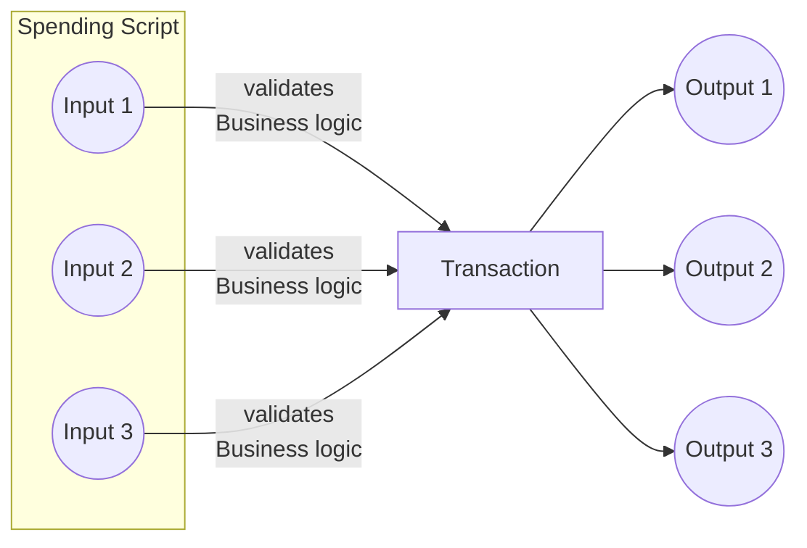

The solution involves the `Spending Validator` checking that the `Staking validator` is called in the same transaction, consolidating the logic to run once at the `Staking Validator`. This significantly reduces script size and simplifies business logic.


`Staking Validators` play a crucial role, not only in adding logic to stake control but also in minimizing script size and optimizing CPU and memory usage. 
It's essential to note that staking validators aren't a one-size-fits-all solution; careful evaluation is needed to determine if this design pattern aligns with your specific purpose.


## What are the main features of the Staking Account?

The Staking Account offers to users the ability to:

- Receive Staking Rewards: Users can earn rewards every epoch through the staking of their ADA holdings.
- Withdraw Staking Rewards: Allows users to withdraw their rewards accumulated through staking.
- Register Staking Credential
- Deregister Staking Credential
- Delegate to a Stake Pool

To comprehend the essence of the Staking Account, it is imperative to grasp the two foundational models within Cardano.

### The Cardano Model Demystified
Cardano operates on two primary models:
- The Extended Unspent Transaction Output (EUTXO) model:
    - Each unspent output is linked to a specific address. 
    - The spending of this input is controlled by a payment credential or a script credential
- The Accounting model (Staking):
    - Each utxo can be associated with an address containing an optional staking credential
    - Staking credential owners have control over delegation and possess the capability to withdraw rewards.

### What are the components of an Address?
Cardano address consists of two crucial components.
 - Payment Credential
    - Controls the spending of the UTXO associated with the payment credential address.
 - Staking Credential
    - Controls the registration, de-registration, delegation, and withdrawal of rewards 

Let's explore the representation of an address type in Plutus:

Constructing an Address involves specifying the Credential and optionally the StakingCredential
```haskell
data Address = 
  Address 
  { addressCredential :: Credential
  , addressStakingCredential :: Maybe StakingCredential 
  }
```

> Note: While it is possible to construct addresses without a staking credential, this document will not delve into that aspect.

### What are the component of a Script Address?
Addresses are not only used in wallet, but also in smart contracts, often referred to as scripts.

For the purpose of this article we are going to create an Script Address by hashing the Spending Validator and the Staking Validator. 

#### Constructing the Script address
In the below code we can see that our address is composed of the Spending Validator and Staking Validator
```haskell
scriptAddress = 
  Address 
    (ScriptCredential $ ScriptHash "SpendingValidatorHash") 
    (Just $ StakingHash $ ScriptCredential $ ScriptHash "StakingValidatorHash")
```

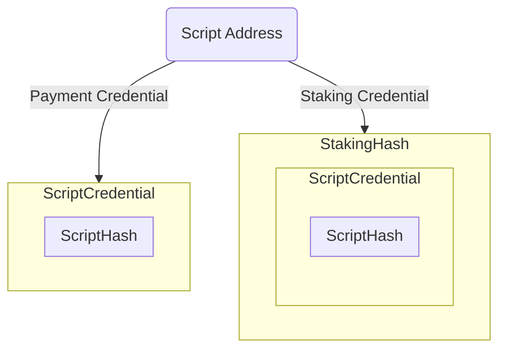
Once you have the script address and following your business logic, now you can lock assets along with datums into the Script Address, therefore associating the new EUTXO and the Script Address with both components `Payment Credential` and `Staking Credential`

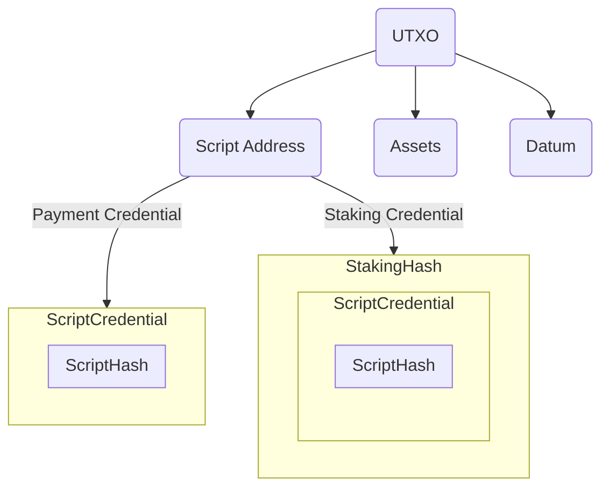
## Let's dive into the implementation

The strategy involves enforcing the spending validator to require invocation of staking validator, upon each attempted expenditure of the script input.
Following this, the staking validator assumes the responsibility of validating each spending script input to ensure strict adherence to the protocol specifications.

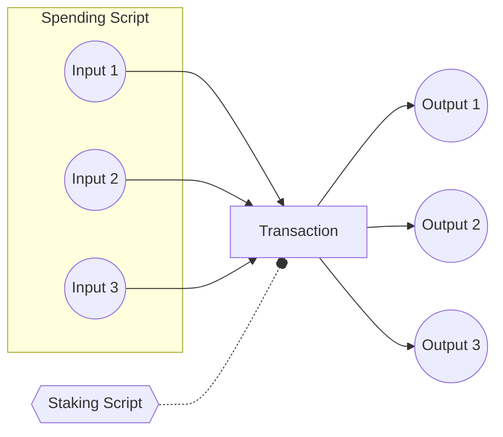

From the transaction we are going to specifically focus on the `ScriptContext`
This shared context is accessible to all validators within the transaction, enabling the enforcement of certain conditions, such as the presence of the `Staking Validator`.

Specifically, every `Spending Validator` is mandated to verify the existence of the `Staking Validator` within the transaction.

Consider the definition of the `ScriptContext` data type:

```haskell
data ScriptContext = 
  ScriptContext 
    { scriptContextTxInfo :: TxInfo
    , scriptContextPurpose :: ScriptPurpose 
    }
```

Within the `TxInfo` type, note the importance of the `txInfoWdrl :: Map StakingCredential Integer` field.

This field encapsulates a Map where each `StakingCredential` serves as a key, paired with its corresponding withdrawal amount as the associated value.
> Note: The `txInfoWdrl` contains all the staking credentials attempting to withdraw rewards from their staking accounts. Also keep in mind that the Map type in Plutus Core is implemented as a list of builtin pairs [^1].

[^1]: [https://github.com/input-output-hk/plutus/blob/d6382618ae38ce75cdef432e4974809ec466456e/plutus-tx/src/PlutusTx/Builtins/Internal.hs#L473-L476]

```haskell
data TxInfo = TxInfo
    { txInfoInputs          :: [TxInInfo] -- ^ Transaction inputs
    , txInfoReferenceInputs :: [TxInInfo] -- ^ Transaction reference inputs
    , txInfoOutputs         :: [TxOut] -- ^ Transaction outputs
    , txInfoFee             :: Value -- ^ The fee paid by this transaction.
    , txInfoMint            :: Value -- ^ The 'Value' minted by this transaction.
    , txInfoDCert           :: [DCert] -- ^ Digests of certificates included in this transaction
    , txInfoWdrl            :: Map StakingCredential Integer -- ^ Withdrawals
    , txInfoValidRange      :: POSIXTimeRange -- ^ The valid range for the transaction.
    , txInfoSignatories     :: [PubKeyHash] -- ^ Signatures provided with the transaction, attested that they all signed the tx
    , txInfoRedeemers       :: Map ScriptPurpose Redeemer
    , txInfoData            :: Map DatumHash Datum
    , txInfoId              :: TxId -- ^ Hash of the pending transaction (excluding witnesses)
    }
```
## Create a simple Spending Validator
To implement this validation requirement, a parameterized `Spending Validator` is created as follows:

```haskell
mkValidator :: StakingCredential -> Datum -> Redeemer -> ScriptContext -> Bool
mkValidator stakingCred _datum _redeemer context =
  case PlutusTx.AssocMap.lookup stakingCred $ txInfoWdrl txinfo of
    Just _ -> True
    Nothing -> PlutusTx.Prelude.error ()
  where
    txinfo = scriptContextTxInfo context
```

The `Spending Validator` utilizes the lookup function to verify the presence of `StakingCredential` of the required `Staking Validator` in `txInfoWdrl` field of `TxInfo`. This enforces invocation of the `Staking Validator`. If this lookup fails, spending of the corresponding UTXO will result in failure.

It's important to highlight that this approach is often referred to as the `withdraw zero trick`, but it does not enforce the user to withdraw a specific amount, therefore the logic remains independent of the withdrawal amount 

> Note: Please be aware that this validator serves only as a reference. There might be instances where your protocol does not necessarily require the staking validator to be present. This is particularly applicable in situations where, for example, you aim to facilitate a user's withdrawal of assets from the spending script. In such cases, the primary validation is ensuring that the user is appropriately signing the transaction.


## Validating the business logic at Staking Validator

As illustrated below, the spending script performs validation by ensuring the presence of the staking credential corresponding to the staking validator within the transaction.
The staking validator, in turn, is responsible for executing the protocol's business logic, which may vary based on the specific use case. 

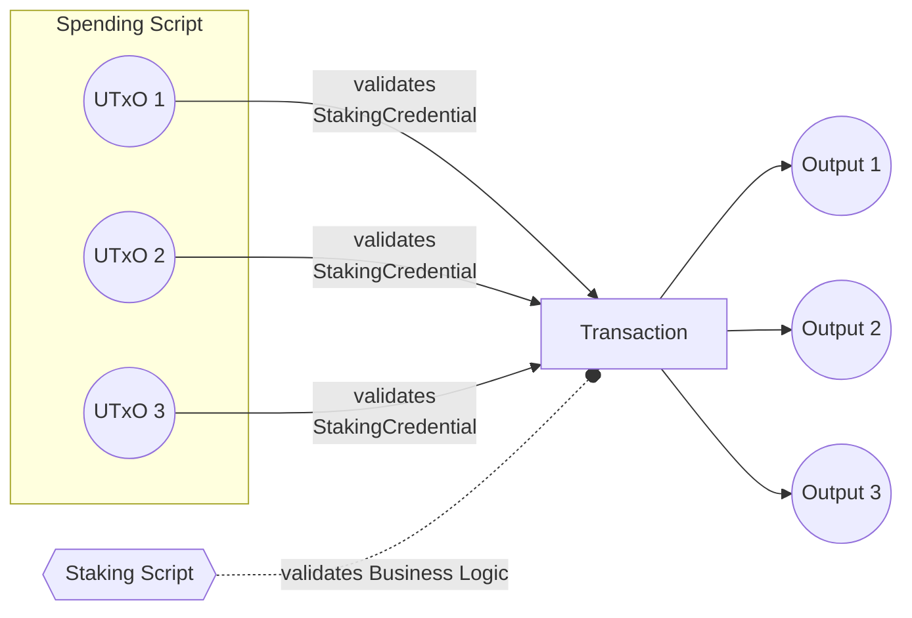

However it is a must to consider key components to ensure the efficiency and that there are no exploits in your protocol.

### Protect against Double Satisfaction exploit

In scenarios where the protocol necessitates spending from the script back to a specific output—such as returning funds from the script to the same script, directing them to another script, or transferring assets to a wallet, it is imperative to ensure that each script input is uniquely associated with an output. This preventive measure is essential for mitigating the risk of [Double Satisfaction Attack](https://plutus.readthedocs.io/en/latest/reference/writing-scripts/common-weaknesses/double-satisfaction.html?highlight=double#unique-outputs).

We have outlined some patterns 
1. Unique output datum tagging

The simplest implementation to ensure the uniqueness of the script outputs is by tagging the serialized input script outref at the output datum level. 
This prevents that the outputs remain distinct.
>Note: This tagging validation should be done at the spending validator.

2. Folding inputs

Consider taking all the inputs list and making sure each input in unique by folding the list and removing the element use,also within this fold function you must introduce your business logic.The drawback of using this folding pattern is that you input list must be return in the recursion of the computation, increasing the execution of your script.

3. Filter inputs using multi-validator

Another consideration involves filtering all inputs associated with the same spending script hash. This approach necessitates the parametrization of the staking validator with the spending script hash. 
When implementing this filtering mechanism, the staking validator requires the spending script hash as a parameter. Since the spending script inherently depends on the staking credential, introducing the spending script hash into the staking validator may not be possible due to the unidirectional dependency nature of the scripts.
One potential solution to this challenge is the implementation of a `Multi Validator`. By consolidating both the spending and staking validators, these dependencies can be unified. In this approach, the script hash and staking hash become identical, eliminating the problem posed by unidirectional dependencies.
In addition to this you must introduce a list of unique index at the redeemer level which corresponds to each input, and because this list is unique you can use it to validate unique outputs 

4. Unique redeemer inputs/ouputs index

Lastly you can use a redeemer containing one-to-one correlation between script input UTxOs and output UTxOs. This is provided via ordered lists of input/output indices of inputs/ouputs present in the Script Context.

```hs
data StakeValidatorRedeemer = StakeValidatorRedeemer
  { inputIdxs :: [Integer]
  , outputIdxs :: [Integer]
  }
```

For e.g.

```
Inputs     :  [scriptInputA, scriptInputC, randomInput3, scriptInputB, randomInput1, randomInput2]          // random inputs are not the concerned script inputs
Outputs    :  [outputA, outputB, outputC, randomOuput1, randomOutput2, randomOutput3]
InputIdxs  :  [0, 1, 3]
OutputIdxs :  [0, 1, 2]
```

Here the validator needs to check that there are no duplicate indices in either of the lists. While its easy to understand and declare indices of outputs (the order in which outputs appear in the tx builder), we cannot control the order of inputs as seen by the script. As inputs are sorted lexicographically based on their output reference, first by Tx#Id and then by Tx#Idx.


# STRICT and Checks

Strict-and-check

# Stake Validator Design pattern

## Table of Contents

- [Stake Validator Design pattern](#stake-validator-design-pattern)
  - [Table of Contents](#table-of-contents)
  - [How to use this document](#how-to-use-this-document)
  - [Introduction](#introduction)
  - [Why Staking Validators?](#why-staking-validators)
  - [What are the main features of the Staking Account?](#what-are-the-main-features-of-the-staking-account)
    - [The Cardano Model Demystified](#the-cardano-model-demystified)
    - [What are the components of an Address?](#what-are-the-components-of-an-address)
    - [What are the component of a Script Address?](#what-are-the-component-of-a-script-address)
      - [Constructing the Script address](#constructing-the-script-address)
  - [Let's dive into the implementation](#lets-dive-into-the-implementation)
  - [Create a simple Spending Validator](#create-a-simple-spending-validator)
  - [Validating the business logic at Staking Validator](#validating-the-business-logic-at-staking-validator)
    - [Protect against Double Satisfaction exploit](#protect-against-double-satisfaction-exploit)

## How to use this document
The documentation is organized sequentially, starting with basics and progressing to advanced topics for
building your smart contract application.
You can read it in any order or directly access pages relevant to your use case. 
A table of contents on the top facilitates easy navigation between sections.


> It is important to note that all types and functions will be exclusively defined in PlutusTx.
This approach aims to establish a common foundation, especially in the context of the growing variety of languages such as Plutarch, Aiken, etc.

## Introduction
In this comprehensive guide, you will discover how to strategically implement the Staking Validator design pattern to enhance your protocol's performance and introduce composability by employing the innovative "withdraw zero trick." 


##  Why Staking Validators?

Consider a scenario as described in the illustration below, with multiple UTXOs at a `Spending Validator`; if your entire protocol logic resides within it, the logic has to run for each UTXO, quickly reaching transaction limits and increasing CPU and memory usage.


The solution involves the `Spending Validator` checking that the `Staking validator` is called in the same transaction, consolidating the logic to run once at the `Staking Validator`. This significantly reduces script size and simplifies business logic.


`Staking Validators` play a crucial role, not only in adding logic to stake control but also in minimizing script size and optimizing CPU and memory usage. 
It's essential to note that staking validators aren't a one-size-fits-all solution; careful evaluation is needed to determine if this design pattern aligns with your specific purpose.


## What are the main features of the Staking Account?

The Staking Account offers to users the ability to:

- Receive Staking Rewards: Users can earn rewards every epoch through the staking of their ADA holdings.
- Withdraw Staking Rewards: Allows users to withdraw their rewards accumulated through staking.
- Register Staking Credential
- Deregister Staking Credential
- Delegate to a Stake Pool

To comprehend the essence of the Staking Account, it is imperative to grasp the two foundational models within Cardano.

### The Cardano Model Demystified
Cardano operates on two primary models:
- The Extended Unspent Transaction Output (EUTXO) model:
    - Each unspent output is linked to a specific address. 
    - The spending of this input is controlled by a payment credential or a script credential
- The Accounting model (Staking):
    - Each utxo can be associated with an address containing an optional staking credential
    - Staking credential owners have control over delegation and possess the capability to withdraw rewards.

### What are the components of an Address?
Cardano address consists of two crucial components.
 - Payment Credential
    - Controls the spending of the UTXO associated with the payment credential address.
 - Staking Credential
    - Controls the registration, de-registration, delegation, and withdrawal of rewards 

Let's explore the representation of an address type in Plutus:

Constructing an Address involves specifying the Credential and optionally the StakingCredential
```haskell
data Address = 
  Address 
  { addressCredential :: Credential
  , addressStakingCredential :: Maybe StakingCredential 
  }
```

> Note: While it is possible to construct addresses without a staking credential, this document will not delve into that aspect.

### What are the component of a Script Address?
Addresses are not only used in wallet, but also in smart contracts, often referred to as scripts.

For the purpose of this article we are going to create an Script Address by hashing the Spending Validator and the Staking Validator. 

#### Constructing the Script address
In the below code we can see that our address is composed of the Spending Validator and Staking Validator
```haskell
scriptAddress = 
  Address 
    (ScriptCredential $ ScriptHash "SpendingValidatorHash") 
    (Just $ StakingHash $ ScriptCredential $ ScriptHash "StakingValidatorHash")
```


Once you have the script address and following your business logic, now you can lock assets along with datums into the Script Address, therefore associating the new EUTXO and the Script Address with both components `Payment Credential` and `Staking Credential`


## Let's dive into the implementation

The strategy involves enforcing the spending validator to require invocation of staking validator, upon each attempted expenditure of the script input.
Following this, the staking validator assumes the responsibility of validating each spending script input to ensure strict adherence to the protocol specifications.


From the transaction we are going to specifically focus on the `ScriptContext`
This shared context is accessible to all validators within the transaction, enabling the enforcement of certain conditions, such as the presence of the `Staking Validator`.

Specifically, every `Spending Validator` is mandated to verify the existence of the `Staking Validator` within the transaction.

Consider the definition of the `ScriptContext` data type:

```haskell
data ScriptContext = 
  ScriptContext 
    { scriptContextTxInfo :: TxInfo
    , scriptContextPurpose :: ScriptPurpose 
    }
```

Within the `TxInfo` type, note the importance of the `txInfoWdrl :: Map StakingCredential Integer` field.

This field encapsulates a Map where each `StakingCredential` serves as a key, paired with its corresponding withdrawal amount as the associated value.
> Note: The `txInfoWdrl` contains all the staking credentials attempting to withdraw rewards from their staking accounts. Also keep in mind that the Map type in Plutus Core is implemented as a list of builtin pairs [^1].

[^1]: [https://github.com/input-output-hk/plutus/blob/d6382618ae38ce75cdef432e4974809ec466456e/plutus-tx/src/PlutusTx/Builtins/Internal.hs#L473-L476]

```haskell
data TxInfo = TxInfo
    { txInfoInputs          :: [TxInInfo] -- ^ Transaction inputs
    , txInfoReferenceInputs :: [TxInInfo] -- ^ Transaction reference inputs
    , txInfoOutputs         :: [TxOut] -- ^ Transaction outputs
    , txInfoFee             :: Value -- ^ The fee paid by this transaction.
    , txInfoMint            :: Value -- ^ The 'Value' minted by this transaction.
    , txInfoDCert           :: [DCert] -- ^ Digests of certificates included in this transaction
    , txInfoWdrl            :: Map StakingCredential Integer -- ^ Withdrawals
    , txInfoValidRange      :: POSIXTimeRange -- ^ The valid range for the transaction.
    , txInfoSignatories     :: [PubKeyHash] -- ^ Signatures provided with the transaction, attested that they all signed the tx
    , txInfoRedeemers       :: Map ScriptPurpose Redeemer
    , txInfoData            :: Map DatumHash Datum
    , txInfoId              :: TxId -- ^ Hash of the pending transaction (excluding witnesses)
    }
```
## Create a simple Spending Validator
To implement this validation requirement, a parameterized `Spending Validator` is created as follows:

```haskell
mkValidator :: StakingCredential -> Datum -> Redeemer -> ScriptContext -> Bool
mkValidator stakingCred _datum _redeemer context =
  case PlutusTx.AssocMap.lookup stakingCred $ txInfoWdrl txinfo of
    Just _ -> True
    Nothing -> PlutusTx.Prelude.error ()
  where
    txinfo = scriptContextTxInfo context
```

The `Spending Validator` utilizes the lookup function to verify the presence of `StakingCredential` of the required `Staking Validator` in `txInfoWdrl` field of `TxInfo`. This enforces invocation of the `Staking Validator`. If this lookup fails, spending of the corresponding UTXO will result in failure.

It's important to highlight that this approach is often referred to as the `withdraw zero trick`, but it does not enforce the user to withdraw a specific amount, therefore the logic remains independent of the withdrawal amount 

> Note: Please be aware that this validator serves only as a reference. There might be instances where your protocol does not necessarily require the staking validator to be present. This is particularly applicable in situations where, for example, you aim to facilitate a user's withdrawal of assets from the spending script. In such cases, the primary validation is ensuring that the user is appropriately signing the transaction.


## Validating the business logic at Staking Validator

As illustrated below, the spending script performs validation by ensuring the presence of the staking credential corresponding to the staking validator within the transaction.
The staking validator, in turn, is responsible for executing the protocol's business logic, which may vary based on the specific use case. 


However it is a must to consider key components to ensure the efficiency and that there are no exploits in your protocol.

### Protect against Double Satisfaction exploit

In scenarios where the protocol necessitates spending from the script back to a specific output—such as returning funds from the script to the same script, directing them to another script, or transferring assets to a wallet, it is imperative to ensure that each script input is uniquely associated with an output. This preventive measure is essential for mitigating the risk of [Double Satisfaction Attack](https://plutus.readthedocs.io/en/latest/reference/writing-scripts/common-weaknesses/double-satisfaction.html?highlight=double#unique-outputs).

We have outlined some patterns 
1. Unique output datum tagging

The simplest implementation to ensure the uniqueness of the script outputs is by tagging the serialized input script outref at the output datum level. 
This prevents that the outputs remain distinct.
>Note: This tagging validation should be done at the spending validator.

2. Folding inputs

Consider taking all the inputs list and making sure each input in unique by folding the list and removing the element use,also within this fold function you must introduce your business logic.The drawback of using this folding pattern is that you input list must be return in the recursion of the computation, increasing the execution of your script.

3. Filter inputs using multi-validator

Another consideration involves filtering all inputs associated with the same spending script hash. This approach necessitates the parametrization of the staking validator with the spending script hash. 
When implementing this filtering mechanism, the staking validator requires the spending script hash as a parameter. Since the spending script inherently depends on the staking credential, introducing the spending script hash into the staking validator may not be possible due to the unidirectional dependency nature of the scripts.
One potential solution to this challenge is the implementation of a `Multi Validator`. By consolidating both the spending and staking validators, these dependencies can be unified. In this approach, the script hash and staking hash become identical, eliminating the problem posed by unidirectional dependencies.
In addition to this you must introduce a list of unique index at the redeemer level which corresponds to each input, and because this list is unique you can use it to validate unique outputs 

4. Unique redeemer inputs/ouputs index

Lastly you can use a redeemer containing one-to-one correlation between script input UTxOs and output UTxOs. This is provided via ordered lists of input/output indices of inputs/ouputs present in the Script Context.

```hs
data StakeValidatorRedeemer = StakeValidatorRedeemer
  { inputIdxs :: [Integer]
  , outputIdxs :: [Integer]
  }
```

For e.g.

```
Inputs     :  [scriptInputA, scriptInputC, randomInput3, scriptInputB, randomInput1, randomInput2]          // random inputs are not the concerned script inputs
Outputs    :  [outputA, outputB, outputC, randomOuput1, randomOutput2, randomOutput3]
InputIdxs  :  [0, 1, 3]
OutputIdxs :  [0, 1, 2]
```

Here the validator needs to check that there are no duplicate indices in either of the lists. While its easy to understand and declare indices of outputs (the order in which outputs appear in the tx builder), we cannot control the order of inputs as seen by the script. As inputs are sorted lexicographically based on their output reference, first by Tx#Id and then by Tx#Idx.

# Transaction Level Validation via Minting policies

Transaction-level-validation-minting-policy

# Transaction Level Validation via Minting Policies

## Introduction

When crafting transactions to process a single script (smart contract) UTxO, enforcing spending
requirements seems straightforward. However, in high-throughput applications, a more efficient
approach is desired – allowing the processing (spending) of these script UTxOs in a "batch."
Unfortunately, invoking the validator script for each input UTxO in a transaction repeats
pre-processing steps, making it less optimal. To overcome this, the technique of "transaction level
validation" is employed.

For a detailed implementation of transaction level validation using staking validators, refer to the
[Stake Validator Design pattern](STAKE-VALIDATOR.md). This document outlines the details of
implementing the same pattern via minting policies.

## The Problem

A batch transaction involves multiple input UTxOs at a specific script address, and spending can
only occur when specific conditions apply (i.e., the validator function does not reject the
transaction). In this scenario, the validator script is executed for each UTxO, and the transaction
fails if any of the scripts reject it.

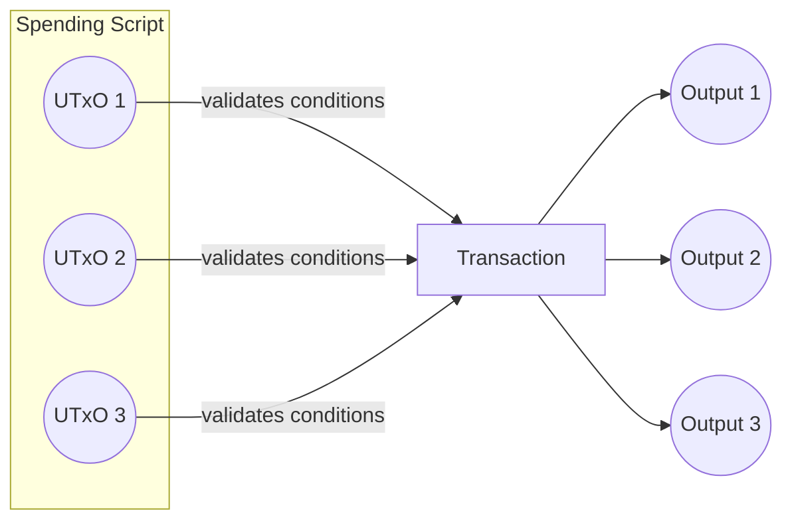

## The Solution

A more efficient way to perform all the validations is by delegating them to a minting script, which
will only be executed once for the entire transaction.

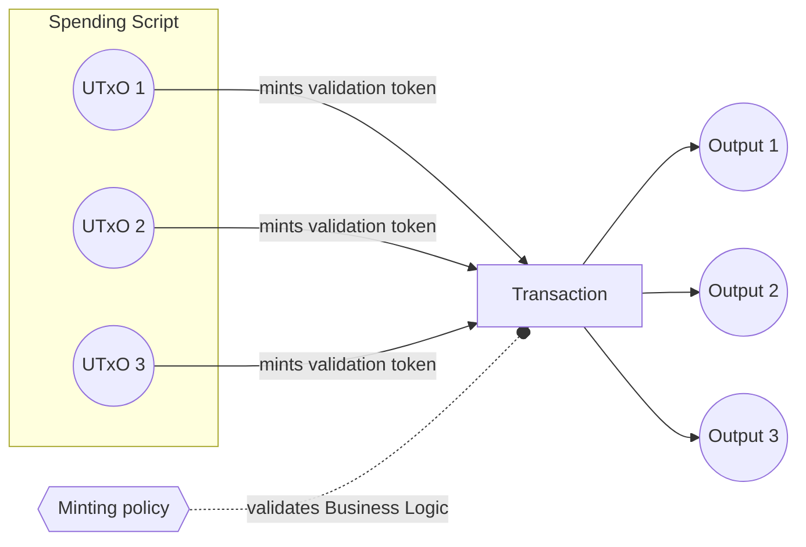

The drawback of this approach is that the minted validation tokens must be included in one of the
outputs, potentially consuming unnecessary block space.

A more desirable solution involves burning the validation tokens instead of minting them in the
batch transaction. However, this requires minting and storing the validation tokens in the input
UTxOs beforehand, allowing for pre-validation steps attached to their creation.

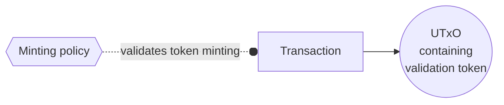

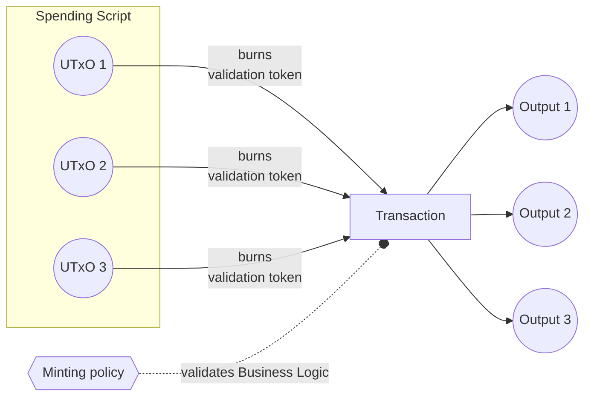

## Conclusion

Transaction level validation can be implemented using minting policies. However, if minting
validation tokens is impractical, the recommended approach is to implement transaction level
validation using a staking validator due to lower ExUnits cost compared to minting policy checks,
based on our experience.

# Taxinfomint Normalization

Taxinfomint-normalization

# TxInfoMint Normalization: Simplifying Cardano Token Validation

## Introduction

Cardano, a blockchain platform, presents a challenge for developers when it comes to token
validation. Specifically, Cardano nodes always append a 0 Lovelace value to the txInfoMint value in
the script context. This seemingly innocuous addition can lead to additional and unnecessary
iterations over the value for validators, especially those relying on minting policies. This article
explores the problem and introduces a solution through the concept of txInfoMint normalization.

## The Problem

In Cardano smart contract development, validators are crucial components that enforce
transaction-specific conditions. Consider the following Haskell code snippet:

```haskell
validator :: CurrencySymbol -> Datum -> Redeemer -> ScriptContext -> Bool
validator ourPolicy datum redeemer context =
  traceIfFalse "should only mint our token" (symbols mint == [ourPolicy])
 where
  info :: TxInfo
  info = scriptContextTxInfo ctx

  mint :: Value
  mint = txInfoMint info
```

At first glance, one might assume that this validator accepts transactions only minting the
"ourPolicy" token. However, this is misleading. The validator will only succeed if no tokens are
minted, and "ourPolicy" corresponds to the "adaSymbol" (empty string). This is because the ledger
automatically adds a zero amount Ada entry to all Value fields in the script context (including the
txInfoMint field).

## The Solution

To address this issue and promote clearer and more straightforward code, a pattern has been
implemented in a library. The key idea is to normalize the txInfoMint value, mitigating the
unintended consequences of the automatic addition of 0 Lovelace. Let's see how this library can
simplify the validator function:

```haskell
validator :: CurrencySymbol -> Datum -> Redeemer -> ScriptContext -> Bool
validator ourPolicy datum redeemer context =
  traceIfFalse "should only mint our token" (symbols mint == [ourPolicy])
 where
  info :: TxInfo
  info = scriptContextTxInfo ctx

  mint :: Value
  mint = normalizeMint $ txInfoMint info
```

By incorporating the normalizeMint function from the library, developers can ensure that their
validators behave as expected without being affected by the automatic addition of 0 Lovelace.

## Conclusion

In the dynamic landscape of blockchain development, subtle nuances can have significant impacts on
smart contract behavior. The txInfoMint normalization solution presented here addresses a specific
challenge in Cardano scripting, offering developers a more reliable and intuitive approach to token
validation. As Cardano continues to evolve, such libraries and patterns contribute to the
ecosystem's robustness and facilitate the creation of secure and user-friendly decentralized
applications.

# UTXO INDEXER

# UTxO Indexer Design Pattern: Enhancing Smart Contract Validation on Cardano 

## Introduction 

In the Cardano blockchain, the UTxO (Unspent Transaction Output) model is fundamental to the functioning of smart contracts. 
The UTxO model defines how transactions are structured, consuming existing UTxOs as inputs and producing
new ones as outputs. This article explores the UTxO Indexer design pattern, focusing on its
application to streamline the validation process for complex transactions.

## Singular Input Processing

The foundational concept of smart contract validation in Cardano begins with singular input
processing. In its simplest form, validators, or smart contracts, are designed to validate
transactions that consist of a single input and optionally a single output. The following
illustrates this basic structure:

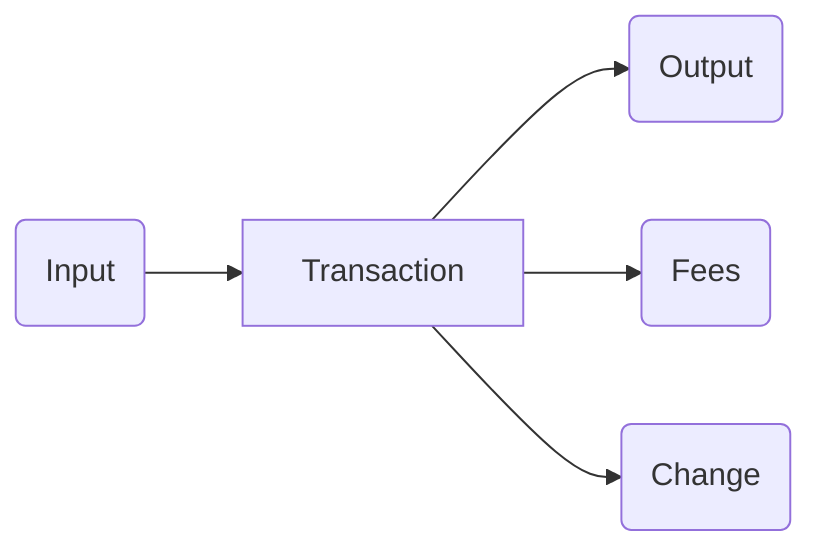

This straightforward scenario provides a clear validation path, making it relatively simple for the
smart contract to verify and process the transaction.

The code for the validator in this case would be something like this:

```haskell
validatorA :: Datum -> Redeemer -> ScriptContext -> Bool
validatorA datum redeemer context =
  let input    = findOwnInput         context
      [output] = getContinuingOutputs context
  in  validateWithInputOutput input output
    where
    findOwnInput :: ScriptContext -> Maybe TxInInfo
    findOwnInput ScriptContext{scriptContextTxInfo=TxInfo{txInfoInputs},                   
                           scriptContextPurpose=Spending txOutRef} =
        find (\TxInInfo{txInInfoOutRef} -> txInInfoOutRef == txOutRef) txInfoInputs
    findOwnInput _ = Nothing
```
Note that `findOwnInput` checks the `TxOutRef` of each input to identify the one currently being validated. In this case, the check (comparing `TxOutRef`) is relatively cheap, but often you will want to search for an input / output with more complex criteria ie:

```haskell
validatorB :: AssetClass -> BuiltinData -> BuiltinData -> ScriptContext -> () 
validatorB stateToken _ _ ctx =
  let ownInput   = findOwnInput ctx
      authInput  = findAuth ctx  
      goodOutput = findOutputWithCriteria ctx
   in validate ownInput authInput goodOutput
    where
    findAuth :: ScriptContext -> Maybe TxInInfo
    findAuth ScriptContext{scriptContextTxInfo=TxInfo{txInfoInputs},                   
                           scriptContextPurpose=Spending txOutRef} =
        find (\TxInInfo{txInOutput} -> assetClassValueOf stateToken (txOutValue txInOutput) == 1) txInfoInputs
    findAuth _ = Nothing

    findOutputWithCriteria :: ScriptContext -> Maybe TxInInfo
    findOutputWithCriteria ScriptContext{scriptContextTxInfo=TxInfo{txInfoOutputs}} = find (\txOut -> criteria txOut) txInfoOutputs 
```

Using the redeemer indexing design pattern we can avoid needing to make these checks for each input / output, instead we pass the index of the input / output we are looking into the redeemer then we just make our checks for the element at that index:
```haskell
validatorA :: AssetClass -> BuiltinData -> Integer -> ScriptContext -> () 
validatorA stateToken _ tkIdx ctx =  assetClassValueOf stateToken (txInInfoResolved (elemAt tkIdx (txInfoInputs (txInfo ctx)))) == 1 
```

## Multiple Inputs and Outputs

However, as the need for increased throughput arises, smart contracts may require the ability to
handle multiple inputs and outputs within a single transaction. This batch processing capability can
significantly improve efficiency. Consider the following example:

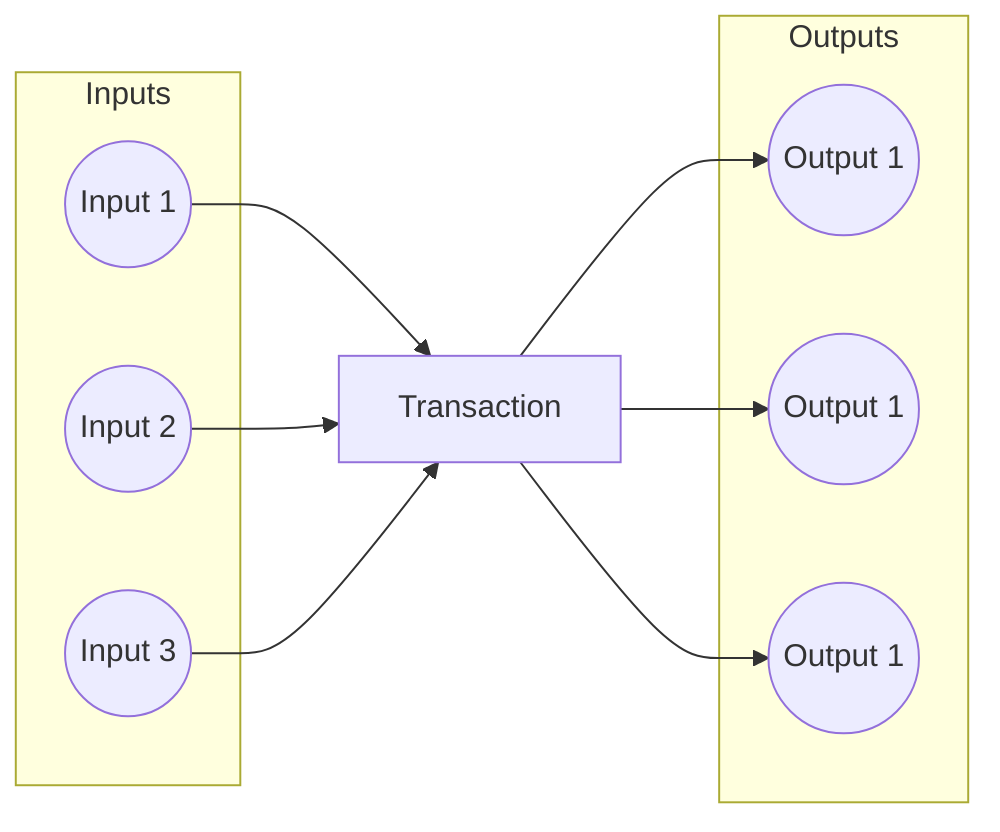

While this approach enhances throughput, it introduces a challenge for the validator. Determining
how inputs and outputs are paired and the order in which they should be processed becomes complex
and potentially costly.

To avoid unintended consequences, the following vulnerabilities must be considered:
- Multiple satisfaction: a single output (or input) can be paired with multiple inputs, which
  individually satisfies the validator, but in a whole can lead to value being lost (stolen).
- Unaccounted outputs: while the validator functions are executed for all inputs, there are no
  checks that are ocurring implicitly for outputs, hence adding more unforeseen outputs to an
  otherwise valid transaction can lead to unexpected/unwanted behaviour.
- Other vulnerabilities are also possible, of course,
  [here](https://library.mlabs.city/common-plutus-security-vulnerabilities) is a good article to
  most of the uncovered ones.

## UTxO Indices in Redeemer

To address the challenges posed by multiple inputs and outputs, the UTxO Indexer design pattern
introduces the use of UTxO indices within the redeemer. The redeemer is a component of a transaction
that carries additional data required for smart contract validation. In this context, the indices of
script inputs and their corresponding outputs are included within the redeemer.

```haskell
data MyRedeemer = MyRedeemer
  { ioIndices :: [(Integer, Integer)] -- [(inputIndex, outputIndex)]
  }

validator :: Datum -> MyRedeemer -> ScriptContext -> Bool
validator datum redeemer context =
  all validateWithIndices indices && allIndicesAccountedFor indices
 where
  indices = ioIndices redeemer
  txInfo  = scriptContextTxInfo context
  inputs  = txInfoInputs  txInfo
  outputs = txInfoOutputs txInfo
  validateWithIndices (inputIndex, outputIndex) =
    let input  = inputs `elemAt` inputIndex
        output = outputs `elemAt` outputIndex
    in  validateWithInputOutput input output
```

By incorporating UTxO indices in the redeemer, the validator gains the ability to more effectively
sort and pair inputs and outputs during the validation process. Additionally, the validator needs to
ensure that no input or output is used more than once, and that indices are not missing.

To achieve this, the implementation to be presented in this repository aims to tackle all the checks
mentioned above, and the pattern is integrated with a transaction level validation pattern
("Transaction level validation for spending validators via stake validators using the withdraw zero
trick" or "Transaction level validation for spending validators via minting policies") to achieve
the best possible throughput.

Also, while the ordering of outputs are preserved (the validator gets them in the same order, in
which the builder of the transaction provided them), the inputs are re-ordered before the validator
receives them. The good news is that this re-ordering is deterministic, it can be taken into account
by the transaction builder before sending the transaction to a node for inclusion in the blockchain.
The inputs are ordered by the id of the UTxO (which consists of the creating transaction hash and the
index of its output) lexicographically, first by transaction hash and then by output index. For the 
transaction builder to determine the indices of the inputs, it needs to order them in the same way 
before creating the redeemer.

## Conclusion

The UTxO Indexer design pattern offers a powerful solution to the challenges posed by transactions
with multiple inputs and outputs. By leveraging UTxO indices within the redeemer, smart contracts on
the Cardano blockchain can achieve greater throughput without compromising on the efficiency and
integrity of the validation process. This pattern exemplifies the adaptability and scalability of
smart contract design in the evolving landscape of blockchain technologies.


# Validity Range Normalization

# Validity Range Normalization: Ensuring Consistency in Plutus Smart Contracts

## Introduction

In the intricate landscape of developing validators for the Cardano protocol, one encounters the
necessity to implement checks that meticulously consider time-related factors. To circumvent the
redundancy of executing smart contract code multiple times, Cardano has devised an approach that
sets it apart from other blockchains. Specifically, validators, at runtime, are intentionally
deprived of direct access to the current time. Instead, they are equipped with information solely
about the validity range of a transaction. This design choice guarantees that a transaction is only
admitted to the chain within its designated validity range. Consequently, smart contracts can
implement checks based on the current time, while maintaining computational purity—wherein functions
exhibit mathematical purity devoid of side-causes or side-effects.

## The Problem

The representation of validity ranges in Plutus introduces a subtle complexity with its lower and
upper bounds, both capable of assuming the extremal values of `-∞` and `+∞`. Additionally, a boolean
flag signifies whether the range is open or closed at each end. This flexibility, however, leads to
multiple representations of the same validity range. For instance, the range `(a, b)` (open on both
ends) is equivalent to the range `[a+1, b-1]` (closed on both ends) if both a and b are finite.
Further complexity arises from the fact that infinite ranges are occasionally represented as closed
on the "open" sides. For example, the always range is (at the time of writing) denoted as `[-∞,
+∞]`, despite the inconsistency with the actual time values that do not include `-∞` or `+∞`.

This ambiguity can potentially result in unintended consequences for validators ill-equipped to
handle these diverse representations. Moreover, as the standard method of communicating the range
may change with any hard fork, long-lived smart contracts must be designed to accommodate various
representations to prevent funds from being indefinitely locked within them.

An example on how to handle every case correctly:

```haskell
isTimeValid :: Datum -> POSIXTimeRange -> Bool
isTimeValid datum (Interval (LowerBound (Finite l) False) (UpperBound (Finite u) False)) = ...
isTimeValid datum (Interval (LowerBound NegInf     False) (UpperBound (Finite u) False)) = ...
isTimeValid datum (Interval (LowerBound (Finite l) False) (UpperBound PosInf     False)) = ...
isTimeValid datum (Interval (LowerBound PosInf     False) (UpperBound (Finite u) False)) = ...
...
isTimeValid datum (Interval (LowerBound PosInf True) (UpperBound PosInf True)) = ...
```

## The Solution

In our endeavor to establish best practices, we advocate for the adoption of normalized versions of
validity ranges within the design patterns library. We propose incorporating functions that
facilitate the normalization procedure to ensure consistency in the representation of these ranges.
The recommended formats for normalized validity ranges are as follows:

`[a, b]`: Denotes a closed range if both a and b are finite.  
`(-∞, x]` and `[x, +∞)`: Represents a half-open range on the infinite side, where x is a finite value.  
`(-∞, +∞)`: Signifies an open range on both sides, specifically used for the representation of the
always range, aligning with the standard convention in mathematics.

With this the example above can be implemented in a much cleaner way:

```haskell
isTimeValid :: Datum -> POSIXTimeRange -> Bool
isTimeValid datum r =
  case normalizedTimeRange r of
    ClosedRange l u -> ...
    FromNegInf    u -> ...
    ToPosInf    l   -> ...
    Always          -> ...
```


2. Aiken-Linked List

# Table of contents
Link: https://github.com/Anastasia-Labs/aiken-linked-list/tree/main

<!-- markdown-toc start - Don't edit this section. Run M-x markdown-toc-refresh-toc -->
# Table of Contents

- [Aiken Linked List](#aiken-linked-list)
  - [Introduction](#introduction)
  - [Documentation](#documentation)
    - [Linked List](#linked-list)
    - [Aiken Linked List](#aiken-linked-list-implementation)
  - [Getting Started](#getting-started)
    - [Prerequisites](#prerequisites)
    - [Building and Developing](#building-and-developing)
  - [Sample Validator](#sample-validator)
  - [Case study](#case-study)
  - [Acknowledgments](#acknowledgments)

<!-- markdown-toc end -->

# Aiken Linked List

## Introduction

Linked list structures leverage the EUTXO model to enhancing scalability and throughput significantly. By linking multiple UTXOs together through a series of minting policies and validators, it can improve the user experience interacting with smart contract concurrently.

This project is funded by the Cardano Treasury in [Catalyst Fund 10](https://projectcatalyst.io/funds/10/f10-osde-open-source-dev-ecosystem/anastasia-labs-the-trifecta-of-data-structures-linked-lists-tries-and-linked-lists-for-cutting-edge-contracts) and is aimed at enhancing the capabilities of Cardano smart contracts in handling complex data structures.

## Documentation

### Linked List

The Aiken Linked List is an on-chain, sorted linked list solution designed for blockchain environments, specifically utilizing NFTs (Non-Fungible Tokens) and datums. It provides a structured and efficient way to store and manipulate a list of key/value pairs on-chain.


#### Entry Structure

Each entry in the list comprises:

- **NFT**: A unique identifier for each entry.
- **EntryDatum**: A data structure containing the key/value pair, a reference to the entry's NFT, and a pointer to the next NFT in the list.

#### EntryDatum Definition

```haskell
data EntryDatum = EntryDatum {
  key :: BuiltinByteString,
  value :: Maybe SomeValue,
  nft :: NFT,
  next :: Maybe NFT
}
```

- **key**: A unique identifier for the entry.
- **value**: The value associated with the key. It can be Nothing for the head entry.
- **nft**: The NFT representing the entry.
- **next**: The NFT of the next entry in the list, or Nothing for the last entry.

#### Operations

##### Inserting an Entry


Insertion involves:

- **Inputs**: Two adjacent list entries.
- **Outputs**:
  - The first input entry, modified to point to the new entry.
  - The newly inserted entry, pointing to the second input entry.
  - The second input entry, unchanged.

Validation Rules

- Keys must maintain the order: a < b < c, where a is the lowest, b is the new key, and c is the highest.
- The pointers must be correctly updated to maintain list integrity.

##### Removing an Entry


To remove an entry:

- **Inputs**: The entry to remove and its preceding entry.
- **Output**: The preceding entry is modified to point to what the removed entry was pointing to.

#### Utilizing NFTs as Pointers

NFTs serve as robust and unique pointers within the list. Their uniqueness is ensured by a specific minting policy related to the list's head NFT.

#### Key Considerations

- **Efficiency**: As on-chain lookups are inefficient, off-chain structures are recommended for this purpose.
- **Datum Hashes**: Not suitable for pointers due to the complexity of updates and security concerns.
- **Security**: The integrity of the list is maintained through careful minting policies and entry validation.

#### Advanced Features

- **[Forwarding Minting Policy](https://github.com/Plutonomicon/plutonomicon/blob/main/forwarding1.md)**: A feature of Plutus to control NFT minting dynamically.
- **List Head**: Utilizes an empty head entry for validating insertions at the start of the list.
- **End-of-List Insertions**: Handled by ensuring the last entry points to Nothing.

### Aiken Linked List implementation

The Aiken Linked List implementation provides several functions to create and manipulate Linked List. Below is a brief overview of each function:

- `init`: Constructs the Linked List head
- `deinit`: Destructs the Linked List
- `insert`: Inserts a node into the linked list
- `remove`: Removes a node from the linked list

## Getting Started

### Prerequisites

Before you begin, ensure you have [aiken](https://aiken-lang.org/installation-instructions) installed on your system.

### Building and developing

Once Aiken is installed, you should be able to seamlessly use the repository to
develop, build and run packages.

Download the Git repository:

```sh
git clone https://github.com/Anastasia-Labs/aiken-linked-list.git
```

Navigate to the repository directory:

```sh
cd aiken-linked-list
```

Execute the test suite:

```sh
aiken check
```

Build:

```sh
aiken build
```


# Sample validator

For a complete example, including tests and further explanations, reger to the provided sample validator: [sample.ak](validators/sample.ak).

# Case study

Linked list can be leveraged in smart contract applications where the order of inputs is not crucial, and multiple users can interact with the contracts simultaneously. For example, consider a decentralized voting system where users can cast their votes concurrently. A linked list data structure can be employed to store and manage the votes efficiently. Each user's vote can be represented as a node in the linked list, containing relevant information such as the user's address and their chosen candidate.

# Acknowledgments

This documentation and the implementation of the Aiken Linked List draw inspiration from an original idea presented in the Plutonomicon. We acknowledge the innovative concepts and approaches outlined in their work, specifically regarding associative data structures on blockchain platforms.

For further details on the foundational ideas and their context, please refer to the Plutonomicon's overview of associative data structures: [Plutonomicon's Associative Data Structures Overview](https://github.com/Plutonomicon/plutonomicon/blob/main/assoc.md#overview).

We express our gratitude to the creators and contributors of the Plutonomicon for their pioneering work in this area, which has significantly influenced the development of our Aiken Linked List.


3. Aiken trie
Link: https://github.com/Anastasia-Labs/aiken-trie

<!-- markdown-toc start - Don't edit this section. Run M-x markdown-toc-refresh-toc -->

# Table of Contents

- [Aiken Trie](#aiken-trie)
  - [Introduction](#introduction)
  - [Documentation](#documentation)
    - [Trie](#trie)
    - [Aiken Trie](#aiken-trie-implementation)
  - [Getting Started](#getting-started)
    - [Prerequisites](#prerequisites)
    - [Building and Developing](#building-and-developing)
  - [Tutorial](#tutorial)
    - [How to use](#how-to-use)
  - [Testing](#testing)
  - [Case study](#case-study)

<!-- markdown-toc end -->

# Aiken Trie

## Introduction

The Aiken Trie project provides a Aiken-based implementation of Distributed Tries for the Cardano blockchain. This project allows developers to leverage the security and efficiency of Tries in their Cardano smart contracts, ensuring data integrity and efficient data verification. This project uniquely allows scalable data structures across multiple utxos, with a developer-friendly typescript api.

This project is funded by the Cardano Treasury in [Catalyst Fund 10](https://projectcatalyst.io/funds/10/f10-osde-open-source-dev-ecosystem/anastasia-labs-the-trifecta-of-data-structures-tries-tries-and-linked-lists-for-cutting-edge-contracts) and is aimed at enhancing the capabilities of Cardano smart contracts in handling complex data structures.

## Documentation

### Trie

A trie, also known as a prefix tree or digital tree, is a kind of search tree—an ordered tree data structure used to store a dynamic set or associative array where the keys are usually strings. Unlike a binary search tree, no node in the tree stores the key associated with that node; instead, its position in the tree defines the key with which it is associated. This makes tries extremely useful for applications like autocomplete systems, spell checkers, and IP routing. Here's a detailed explanation:

#### Basic concept

A Trie is a type of search tree, an ordered tree data structure that is used to store a dynamic set or associative array where the keys are usually strings. Here's how it's structured:

- **Leaf Nodes**: These are the nodes at the bottom of the tree that contain values associated with the keys. The keys are formed by the path from the root to the leaf.
- **Non-Leaf (Intermediate) Nodes**: These nodes contain the common prefixes of the keys or parts of them. They help in reducing the search space for a query.
- **Root Node**: The single node at the top of the tree represents the starting point of every key stored in the trie. It is usually empty.

#### Key Encoding

The core of a Trie is its key encoding mechanism. This mechanism takes input keys of any size and encodes them into a path through the Trie. Each character or byte of the key represents a step down the Trie, from the root towards the leaves.

#### Construction

- **Inserting Keys**: Keys are inserted by walking through the Trie according to the encoded path of the key. If a path does not exist, new nodes are created to accommodate it.
- **Node Structure**: Each node in the Trie can have several children, each representing a possible continuation of the key. The value associated with a key is stored in the leaf node at the end of its path.
- **Prefix Sharing**: Nodes share common prefixes, which makes Tries highly space-efficient for datasets with keys that share common prefixes.

#### Features

- **Efficiency in Search Operations**: Tries allow for efficient search operations, including lookups, insertions, and deletions, all with time complexity proportional to the length of the key.
- **Prefix Matching**: Tries excel at prefix matching, allowing for quick searches of all keys that share a common prefix, which is useful for autocomplete systems and spell checkers.
- **Space Efficiency**: By sharing common prefixes among keys, Tries use space more efficiently than other data structures like hash tables, especially when the dataset contains many similar keys.

#### Example

Consider a Trie with the keys "car", "cat", and "dog":
The structure of the Trie after inserting the keys "car", "cat", and "dog" would look something like this:

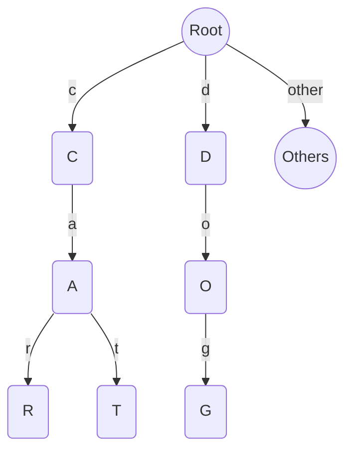

Imagine the Trie as a tree where each node represents a character. The root node is empty and branches out to three paths: one for "c", one for "d", and potentially others for different starting letters of keys not shown in this example. The "c" node branches into "a", which further branches into "r" and "t" to form the words "car" and "cat". Each of these nodes, "r" and "t", would be leaf nodes for "car" and "cat", respectively, possibly containing values or simply marking the end of the word. Similarly, the "d" node branches into "o", which then branches into "g", forming the word "dog" with "g" as its leaf node. This structure allows for efficient searching, adding, and deleting of keys by following the branches corresponding to each character in the key.

This visual representation helps understand how Tries optimize space and search time, especially with a large number of keys sharing common prefixes. By sharing the initial "ca" in "car" and "cat", the Trie saves space compared to storing each word independently. This efficiency becomes more pronounced with a larger dataset with more shared prefixes.

### Aiken Trie implementation

The Aiken Trie implementation is a smart contract solution that allows the creation of many distributed trie's from a single validator. You may attach additional business logic via the

## Getting Started

### Prerequisites

Before you begin, ensure you have [Bun](https://bun.sh), or equivalent installed on your system. This trie implementation comes as a low-level typescript SDK which can be used with your typescript projects.

### Building and developing

You should be able to seamlessly use the repository to
develop, build and run aiken-trie.

Download the Git repository:

```sh
git clone https://github.com/Anastasia-Labs/aiken-trie.git
```

Navigate to the repository directory:

```sh
cd aiken-trie
```

Build:

```sh
bun run build
```

Execute the test suite:

```sh
bun test
```


# Tutorial

## How to use

This guide demonstrates how to use the Trie for blockchain applications using lucid.

### Creating and Utilizing a Trie

1.Constructing the Trie

```ts
const trie = await createTrie(lucid, trieAddress, trieRewardAddress);
```

2. Appending a new element to the Trie

```ts
const trieOrigin = await getTrieOrigin(lucid, trie.trieUnit, trieAddress);
const trieUtxo = await getUtxoByKey(lucid, trie.trieUnit, "", trieAddress);
await appendTrie(
  lucid,
  trie.trieUnit,
  trieOrigin!,
  trieUtxo!,
  "hello_world",
  trieAddress,
  trieRewardAddress,
);
```

3. Inserting an element between a parent and a child

```ts
let newTrieUtxo = await getUtxoByKey(lucid, trie.trieUnit, "", trieAddress);
await betweenTrie(
  lucid,
  trie.trieUnit,
  trieOrigin!,
  newTrieUtxo!,
  "hello",
  trieAddress,
  trieRewardAddress,
);
```

### Aiken On Chain

The aiken on-chain is a reusable smart contract which doesn't need any modification or redeployment. You can write logical extensions in withdrawal validators, which uses the withdraw 0 trick.

The core script will require the invocation of your withdrawal validator if you initialise a trie with it correctly. 

### Sample usage

The main test file has e2e usage of the trie distributed structure here: [main.test.ts](/tests/main.test.ts).

## Testing

Testing is documented literately in the [main test file](/tests/main.test.ts).

4. Aiken merkle Tree
<!-- markdown-toc start - Don't edit this section. Run M-x markdown-toc-refresh-toc -->
# Table of Contents

- [Aiken Merkle Tree](#aiken-merkle-tree)
  - [Introduction](#introduction)
  - [Documentation](#documentation)
    - [Merkle Tree](#merkle-tree)
    - [Aiken Merkle Tree](#aiken-merkle-tree-implementation)
  - [Getting Started](#getting-started)
    - [Prerequisites](#prerequisites)
    - [Building and Developing](#building-and-developing)
  - [Sample validator](#sample-validator)
  - [Case study](#case-study)
- [Acknowledgments](#acknowledgments)

<!-- markdown-toc end -->

# Aiken Merkle Tree

## Introduction

The Aiken Merkle Tree project provides a Plutarch-based implementation of Merkle Trees for the Cardano blockchain. This project allows developers to leverage the security and efficiency of Merkle Trees in their Cardano smart contracts, ensuring data integrity and efficient data verification.

This project is funded by the Cardano Treasury in [Catalyst Fund 10](https://projectcatalyst.io/funds/10/f10-osde-open-source-dev-ecosystem/anastasia-labs-the-trifecta-of-data-structures-merkle-trees-tries-and-linked-lists-for-cutting-edge-contracts) and is aimed at enhancing the capabilities of Cardano smart contracts in handling complex data structures.

## Documentation

### Merkle Tree

A Merkle tree, named after its inventor Ralph Merkle, is a fundamental data structure in computer science and cryptography. It's particularly well-suited for managing and verifying large data structures, especially in distributed systems like blockchain technologies. Here's a detailed explanation:

#### Basic concept

A Merkle tree is a type of binary tree, consisting of nodes. Here's how it's structured:

- **Leaf Nodes**: These are the bottom-most nodes in the tree and contain hashed data. The data could be transactions (as in blockchain), files, or any data chunks.
- **Non-Leaf (Intermediate) Nodes**: These nodes store a cryptographic hash of the combined data of their child nodes.
- **Root Node**: The single node at the top of the tree contains a hash formed by its child nodes, ultimately representing the hashes of all lower levels.

#### Hash function

The core of a Merkle tree is the hash function (like SHA-256 in Bitcoin). This function takes digital data of any size and produces a fixed-size string of bytes, typically a unique digital fingerprint of the input data.

#### Construction

- **Hashing the Data**: First, each piece of data at the leaf level is hashed.
- **Pairing and Hashing Upwards**: These hashes are then paired and concatenated, and the resultant string is hashed again. This process continues until you reach the single hash at the top - the root hash.
- **Tree Structure**: This process creates a tree-like structure where each parent node is a hash of its children, providing a secure and efficient means of verifying the contents of the tree.

#### Features

- **Efficiency in Verification**: To verify any single data chunk's integrity, you don't need to download the entire tree. You only need the hashes of the nodes along the path from your data chunk to the root.
- **Tamper-Proof**: Any change in a leaf node (data) will result in a completely different root hash through a cascading effect of changes in the intermediate hashes. This makes it easy to detect alterations.
- **Concurrency Friendly**: Multiple branches of the tree can be processed simultaneously, making Merkle trees highly efficient for parallel processing.

#### Example

Consider a Merkle tree with four leaf nodes (A, B, C, D).

```
                      Merkle Root
                            |
                +-----------+-----------+
                |                       |
            Hash(A+B)               Hash(C+D)
                |                       |
            +---+---+               +---+---+
            |       |               |       |
            Hash(A) Hash(B)     Hash(C) Hash(D)
```

1. Each of A, B, C, and D is hashed: Hash(A), Hash(B), Hash(C), Hash(D).
2. The hashes of A and B are combined and hashed: Hash(Hash(A) + Hash(B)). Similarly for C and D.
3. The hash results from step 2 are combined and hashed to give the Merkle root.

Thus, the Merkle root is a digest of all the data in the leaf nodes.

In conclusion, Merkle trees offer a secure and efficient way to summarize and verify large data sets.

### Aiken Merkle Tree implementation

The Aiken Merkle Tree implementation provides several functions to create and manipulate Merkle Trees. Below is a brief overview of each function:

-`from_list`: Constructs a Merkle Tree from a list of serialized data.

-`to_list`: Deconstructs a Merkle Tree back into a list of elements.

-`root`: Retrieves the root hash of a Merkle Tree.

-`is_empty`: Checks if a Merkle Tree is empty.

-`size`: Returns the number of leaf nodes in a Merkle Tree.

-`get_proof`: Generates a proof of membership for an element in the Merkle Tree.

-`is_member`: Verifies if an element is part of a Merkle Tree using a proof.

-`combine`: Combines two hashes into a new one.

## Getting Started

### Prerequisites

Before you begin, ensure you have [aiken](https://aiken-lang.org/installation-instructions) installed on your system.

### Building and developing

Once Aiken is installed, you should be able to seamlessly use the repository to
develop, build and run packages.

Download the Git repository:

```sh
git clone https://github.com/Anastasia-Labs/aiken-merkle-tree.git
```

Navigate to the repository directory:

```sh
cd aiken-merkle-tree
```

Execute the test suite:

```sh
aiken check
```

Build:

```sh
aiken build
```


# Sample validator

For a complete example, including tests and further explanations, reger to the provided sample validator: [sample.ak](validators/sample.ak).

# Case study

For an in-depth real-world case study on the application of Merkle Trees within the Cardano blockchain environment, particularly in the context of sidechain to main chain token transfers, refer to the following resource:

[Cardano Sidechain Toolkit - Main Chain Plutus Scripts](https://docs.cardano.org/cardano-sidechains/sidechain-toolkit/mainchain-plutus-scripts/)

This case study provides valuable insights into how Merkle Trees are integrated into blockchain transactions, offering practical examples and detailed workflows.

# Acknowledgments

This library takes the Aiken code from the aiken-lang.

The repository can be found at <https://github.com/aiken-lang/trees>

5. Aiken Swap aicone Library

SundaeSwap-finance/aiken-libs
|- multisig/
|  |- aiken.toml
|  |- lib/
|  |  |- sundae/**
|- other-thing/
|  |- aiken.toml
|  |- lib/
|  |  |- sundae/**


[[dependencies]]
name = "SundaeSwap-finance/aiken-libs/multisig"
version = "main"
source = "github"

6. Aiken Game 


Link: https://tetrano.net/

7. Lending & Browning System By Aiken Contract
# Lenfi - Permissionless Borrowing

## Introduction

We are building the product and its validators with a singular focus on creating a **Permissionless system**. This system is designed to be balanced, governed by smart contracts known as validators. It is an open system, free from dependencies on specific systems or individuals.

## Terminology

- **NFT**: A unique, non-fungible token whose uniqueness is guaranteed by a consumed UTXO reference.
- **Pool**: A UTXO with a Pool NFT, accompanied by a deposit and details (datum) locked in a `pool.ak` validator.
- **Oracle**: A UTXO with an Oracle NFT and details (datum) locked in a `collateral.ak` validator.
- **Liquidity Provider (LP) Token**: Fungible tokens that represent a share of the pool deposit.
- **Collateral**: Assets used as security to cover the value of loans taken from the pool.
- **Interest Rate**: Annual Percentage Rate (APR) charged on the loan amount.
- **Loan**: An agreement to borrow assets from a pool, governed by specific interest rates and collateral requirements.
- **Pool Manager NFT**: An NFT minted at the time of pool creation that allows for control over the stake address attached to `collateral.ak` and `pool.ak`.

## Off-chain validations

These are validation done off-chain, before pool appears on the client side. Failing to match any of below criteria would result in pool being dismissed as 'valid' and not displayed on the UI.

**Pool validation**

- Pool NFT is sent to `pool.ak` and Stake Credentials are correct (`pool_stake.ak` script credentials)
- Pool NFT policyId matches `pool.ak`
- Minted LP tokens policyId matches `liquidity_token.ak` policy. Also, it is recorded in pool datum lpToken polilcyId and asset name
- Pool config NFT is minted (policyId matches `pool_config.ak`) and is sent to pool Config validator
- `pool_stake.ak` script is locked to `leftovers.ak` for future contract references. With datum coressponding to Pool NFT.

**Pool datum validation**

- `collateralAddress`: validator ScriptCredential matches `collateral.ak`; Stake ScriptCredential matches pool stake credentials;
- `LoanCs`, `CollateralCs` are from approved list of borrowable and collateral assets
- `OracleCollateralNft/OracleLoanNft` is from approved list of oracle NFTs
- `lpToken` token name matches pool token name
- `poolNftName` matches pool NFT minted on the transaction
- `PoolConfigAssetname` matches pool NFT name
- `balance` match pool deposit amount and is used to calculate total_lp_tokens. Cannot be 0.
- `lent_out` = 0
- `total_lp_tokens` match amount of LP tokens minted in the transaction

**Oracle validation**

- Oracle NFT is sent to oracle contract. Both match `oracle_validator.ak` **Oracle datum validation**
- `poolNftCs` - hand checked valid DEX pool NFT associated to the token and ADA
- `oracleNftCs` - minted NFT CS
- `tokenACs` - matches DEX relation
- `tokenBCs` - is ADA ("","")
- `tokenAAmount` - current or approximate tokenA amount in a DEX
- `tokenBAmount` - current or approximate ADA amount in a DEX
- `expirationTime` - epoch time no later than 20 minutes from now
- `maturityTime` - epoch time no later than 20 minutes from now

**Pool Config validation**

- Pool Config NFT is sent to `pool_config.ak` **Config datum validation** _**All the values are vetted by Lenfi team.**_
- `liquidation_threshold` - is positive and ranging between 1,000,000 - 3,000,000. Cannot be changed
- `initial_collateral_ratio` - Is higher than `liquidation_threshold`. Cannot be changed
- `pool_fee` - is not negative.
- `loan_fee_details.tier_1_fee` - is not negative
- `loan_fee_details.tier_1_threshold` - is not negative
- `loan_fee_details.tier_2_fee` - higher than `tier_1_fee`
- `loan_fee_details.tier_2_threshold` - higher than `tier_1_threshold`
- `loan_fee_details.tier_3_fee` - higher than `tier_2_fee`
- `loan_fee_details.tier_3_threshold` - higher than `tier_2_threshold`
- `liquidation_fee` - Is not negative
- `platform_fee_collector_address`- is valid address
- `min_transition` - is not negative
- `min_loan` - is not negative

**Reference Token validation**

Reference token is minted at a time of protocol creation. Stores script hashes in a lock-forever script, replaces some script params and avoids circular imports thruought the protocol usage.

Offchain validates that Reference Token is and NFT locked in 'always fail' script with correct Datum values. `delegator_nft_policy` - Correct pool manager NFT policyId (`placeholder_nft.ak` with param of `3`) `liquidations_pkh` - Correct liquidations script hash (`leftovers.ak`) `pool_script_hash` - Correct pool script hash (`pool.ak`) `pool_config_script_hash`- Correct pool config script hash (`pool_config.ak`) `merge_script_hash`- Correct delayed merge script hash (`delayed_merge.ak`)

## Governance control

Unique governance NFT is minted that has an access to control every pool config (stored in poolConfigValidator). NFT will be held by developer team before it is moved to DAO validator (see `pool_config.ak` for more details). Governance NFT holder will have a right to change any `Pool Config Datum` except `liquidation_threshold` and `initial_collateral_ratio`.

## Validators Definitions

- `collateral.ak`: Ensures fair loan issuance and repayment from the pool.
- `pool.ak`: Manages the proper utilization of user funds.
- `liquidity_token.ak`: Oversees fair deposits and withdrawals from the pool.
- `pool_config.ak`: Manages pool-specific parameters which can be adjusted based on off-chain consensus.
- `pool_stake.ak`: Ensures that delegated ADA is withdrawn to the pool. Allows to control stake address.
- `order_contract.ak`: Executes user orders fairly when direct execution with the pool is not possible.
- `oracle_validator.ak`: Streams token prices to the protocol.
- `leftovers.ak`: Manages the return of any remaining collateral after loan repayment or liquidation.
- `delayed_repayment_merge.ak`: Allows to repay/liquidate the loan by sending funds to intermediate contract. This is handy when pool is busy.
- `placeholder_nft.ak`: Ensures that minted NFTs are unique.

## Protocol Requirements

- Each pool only accepts one collateral asset defined in the pool datum
- LP token holders are entitled to a proportional share of the pool balance.
- An LP token's value in relation to the pool balance can never decrease; it can only appreciate due to accrued interest.
- Borrower NFT guarantees the right to reclaim 100% of collateral if the loan is repaid.
- Borrower NFT also guarantees the right to any remaining collateral, after loan and fees, if liquidation occurs.
- Loans must be overcollateralized.
- Loans can only be liquidated if undercollateralized at the time of liquidation.
- Liquidators are allowed to claim a percentage of the collateral as a fee during liquidation.
- Liquidateion fee is set in `pool_config.ak` as a % of total collateral
- All loans must eventually be repaid; failure to do so will result in the loan becoming undercollateralized due to increasing interest.
- Delegation rewards can only be withdrawn to the pool.
- Pool Manager NFT allows delegation to any Stake Pool (SPO).
- Pool configuration (`pool_config.ak`) values can be adjusted.
- Oracles are used to determine asset values during borrow, liquidate, and withdraw actions.
- Oracle data must be updated based on values from a Decentralized Exchange (DEX) and is considered expired if older than 30 minutes.
- Oracle data cannot be updated more frequently than every 10 minutes.
- A pool fee, set in `pool_config`, is payable to the pool.
- Utilization rate (`lent_out / (balance + lent_out)`) determines the platform fee payable to the `platform_fee_collector_address`.
- The pool datum must always accurately reflect the total supply of LP tokens n=n.
- Each pool must have unique: Pool NFT, pool address, stake address, and collateral address.
- The same stake address must be enforced for both the pool and the collateral.
- A pool can be destroyed if all balance is withdrawn and the Pool Manager NFT is burned.
- When user creates a batch order, they strictly define value they want to receive.
- Anyone can execute a batch order created by user.

## Use Cases

- Create a pool
- Delegate to an SPO
- Destroy a pool
- Deposit to a pool (may use `order_contract.ak`)
- Withdraw from a pool (may use `order_contract.ak`)
- Borrow (may use `order_contract.ak`)
- Repay (may use `order_contract.ak`)
- Liquidate (may use `order_contract.ak`)
- Create an oracle
- Update oracle prices

## User Journeys

### Lender

1. Creates a pool.
2. Deposits funds into the pool and mints LP tokens.
3. Withdraws 50% from the pool and burns the corresponding LP tokens.
4. Withdraws the remaining 50% and destroys the pool.

### Borrower

1. Borrows from the pool, locks collateral, and mints a Borrower NFT.
2. Repays the loan, unlocks the collateral, and burns the Borrower NFT.

### Liquidator

1. Liquidates an undercollateralized loan by repaying the loan on behalf of the borrower.
2. Locks the remaining collateral for the borrower to claim later.

## Actions

### Creating a Pool

- A unique Pool NFT must be minted and locked in `pool.ak`.
- A unique Pool Manager NFT and Pool Config NFT must be minted.
- An initial deposit must be made to the pool.
- LP tokens must be minted to represent the initial deposit.
- LP token asset names must match the asset name of the Pool NFT.
- The `balance` and `total_lp_tokens` fields in the pool datum must be correctly initialized.

### Depositing to the Pool

- LP tokens must be minted to represent the deposit.
- The asset name of the LP tokens must match the asset name of the Pool NFT into which the deposit is made.
- The `balance` field in the pool datum must be incremented by the deposit amount.
- The `total_lp_tokens` field in the pool datum must be incremented by the amount of minted LP tokens.

### Withdrawing from the Pool

- The corresponding amount of LP tokens must be burned to represent the withdrawal.
- The asset name of the LP tokens must match the asset name of the Pool NFT from which the withdrawal is made.
- The asset name of the LP tokens must match the asset name of the Pool NFT into which the deposit is made.
- The `balance` field in the pool datum must be decremented by the withdrawal amount.
- The `total_lp_tokens` field in the pool datum must be decremented by the amount of burned LP tokens.

### Borrowing

- Mint a Borrower NFT upon initiating a loan.
- The loan amount should be smaller than the value of the collateral plus a buffer, defined as the liquidation threshold.
- Determine the interest rate as an Annual Percentage Rate (APR) for the entire loan duration.
- Securely lock collateral, which can either be claimed by the borrower upon repayment or liquidated if the loan becomes undercollateralized.
- Subject borrowers to a Loan-to-Value (LTV) ratio, as stipulated in the pool's `pool_config.ak`.
- Specify the loan duration at the time of borrowing.
- Invoke `oracle_validator.ak` to determine the current value of both the collateral and the borrowed asset.
- Use `leftovers.ak` to ensure that any remaining collateral is returned to the borrower once the loan is repaid or liquidated.
- Decrease the `balance` and increment `lent_out` fields in the pool's datum.

### Repayment

- Only the holder of the Borrower NFT is authorized to repay the loan.
- Calculate the interest based on the duration the loan was active.
- Both the loan amount and interest should be repaid to the pool.
- Update the pool datum: increment the `balance` and decrement the `lent_out` fields.
- Grant the borrower rights to reclaim 100% of the initially locked collateral.

### Liquidation

- Allow liquidation only when a loan is undercollateralized.
- Repay the loan and interest to the pool.
- Entitle the liquidator to a percentage of the collateral, where the percentage is specified in `pool_config` (denominated by 1,000,000, e.g., 2% = 20,000).
- Make the remaining collateral claimable by the holder of the Borrower NFT.

### Delegation and Withdrawal

- Enable the Pool Manager NFT holder to delegate `pool.ak` and `collateral.ak` stake addresses to any Stake Pool Operator (SPO).
- Allow delegation rewards to be withdrawn only to the pool.
- Convert non-ADA assets to ADA at a fair market price (utilize the oracle) upon withdrawal.

### Oracle UTXO Update

- Update the Oracle UTXO strictly based on values from a Decentralized Exchange (DEX) UTXO.
- Restrict updates to a minimum interval of 10 minutes.
- Updated value is an average of datum from unlocked oracle UTXO and DEX


8. NFT Based private transaction Protocol

License

MIT License

Copyright (c) 2023 ENCOINS

Permission is hereby granted, free of charge, to any person obtaining a copy
of this software and associated documentation files (the "Software"), to deal
in the Software without restriction, including without limitation the rights
to use, copy, modify, merge, publish, distribute, sublicense, and/or sell
copies of the Software, and to permit persons to whom the Software is
furnished to do so, subject to the following conditions:

The above copyright notice and this permission notice shall be included in all
copies or substantial portions of the Software.

THE SOFTWARE IS PROVIDED "AS IS", WITHOUT WARRANTY OF ANY KIND, EXPRESS OR
IMPLIED, INCLUDING BUT NOT LIMITED TO THE WARRANTIES OF MERCHANTABILITY,
FITNESS FOR A PARTICULAR PURPOSE AND NONINFRINGEMENT. IN NO EVENT SHALL THE
AUTHORS OR COPYRIGHT HOLDERS BE LIABLE FOR ANY CLAIM, DAMAGES OR OTHER
LIABILITY, WHETHER IN AN ACTION OF CONTRACT, TORT OR OTHERWISE, ARISING FROM,
OUT OF OR IN CONNECTION WITH THE SOFTWARE OR THE USE OR OTHER DEALINGS IN THE
SOFTWARE.

9. Aiken Logical Mechanism

The Aiken Assist Library is a collection of specialized aiken function designed for smart contract on cardano

# Aiken Assist Library

The **Aiken Assist Library** is a collection of specialized Aiken functions designed for smart contracts on Cardano. This library extends the default functionality and provides routines that facilitate quick development.

## Getting Started

To start using the library, follow these steps:

1. Import the library with the command:

```bash
aiken packages add logicalmechanism/assist --version v0.4.8
```

- Stay up to date by updating the version to the newest tag when applicable, i.e. `v0.4.2` -> `v0.4.x`.

2. Compile your project by running the command `aiken check` in your project directory. If a complete recheck is required then run the command:

```bash
rm -fr build || true
aiken check
```

## Usage

To use the **Aiken Assist Library** in your project, import the desired submodules into your `.ak` file. For example:

```rust
use assist/signing
use assist/count
```

Assist modules can be found in the documentation.

## Documentation

You can generate the library's documentation locally by running the command `aiken docs` in your project directory. Alternatively, you can view the [online documentation](https://www.logicalmechanism.io/docs/index.html) for detailed information on the library's functions and usage.

## Contributing

Want to contribute? See [CONTRIBUTING.md](./CONTRIBUTING.md) to know how.

## Contact

For any questions or feedback, please contact the project maintainer at `support@logicalmechanism.io`.

## License

The **Aiken Assist Library** is released under the Apache2 License. See the `LICENSE` file for more details.


Link: https://github.com/logicalmechanism/assist/tree/main/lib/assist

10. ACCA ( Aiken’s Utility Library )
[](https://github.com/Cardano-Fans/acca/actions/workflows/tests.yml)
[](https://github.com/Cardano-Fans/acca/blob/master/LICENSE)

<div align="center">
  
  
    <h2 align="center" style="border-bottom: none">Aiken's utility library.</h2>
  <hr/>
</div>


## Introduction

Acca is Aiken's utility library (https://github.com/aiken-lang/aiken).


Creators of Aiken standard library are quite opinionated what should be in Aiken's standard library (stdlib) and what should not be. They want to keep it quite minimal. This library is simply an extension / utility library that is adding many useful / repetitive functions, which somehow didn't make to std lib.

## Usage

aiken.toml
```
licences = ["Apache-2.0"]
description = "Example project"

dependencies = [
  { name = "Cardano-Fans/acca", version = "a3a886b1e3557d00ed491a73001020a533cf34cd", source = "github" }
]
```

## Limitations
Since Aiken doesn't support libraries which both include the same std library (or any other library), this project simply clones std library. In other words Aiken's std lib is inlined in this project and there is no plan to make any changes to it.

Current std lib SHA1 version: 746c7a9cf29729c3978235703de9e2e30848088d

## Requirements
- Aiken (https://github.com/aiken-lang/aiken)

## Examples

```gleam
use acca/list as alist
use acca/math as amath

let items: List<Option<Int>> = [Some(1), None, Some(2)] 

// resolve only Some and ignore None elements
let resolved: List<Option<Int>> = alist.resolve(items)

// resolved = [Some(1), Some(2)]

let min: Option<Int> = amath.min([1, 2, 3])
expect Some(x) = min

// x = 1

let max: Option<Int> = amath.max([1, 2, 3])
expect Some(x) = max

// x = 3

let indexOf: Option<Int> = alist.index_of([1, 2, 3], 3)
expect Some(x) = indexOf

// x = 2

let sum: Option<Int> = amath.sum([1, 2, 3])
expect Some(x) = sum

// x = 6

let product: Option<Int> = amath.product([1, 2, 3, 4])
expect Some(x) = product

// x = 24

// and many more functions...
```

## Why acca?
Acca (Acca sellowiana) is brazilian guava fruit. The name is not accidental, this library is a tribute to well known Google's java library called guava.

## Status
Project under development, API subject to change.

11. Unofficial Aiken Utilities

12. Aiken Project Tracking

Link: https://github.com/orgs/aiken-lang/projects/2/views/1


13. Swap Formula

# Minswap Stableswap Formula
References: https://miguelmota.com/blog/understanding-stableswap-curve/

Base on the Article above, we finalize Stableswap formula is:
$$A.n^{n}.\sum_{0}^{i}x + D = A.D.n^{n} + \frac{D^{n+1}}{n^{n}.\prod_{0}^{i}x} $$

Before we go to details, we need define some variables:
- n: Number of Tokens
- A: Amplification coefficient factor
- D: Sum variant
- $x$: Pool balance
multiples: the multiple of stable assets, using for calculation between stable assets with different decimals

## Core formula
Almost all Stableswap calculations are using 2 core formulas. 

First is calculating Constant Sum Variant (get D) and calculating balance after exchaging (get Y)
### get D
From the Stableswap formula, we change it to
$$\frac{D^{n+1}}{n^{n}.\prod_{0}^{i}x} + D.(A.n^{n} - 1) - A.n^{n}.\sum_{0}^{i}x = 0$$

$$f(D) = \frac{D^{n+1}}{n^{n}.\prod_{0}^{i}x} + D.(A.n^{n} - 1) - A.n^{n}.\sum_{0}^{i}x$$
$$f'(D) = (n+1).\frac{D^{n}}{n^{n}.\prod_{0}^{i}x} + (A.n^{n} - 1)$$

Base on [Newton method](https://en.wikipedia.org/wiki/Newton%27s_method), we find the approximation root of the formula above:

$$x^{n+1} = x_{n} - \frac{f(x_{n})}{f'(x_{n})}$$

$$D_{n+1} = D_{n} - \frac{f(D_{n})}{f'(D_{n})}$$
$$D_{n+1} = D_{n} - \frac{\frac{D_{n}^{n+1}}{n^{n}.\prod_{0}^{i}x} + D_{n}.(A.n^{n} - 1) - A.n^{n}.\sum_{0}^{i}x}{(n+1).\frac{D^{n}}{n^{n}.\prod_{0}^{i}x} + (A.n^{n} - 1)}$$

$$D_{n+1} = \frac{D_{n} * ((n+1).\frac{D^{n}}{n^{n}.\prod_{0}^{i}x} + (A.n^{n} - 1)) - \frac{D_{n}^{n+1}}{n^{n}.\prod_{0}^{i}x} + D_{n}.(A.n^{n} - 1) - A.n^{n}.\sum_{0}^{i}x}{(n+1).\frac{D^{n}}{n^{n}.\prod_{0}^{i}x} + (A.n^{n} - 1)}$$ 

Let $DP = \frac{D_{n}^{n+1}}{n^{n} . \prod_{0}^{i}x}$ and we multiple $D_{n}$ on both numerator and denominator of right side, we have:

$$D_{n+1} = \frac{(n . DP + A.n^{n}.\sum_{0}^{i}x).D_{n}}{(n + 1).DP + (A.n^{n} - 1).D_{n}}$$


### get Y

Let say, after exchanging, the new balance sum and new balance prod is: 
$\sum_{0}^{i}x'$ and $\prod_{0}^{i}x'$

$$A.n^{n}.\sum_{0}^{i}x' + D = A.D.n^{n} + \frac{D^{n+1}}{n^{n}.\prod_{0}^{i}x'}$$
Equal to
$$A.n^{n}.(\sum_{0}^{i}x' - y + y) + D = A.D.n^{n} + \frac{D^{n+1}}{n^{n}.\frac{\prod_{0}^{i}x'}{y}.y}$$
Equal to
$$A.n^{n}.y^{2} + y . (A.n^{n}.(\sum_{0}^{i}x' - y) + D - A.n^{n}.D) - \frac{D^{n+1}}{n^{n}.\frac{\prod_{0}^{i}x'}{y}} = 0$$
Equal to
$$y^{2} + y . ((\sum_{0}^{i}x' - y) + \frac{D}{A.n^{n}} - D) - \frac{D^{n+1}}{A.n^{n}.n^{n}.\frac{\prod_{0}^{i}x'}{y}} = 0$$

Use [Newton method](https://en.wikipedia.org/wiki/Newton%27s_method), we have
$$f(y) = y^{2} + y . ((\sum_{0}^{i}x' - y) + \frac{D}{A.n^{n}} - D) - \frac{D^{n+1}}{A.n^{n}.n^{n}.\frac{\prod_{0}^{i}x'}{y}}$$
$$f'(y) = 2.y + ((\sum_{0}^{i}x' - y) + \frac{D}{A.n^{n}} - D)$$
Then
$$y_{i} = \frac{y_{i-1}^{2} + \frac{D^{n+1}}{A.n^{n}.n^{n}.\frac{\prod_{0}^{i}x'}{y_{i-1}}}}{2.y_{i-1} + ((\sum_{0}^{i}x' - y_{i-1}) + \frac{D}{A.n^{n}} - D)}$$


## Use case formula

On our Stableswap, we do not use Token Balance for calculation because Stableswap Tokens can have different decimals. So:
- Calculation Balance: Token Balance * Multiple
- $A.n^{n}$: A variable on Pool Datum

You can checkout the code to see more about each use case formula:
- Deposit: `calculate_deposit`
- Exchange: `calculate_exchange`
- Withdraw: `calculate_withdraw`
- Withdraw Imbalance: `validate_withdraw_imbalance`
- Withdraw One Coin: `calculate_withdraw_one_coin`

14. Swap Specification

# Minswap Stableswap Specification

## 1. Overview

- Minswap Stableswap uses Curve's Stableswap model: https://classic.curve.fi/files/stableswap-paper.pdf. This model aims to provide low slippage and low fees when trading stablecoins. The key metric in this model is Amplification Coefficient (TODO: Do we need to explain how's A work?). References Curve's contract: https://etherscan.io/address/0xbebc44782c7db0a1a60cb6fe97d0b483032ff1c7#code
- The Stableswap uses Batching architecture to solve concurrency on Cardano. Each user action will create an "Order" and "Batcher" will look through them and apply them into a "Stable Pool". A valid "Batcher" is a wallet which contains Minswap's License Token. Batching transaction is permissioned and only is triggered by "Batcher".
- Limitations:
  - Current contract only supports non-ADA assets (i.e. a pool of ADA and ADA-pegged assets wouldn't be supported)

## 2. Architecture


There're 3 contracts in the Stableswap system:

- Order Contract: represents "User Action", contains necessary funds and is waiting to be applied into a Pool
- Pool Contract: a.k.a Liquidity Pool, which holds all User's assets for trading.
- Liquidity Contract: a Minting Policy whose tokens represents the "share" of Liquidity Providers in Liquidity Pool

## 3. Specification

### 3.1 Actors

- User: An entity who wants to interact with StableSwap to deposit/withdraw liquidity or swap. The only requirement of users is that they must not be the same as batcher (because of how we filter UTxOs) and should not be any another Smart Contract (because an pending Order can only be cancelled by User's signature in case of over-slippage).
- Batcher: An entity who aggregate order UTxOs from users and match them with liquidity pool UTxO. A batcher must hold a batcher's license token. The license token must not be expired and the expired time must be between current time and Maximum Deadline (to prevent minting license with infinity deadline).
- Admin (aka Minswap team): An entity who has permission to update pools' amplification coefficient, withdraw admin fee and change the pool's stake address. An Admin must hold admin's license token.

### 3.2 Tokens

- Pool NFT token: Assumed to be unique and can't be replicated. Pool NFT is minted by the team before creating a pool and will be put into the pool on creation. The team will choose the most secured way to mint the NFT (e.g. by using time-locked policy).
- LP token: Represents Liquidity Provider's share of pool. Each pool has different LP token.
  - CurrencySymbol: Liquidity Contract
  - TokenName: Same as pool NFT's TokenName.
- Batcher license token: Permit batcher to apply pool
  - CurrencySymbol: Defined in Pool parameters. The policy is managed by team (e.g. multisig policy)
  - TokenName: POSIX timestamp represents license deadline
- Admin license token:
  - CurrencySymbol: Defined in Pool parameters. The policy is managed by team (e.g. multisig policy)
  - TokenName: A constant string defined in pool parameters (e.g. "ADMIN")

### 3.3 Smart Contract

#### 3.3.1 Order Batching Validator


Order Batching validator is a Withdrawal Script, is responsible for validating Pool Representation in the Transaction Inputs. This validator will help reduce `Order Validator` cost in Batching Transaction.


#### 3.3.1.1 Parameter


- _pool_hash_: the hash of Liquidity Pool Script


#### 3.3.1.2 Redeemer


- **OrderBatchingRedeemer**:
   - _pool_input_index_: Index of Pool UTxO in Transaction Inputs.


#### 3.3.1.3 Validation


- **OrderBatchingRedeemer**: The redeemer contains `pool_input_index`, it's used for finding Pool Input faster, it will be called on Batching Transaction.
   - validate that there's a Pool Input which have Address's Payment Credential matching with `pool_hash`


#### 3.3.2 Order Validator

Order validator is responsible for holding "User Requests" funds and details about what users want to do with the liquidity pool. An order can only be applied to the liquidity pool by Batcher or cancelled by User's payment signature / Script Owner Representation (in case Owner is a Smart Contract)

#### 3.3.2.1 Parameter

- _stake_credential_: the Stake Credential of `Order Batching Validator`

#### 3.3.2.2 Datum

There are 5 order types:

- **Exchange**: is used for exchanging assets in the liquidity pool
  - _asset_in_index_: The index of asset which users want to exchange
  - _asset_out_index_: The index of asset which users want to exchange to
  - _minimum_asset_out_: Minimum amount of Asset Out which users want to receive after exchanging
- **Deposit**: is used for depositing pool's assets and receiving LP Token
  - _minimum_lp_: The minimum amount of LP Token which users want to receive after depositing
- **Withdraw**: is used for withdrawing pool's asset with the exact assets ratio of the liquidity pool at that time
  - _minimum_amounts_: minimum amounts of received assets. The array has the same length and index as assets inside pools
- **WithdrawImbalance**: is used for withdrawing custom amount of assets.
  - _amounts_out_: The exact amount of assets which users want to receive
- **WithdrawOneCoin**: is used for withdrawing a specific asset in the liquidity pool
  - _asset_out_index_: The index of the asset which users want to withdraw
  - _minimum_asset_out_: The minimum amount of Asset Out which users want to receive after withdrawal

An Order Datum keeps information about Order Type and some other informations:

- _sender_: The address of order's creator, only sender can cancel the order
- _receiver_: The address which receives the funds after order is processed
- _receiver_datum_hash_: (optional) the datum hash of the output after order is processed.
- _step_: The information about Order Type which we mentioned above
- _batcher_fee_: The fee users have to pay to Batcher to execute batching transaction
- _output_ada_: As known as Minimum ADA which users need to put to the Order, and these amounts will be returned with _receiver_ Output

#### 3.3.2.3 Redeemer

There're 2 order actions:

- **ApplyOrder**
- **CancelOrder**

#### 3.3.2.4 Validation

- **ApplyOrder**: the redeemer will allow spending Order UTxO in Batching transaction 
  - validate that an Order can be spent if there's a single Pool UTxO that matches with _pool_validator_hash_ parameter in the transaction inputs. The rest of validation is delegated to pool script
- **CancelOrder**: the redeemer will allow _sender_ to spend Order UTxO to get back locked funds.
  - validate that the transaction has _sender_'s signature or _sender_ script UTxO in the Transaction Inputs

### 3.3.3 Liquidity Minting Policy

Liquidity Minting Policy is responsible for making sure only Pool Validator can mint LP, other validations related how many LP will be minted will be forwarded to Pool Validator

#### 3.3.3.1 Parameter

- _nft_asset_: is known as Pool NFT asset which identifies Pool and make sure that Liquidity Pool is unique

#### 3.3.3.2 Redeemer

None

#### 3.3.3.3 Validation

- Validate that the transaction must have a Pool UTxO holding 1 NFT Asset in both the inputs and outputs
- Validate that transaction must only mint LP asset and LP Asset must have the same TokenName with NFT Asset

#### 3.3.4 Pool Validator

Pool validator is the most important part in the system. It's responsible for guaranteeing that Orders must be processed in the correct way and Liquidity Providers' funds cannot be stolen in any way.

#### 3.3.4.1 Parameter

- _nft_asset_: a.k.a Pool NFT asset which identifies Pool and make sure that the Liquidity Pool is unique
- _lp_asset_: is the "share" asset which is created by the Liquidity Minting Policy
- _license_symbol_: is the policy ID managed by the Minswap team, used for minting Batcher License and Admin License assets
- _admin_asset_: is used to identify Admin, can interact with _WithdrawAdminFee_ and _UpdateAmpOrStakeCredential_ redeemer
- _maximum_deadline_range_: is the maximum expiration time of Batcher license from now (to prevent minting infinity license)
- _assets_: the stable assets which the Pool supports trading
- _multiples_: is the multiple of stable assets, using for calculation between stable assets with different decimals
- _fee_: the **numerator** of the fee % users need to pay when interacting with the pool
- _admin_fee_: the **numerator** of the % of the fee that goes to Admin
- _fee_denominator_: is the **denominator** of _fee_ and _admin_fee_, which help calculation more accurate

#### 3.3.4.3 Datum

- _balances_: is the balances of Pool's assets, has the same index with _assets_ in Pool's parameters
- _total_liquidity_: is the Total Liquidity (which is equals with total amount of minted LP Token)
- _amp_: is known as Amplification Coefficient, is the key metric in whole Stableswap system.
- _order_hash_: Validator Hash of Order Contract

#### 3.3.4.3 Redeemer

There're 3 pool actions:

- **ApplyPool**: can only be triggered by Batcher, allow Batcher to take Order UTxOs and apply them to Liquidity Pool
- **WithdrawAdminFee**: can only be trigged by Admin, allow Admin to withdraw earned Admin Fee
- **UpdateAmpOrStakeCredential**: can only be trigged by Admin, allow Admin to update Amplification Coefficient configuration or update Pool's Stake Credential

#### 3.3.4.4 Validation

- **ApplyPool**:
  - Having only one Pool Input and Output in the transaction. The Pool Input and Output must have the same Address (both payment and stake credential part)
  - Pool NFT must exist in Pool Input and Output value
  - Pool Value must only contain necessary tokens inside:
    - Minimum ADA
    - Pool NFT Asset
    - Stable Assets (which is defined in Pool Paramters)
  - Batcher with valid license token must be a signer of transaction. A valid license token is the token having expired timestamp as TokenName and must be within current time and current time + _maximum_deadline_range_
  - Irrelevant field (which is Amplification Coefficient) in Pool datum must be unchanged.
    - Validate the Pool State (datum balances, value balances and total_liquidity) must be the same with the calculated amount after applying through all orders. The validator will loop through the list of batch inputs and outputs and validate each one, as well as calculate the final state of the pool. Important note that order inputs are sorted lexicographically due to Cardano ledger's design, so the Batcher will pre-calculate correct order inputs indexes, pass through the redeemer (input_indexes) and validator will sort the Order Inputs with the indexes to make sure that Orders will be processed with FIFO ordering
    - Validate that transaction can only mint LP Token if having any order requires minting LP. Otherwise, transaction doesn't mint anything
    - Balances in Pool In/Out datum must have the same length with Pool Assets
- **WithdrawAdminFee**:
  - Having only one Pool Input and Output in the transaction. This redeemer doesn't allow any other scripts except Pool's script in the Inputs or Outputs
  - Pool NFT must exist in Pool Input and Output value
  - Pool Value must only contain necessary token inside:
    - Minimum ADA
    - Pool NFT Asset
    - Stable Assets (which is defined in Pool Parameters)
  - This transaction doesn't mint anything
  - Pool Datum must be unchanged in this redeemer
  - Only Admin token can trigger this redeemer
  - Admin can only withdraw the exact accumulated admin fee amounts. These amounts are calculated by the difference of Pool Value and Datum Balances
  - After Admin Fee amounts are withdrawn, Pool Value must be equals to Datum balances
- **UpdateAmpOrStakeCredential**:
  - Having only one Pool Input and Output in the transaction. This redeemer doesn't allow any other scripts except Pool script in the Inputs or Outputs
  - Pool NFT must exist in Pool Input and Output value
  - Pool Value must only contain necessary tokens inside:
    - Minimum ADA
    - Pool NFT Asset
    - Stable Assets (which is defined in Pool Parameters)
  - This transaction doesn't mint anything
  - Irrelevant fields (_balances_, _total_liquidity_) in Pool datum must be unchanged
  - Only Admin license token can trigger this redeemer
  - Pool Value must be unchanged in this redeemer

### 3.4 Transaction

#### 3.4.1 Create Pool

Create Pool transaction is quite simple. Because each Pool has to include a Pool NFT asset. Transaction only create a Pool UTxO which has Pool NFT inside and some initial datum. There's no validation for pool creation, and pools that users can interact on Minswap interface are created and whitelisted by Minswap team. Those pools (and their NFTs) are assumed to be created correctly.

Pool UTxO includes:

- Value:
  - Minimum ADA
  - Pool NFT
- Datum:
  - balances: an array having N elements, each element has _0_ value
  - total_liquidity: 0
  - amp: initial Amplication Coefficient (decided by Minswap team)
  - _order_hash_: is the Validator Hash of `Order Contract`


#### 3.4.3 Create Order

Create Order transaction will transfer User funds into an Order UTxO.

Besides common information such as _sender_, _receiver_, etc, each order type requires different information in _step_ field (note that we only mention _field name_ here, the fields' descriptions have been explained above):

- **Exchange**:
  - Datum:
    - _asset_in_index_
    - _asset_out_index_
    - _minimum_asset_out_
  - Value:
    - Output ADA + Batcher Fee
    - Asset In + its amount
- **Deposit**:
  - Datum:
    - _minimum_lp_
  - Value:
    - Output ADA + Batcher Fee
    - Assets which users want to deposit + their amounts
- **Withdraw**:
  - Datum:
    - _minimum_amounts_
  - Value:
    - Output ADA + Batcher Fee
    - LP Token + its amount
- **WithdrawImbalance**:
  - Datum:
    - _amounts_out_
  - Value:
    - Output ADA + Batcher Fee
    - LP Token + its amount
- **WithdrawOneCoin**:
  - Datum:
    - _asset_out_index_
    - _minimum_asset_out_
  - Value:
    - Output ADA + Batcher Fee
    - LP Token + its amount


#### 3.4.3 Cancel Order

Cancel Order transaction will spend Order UTxO and take users' fund back to their wallet.
This transaction requires the _sender_'s signature or _sender_ script UTxO in the Transaction Inputs


#### 3.4.4 Batching

Batching transaction is the most complex structure.

It requires a Pool UTxO, Batcher UTxOs (must include Batcher License Token), Order UTxOs which are applying to the Pool UTxO and Order Batching Withdrawal Script

Batcher will:

- Find all pending Orders (Order UTxOs) in the blockchain, sort them by FIFO ordering
- Find corresponding Pool UTxO that matches with these Orders
- Loop through Orders, apply them to the Pool UTxO, then calculate User funds after their requests are processed. The users' funds have to pay to _receiver_ Address and include _receiver_datum_hash_ (if present)
  - **Exchange**:
    - Value:
      - Output ADA
      - Asset Out + its amount (must be greater than _minimum_asset_out_)
  - **Deposit**:
    - Value:
      - Output ADA
      - LP Token + its amount (must be greater than _minimum_lp_)
  - **Withdraw**:
    - Value:
      - Output ADA
      - Pool Assets + their amounts (must be greater than _minimum_amounts_)
  - **WithdrawImbalance**:
    - Value:
      - Output ADA
      - Pool Assets + their amounts (must be exact _amounts_out_)
      - LP Token + change amount of LP Token (because slippage of this order affects LP Token which users put in Order, so LP Token may have changed after executing Batching transaction. This amount will be returned to _receiver_)
  - **WithdrawOneCoin**:
    - Value:
      - Output ADA
      - Asset Out + its amount (must be greater than _minimum_asset_out_)
- Take _Batcher Fee_ of all Orders, a part of them will be used for Transaction Fee, the remaining amount will be kept on Batcher wallet


#### 3.4.5 Withdraw Admin Fee

Withdrawing Admin Fee transaction requires Admin's License Token.

The transaction will spend Admin's License Token, calculate earned Admin Fee amounts and pay them to Admin Wallet.


#### 3.4.6 Update Amplification Coefficient or Update Pool's Stake Credential

This transaction can either update Amplification Coefficient or update Pool's Stake Credential.

It will spend Pool UTxO and modify _Amp_ configuration in Pool's Datum and take Datum & Value inside Pool UTxO to new UTxO (which has the same _payment_credential_ and new _stake_credential_ part)


